分类问题中的最最基础的几个模型

#### LeNet - 5

> ref：Gradient-Based Learning Applied to Document Recognition
>
> YANN LECUN, MEMBER, IEEE, LÉON BOTTOU, YOSHUA BENGIO, AND PATRICK HAFFNER
>
> PROCEEDINGS OF THE IEEE, VOL. 86, NO. 11, NOVEMBER 1998

网络结构：

在文章的比较环节里面还给出了其他的lenet，比如lenet-1，lenet-4等，但是最常见的还是上面这种lenet，也就是LeNet-5。这个网络是最早的具有现在的CNN的基本环节和框架的卷积神经网络。可以看出，LeNet-5包含如下一些技术：

- 权值共享，也就是卷积的kernel来代替全连接，从而减少参数规模的方法。
- subsampling，降采样，实际上也就是池化pooling操作。
- 用RBF，径向基函数，来作为loss函数进行训练，已经有了很像图像分类的损失函数了。
- 在convolution层之后做全连接FC层，使得网络符合：卷积-池化-全连接 的基本形式，后来的ImageNet比赛中胜出的的各种CNN，如alexnet，vgg等基本都是这种采用了这种模式。

下面按照网络的层顺序说明其结构：

该网络目的是手写字母或者数字，如邮编，的识别问题，实际上就是一个已知所有字符模式的一个匹配，或者分类的问题。因为从MNIST上测试，也就是说，图片输入大小为28×28，这里首先把输入做成32×32，把28的图像放在中间，目的是在第一层做5×5的convolution提取特征的时候，边角的位置的特征也能被提取到，因为一次5×5过后，32就变成了28（也就是现在常说的convolution的mode中full，same，valid的same模式）。然后得到了6个28×28的feature map，对这些fm也就是C1层做降采样，这里的降采样和max pooling等不太一样，它的做法是这样：采样后的fm的每个像素都只和上面的2×2的邻域有关，首先把对应于S2中一个unit 的四个input相加，然后给它们乘上一个可以训练的系数，再加上bias，然后过一个sigmoidal的激励函数。2×2的receptive field是不重叠的，这和pooling是一致的。这样就得到了14×14的6个fm，也就是S2。然后对S2再做convolution，仍然是5×5，但是这里需要注意，C3中的每个fm不是和S2中所有的fm都有连接的。（现在的CNN都是后面和前面卷积层所有的fm都有连接）。其连接方式如下图：

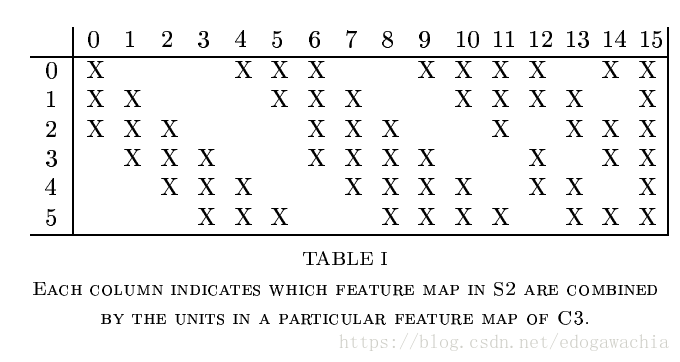

column对应的是上一层的6个，row对应于下一层的16个。可以看出，这16个里，前面的6个，即0–5，是由相邻的三个fm组合变换而成，而中间的6个，即6-11，是相邻的四个fm，而再后面的三个是不相邻的四个fm，最后一个，即15，是所有的fm都连接得到的。

为何要采用这样的连接。作者给出两点理由：首先，可以降低连接数目（毕竟当时还没有这么多框架和GPU，参数量规模不要过大还是一个需要考虑的因素）；另外，更重要的一个理由是，作者希望通过这种方式学得一个可以互补的fm，通过强行破坏网络结构中，也就是上下层连接中的这种对称性。

这样可以得到C3。对C3进行一个降采样，方法同上，得到S4，16个5×5的fm，然后在进行一个5×5的卷积，得到C5，由于是valid，所以C5已经变成了1×1的fm图像，也就是已经变成了scalar。而且变成了120个fm，这里的120个每个都和前面的16个相连，没有之前6到16的那种方式。这里还把该层看成是C5，也就是第5个卷积层。（lenet-5的5就是表示它有5个convolution层）当然也可以认为这是一个FC。之所以不叫FC是因为这里的输入是32，刚好在该层变成了1×1，如果换别的数据，那么就不是scalar而仍是fm了。然后过了一个F6，成了84的全连接。这里之所以要用84，是因为每个待识别的label都用一个模式来表征，这个模式就是7×12的bitmap，（如下图），所以为了和这些stylized image匹配，所以设定为84。

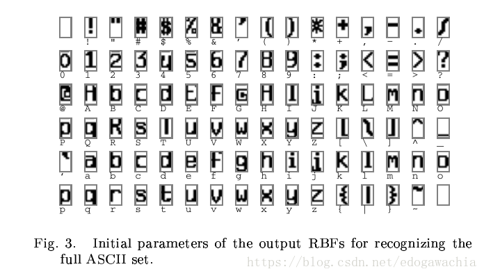

最后一层用欧式径向基函数，ERBF，来计算和每一个类别的距离，距离越近输出越小，也就是说明越接近某个模式。

$y_i=\sum_j(x_j-w_{ij})^2$

这样用模式图匹配在数字上看不太出优势，但是在ascii码上就比较明显，因为有很多confusable的比如：O，o，0，或者小写的l和数字1。这时候用匹配就有用了。

一直到F6层，所有的激活函数都是sigmoid squashing function，也就是tanh函数，双曲正切。

#### AlexNet

> ImageNet Classification with Deep Convolutional Neural Networks Alex Krizhevsky Ilya Sutskever Geoffrey E. Hinton 2012 NIPS
>
> http://papers.nips.cc/paper/4824-imagenet-classification-with-deep-convolutional-neural-networks.pdf

AlexNet的特点

- 用relu代替sigmoid
- local response normalization，提高泛化能力
- 分到多个GPU训练，提高训练效率
- 用数据增强和dropout避免过拟合

网络结构

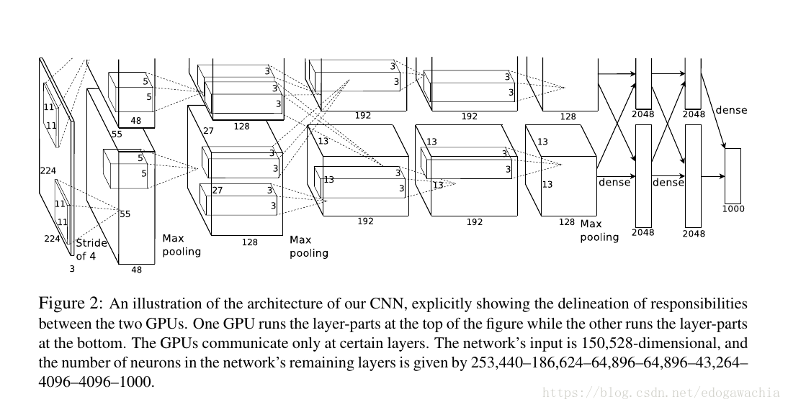

上面是论文中的图，示意GPU并行操作的连接和分离。不过没有画出没一层的内部结构，所以参照下图进行说明：

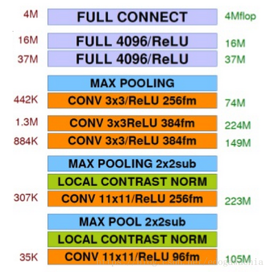

总体结构：5层卷积，3层全连接。

注意到，**这里的激活函数已经不是lenet用的sigmoid形式的tanh函数，而是用了ReLU函数**，可以避免sigmoid的饱和区域难以下降的困难。

前面的两层卷积后面跟了一个local contrast norm，局部对比度归一化处理。在第一个convolution，第二个convolution，以及最后一个convolution后跟了一个max pooling，这里的max pooling 池化方法也是第一次应用于CNN分类。对比之前的lenet用的是降采样（局部2×2区域求和乘以系数加bias）。并且，这里的pooling是overlap的，有重叠的池化。在这个model的设计中，作者在实验中观察到，stride=2，kernel=3的时候比起stride和kernel相等的不重叠的pooling可以降低top-1和top-5的error，所以用了重叠的pooling。后面用了两层带relu的全连接，各4096。最后一层是全连接1000，对应于1000个分类。

参照论文中的图，最开始输入的是224×224×3的图像，然后用11×11的大kernel卷积一遍，卷积的stride=4，取4是因为这是相邻的两个感知域的中心点的距离（kernel是11，如果要想该kernel相邻的包含它的中心的话，最多移动4个长度）。**注意，到了第二层开始，网络就被分到两个GPU去了。而且在第2,4,5层的时候只在本GPU上运算，而在第3层的时候进行一次GPU的通信，也就是将两个GPU上的feature map都连接到后一层。**在最后的dense层的时候在进行综合，从而使得网络的训练可以在多个GPU上进行，提高了效率。

下面介绍AlexNet里的一些技术创新。

**ReLU 非线性激活函数**

Deep convolutional neural networks with ReLUs train several times faster than their equivalents with tanh units.

ReLU是Hinton提出来用在RBM中的，V. Nair and G. E. Hinton. Rectified linear units improve restricted boltzmann machines. In Proc. 27th International Conference on Machine Learning, 2010，在此处被应用在模型里来加快训练速度。由于ReLU没有饱和区域，所以可以得到很好的训练效果。

**Local Response Normalization（局部响应归一化）**

首先要说的是，由于采用了relu替代了sigmoid，所以其实不必对激活函数的输入有规范化的要求。sigmoid之所以要求规范化是希望输入能落在线性区域而不是饱和区域。但是对于relu来说只要有大于零的训练样本，神经元就可以持续学习。但是在实验中，作者发现，进行local normalization可以提高泛化性能。所以做了一个LRN，局部归一化的操作。

This sort of response normalization implements a form of lateral inhibition inspired by the type found in real neurons, creating competition for big activities amongst neuron outputs computed using different kernels. 也就是说，这种归一化模拟了实际神经元的侧抑制功能，提高了模型的performance。

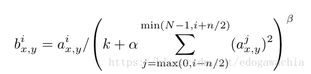

注意这里的 i 和 j 是 第 i 和 j 个 kernel，xy是位置。其他的都是超参数。
防止过拟合的策略

由于这个网络结构的参数体量较大，所以很容易过拟合。alexnet有两种方式在避免过拟合：data augmentation和dropout

**数据增强（data augmentation）**

首先是translation和horizontal reflection，然后从256×256的里面分割成224×224的patch，这样数据就大了很多，但是高度inter-dependent。在测试的时候，也切出5个224的patch，然后预测求平均。

除了平移翻转之外，还用了RGB通道扰动的方法：首先对RGB像素值做一个PCA，然后找到主成分。在原来的基础上加上下面的值：

$[p_1, p_2,p_3][\alpha_1\lambda_1, \alpha_2\lambda_2, \alpha_3\lambda_3]^T$

其中p是特征向量，lambda是特征值，而alpha是N(0,0.1)的随机扰动。

This scheme approximately captures an important property of natural images, namely, that object identity is invariant to changes in the intensity and color of the illumination. 物体对于不同的光照的颜色和强度应该表现出同一性（identity）

**引入Dropout**

> G.E. Hinton, N. Srivastava, A. Krizhevsky, I. Sutskever, and R.R. Salakhutdinov. Improving neural networks by preventing co-adaptation of feature detectors. arXiv preprint arXiv:1207.0580, 2012.

通过dropout可以不用做多组模型用来降低test error。实际上dropout本身就有多个模型融合的意味，每个模型就是dropout掉一部分连接后剩余的trainable的网络，然后最后利用概率进行融合。这里用的是Dropout(0.5)。避免了overfitting，也使得收敛慢了一倍。下降方法：动量为0.9，weight decay 0.0005， 梯度epsilon，batch size 128 。

#### ZFNet

> Visualizing and Understanding Convolutional Networks Matthew D. Zeiler and Rob Fergus D. Fleet et al. (Eds.): ECCV 2014, Part I, LNCS 8689, pp. 818–833, 2014.

ZF Net是用作者的名字命名的。这篇文章的模型是在alexnet上的改进，也是2013年的ILSVRC的冠军。实际上在网络结构上似乎没有特别大的变动，因此也没有vgg，googlenet，ResNet等出名。但是这篇文章的一个很大的贡献在于它提出了两个新的问题：**为何CNN如此有效，以及怎样改进才可以提高 why they perform so well, or how they might be improved。**也就是CNN的原理问题。实际上，至今为止，CNN在很大程度上仍然是一个黑箱，对某些参数和结构的微调带来的变化仍然是不可预知的。Without clear understanding of how and why they work, the development of better models is reduced to trial-and-error. 这篇文章可以看做是CNN可视化或者CNN可解释性的开山之作，对应于那两个问题，作者给出了一个**Deconvnet用来做可视化**的方法，从而展示了CNN究竟看到了什么特征。

因此这里重点整理一下Deconvnet可视化的内容，对于ZF Net的分类网络的结构和改进略作说明。

网络结构

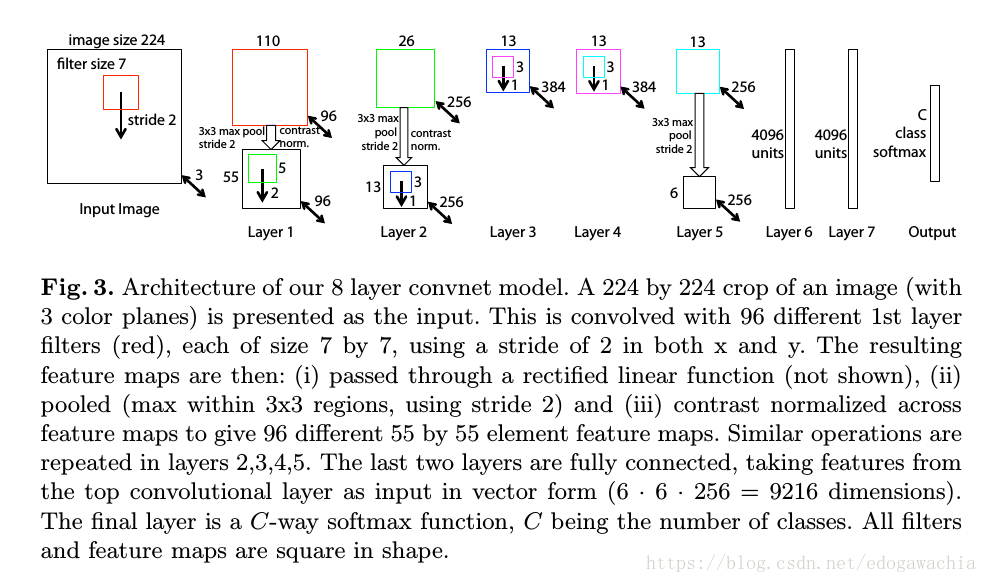

总体来说，和alexnet很相近。区别在于，一方面，把alexnet中的sparse connection全部变成了dense的，sparse connection指的是alexnet中为了分给两个GPU，从而两块GPU上的网络层除了在一个卷积层以外，其他卷积层都分别计算，所以是稀疏的连接。另一方面，把输入的kernel由11变成了7，并且stride也减小了，为了更好的保留信息。

**CNN的可视化（multi-layered Deconvolutional Network，Deconvnet）**

可视化的方法如下：

首先，给一张图片学习特征，然后为了检验特定的convnet activation，我们把该层其他的所有的activation都置零，然后把这些feature maps作为输入，送入attached Deconvnet中去，然后我们依次执行：

- unpooling （去池化）
- rectify（整流（对应于relu））
- filter（滤波（对应于卷积层的操作））

从而重建出可以使得选中的层激活的下面的层的活动情况。上述的操作一直重复，知道达到input pixel space，即输入像素空间。

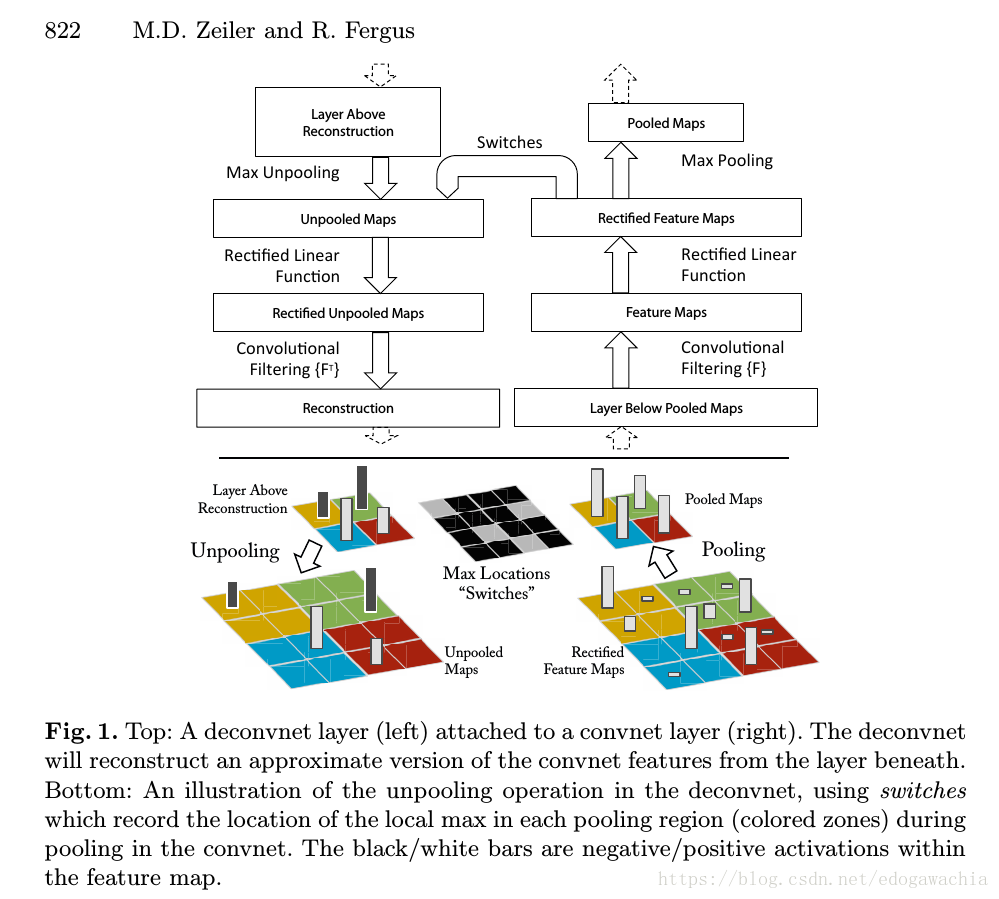

下面对unpooling，rectify和filter依次说明：

**Unpooling**

由于池化操作max pooling是不可逆的，因此我们用近似的方法来代替它。首先记录下maxima的位置，记做switch variable，然后把现在的池化后的每个像素点按照switch放回到原来的位置，而剩下的位置也就是非最大值的位置，直接置零。由于池化一般是接在activation之后的，因此relu过后应该都是非负数，所以置零也是合理的。但是会有信息的丢失。

**Rectification**

如果正向是ReLU的话，那么反向仍然用ReLU作为激活函数。从而得到valid feature reconstruction

**Filtering**

由于通过卷积得到了输出，因此由输出在倒退回去的话，当然也是approximately，可以用同样的filter的转置来操作（根据作者的说法似乎RBM等autoencoder自编码的模型也这么干）。对rectify之后的结果用transpose矩阵卷积就可以得到最终的结果。

（此处的一些问题似乎可以参考同一作者的另一篇文章Adaptive Deconvolutional Networks for Mid and High Level Feature Learning，在文中也有引用）

#### VGG

> VERY DEEP CONVOLUTIONAL NETWORKS FOR LARGE-SCALE IMAGE RECOGNITION Karen Simonyan∗ & Andrew Zisserman+ http://arxiv.org/abs/1409.1556

vgg是作者所在的课题组的缩写，visual geometry group，视觉几何学小组。通常有vgg16和vgg19两种模型，16和19指的是网络的深度。由此可以看出，和之前的相比，该网络的深度大大增加，与之相适应，每一层的卷积核变小（3×3）。vgg模型的一个重要贡献就是强调了CNN网络中深度的重要性，从而使得神经网络朝着“深度学习”的方向发展。

vgg是2014年的ImageNet challenge的localisation的冠军和classification的亚军（冠军googlenet）。下面简单说明一下该网络的一些特点。

**网络结构**

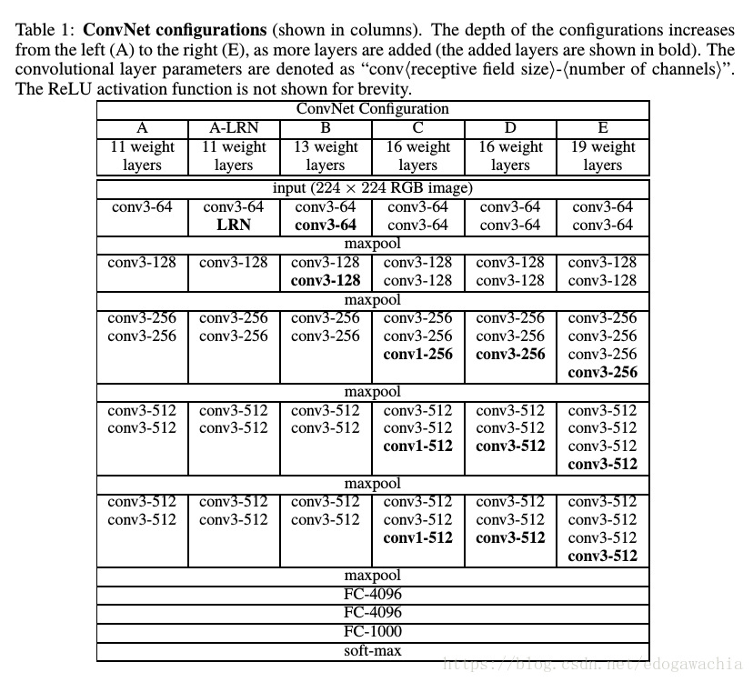

首先，关于训练的预处理，作者只对RGB图像做了一个去掉均值的操作，就直接投入训练，图片大小是224×224。网络的一些特点如下：

- 所有的kernel都是用小的receptive field，除了个别的1×1，都是3×3，代替了之前普遍使用的较大的卷积核。
- convolution 中的 stride 设置为1，并且做了padding，从而保持了分辨率，也就是feature map的尺寸
- 用了1×1的卷积核，相当于对通道之间做了一个线性变换，然后再通过非线性激活函数
- max pooling的方法做的池化，并且用2×2的区域，stride=2.
- 用了较多的卷积层，并设计了集中不同的结构，如上图所示
- 基本框架一样，若干卷积后一次池化，再卷积和池化重复，最后接了三个FC层，大小为4096，用softmax激活后输出。

**细节阐释**

**首先是3×3的kernel size。用3×3的一个好处是可以提高效率，只要和深度结合，比如两层3×3就能达到5×5的感知域，同理，再加一层就是7×7。这样的方式比直接7×7效率更高。**（btw，ZF中把11×11改成7×7并且减小了stride的一个原因是这样可以更好的保留信息。）考虑如果输入和输出都是有C个通道，那么3×3的卷积核有3×3×C×C个参数，三层的话就是27乘以C squared。而直接用7×7的话，参数量为7×7×C×C，也就是49乘以C squared。所以说小kernel加上深网络可以用较少的参数量达到与大kernel相当的效果。

另外是1×1的卷积核，这个是用来在不影响receptive fields的情形下，增加判决函数的非线性的操作。尽管1×1卷积核只是一个线性操作（相当于对不同的channel加权求和），但是后面接上激活函数可以引入非线性。1×1的卷积核操作在NiN（Network in Network）https://arxiv.org/abs/1312.4400v3 中有应用。

其他非网络结构的细节如下，主要是训练和测试中的一些trick：

首先，训练过程中，损失函数是softmax，也就是multinomial logistic regression的优化。下降方法用的是mini-batch的gradient descent with momentum。batch size设置为256，momentum 0.9。训练过程中的正则化包括weight decay（l2 penalty multiplier set to 5e-4），以及dropout，ratio设置为0.5。

另外，训练的图像大小问题，有两种方法。一种是给一个fixed scale，然后都resize成这个scale，另一种是给一个range，即Smin和Smax，然后随机抽取scale，这样也可以起到training set augmentation 的作用。

需要注意的是，分类问题的输入图像的处理方式和端到端的image-to-image，比如去噪或者去模糊之类的low level vision问题是有区别的。low level 的这些只需要训练时候patch固定，把kernel的weights学出来即可，然后通过调用这些卷积核，可以适用于任何尺寸的大小，实际上就是学习了一堆非线性的滤波器。而分类不同，它对于输入图像的尺寸不要求，任何大小的图像中的一只猫都会被分到猫的类别，所以可以放缩，并且为了保持object的形状不变，还必须长宽同比例的，也就是isotropical的放缩。一般来说是将短边放缩成一个固定的值，然后滑动窗口去取得patch。

对于训练这样好实现，因为S，即scale，输入图像的尺寸都被切成了固定的大小。但是对于测试来说，这里又一个技巧。

从最简单的考虑来说，我们可以把test image也resize成短边为S的图像，然后切成patch的大小，最后挨个分类，然后取平均。这样的过程比较繁琐。本文中采用了把FC层变成卷积层的策略，如下：

Namely, the fully-connected layers are first converted to convolutional layers (the first FC layer to a 7 × 7 conv. layer, the last two FC layers to 1 × 1 conv. layers). The resulting fully-convolutional net is then applied to the whole (uncropped) image. The result is a class score map with the number of channels equal to the number of classes, and a variable spatial resolution, dependent on the input image size. Finally, to obtain a fixed-size vector of class scores for the image, the class score map is spatially averaged (sum-pooled).

简单解释一下，**比如我们在FC的前一层得到了一个7×7×64的feature map，那么我们需要flatten，然后连上全连接。这样的操作可以通过一个卷积操作来实现，实现方法就是用4096个大小为7×7的卷积核去卷积和这个fm，那么就会得到4096个1×1的fm，相当于一个4096的FC，然后进行后续处理。**这样做的好处是，卷积是不管输入大小的，因此我们可以把整张图投进去测试，比如一个大一些的图，到了FC的前一层不是7×7×64，而是15×15×64，那么它通过4096个7×7的kernel后，会得到一个9×9×4096的fm，再继续下去， (the first FC layer to a 7 × 7 conv. layer, the last two FC layers to 1 × 1 conv. layers) 最终将得到一个9×9×1000的fm，这里实际上就标志着在test image 的81个位置切patch所得到的分类的softmax的概率向量是多少，因为我们要对整张图做判断，因此做一个sum pooling，也就是空域平均，即可得到整张图平均分类结果。这样便于计算。

**结论**

**Our results yet again confirm the importance of depth in visual representations.**

#### ResNet

> Deep Residual Learning for Image Recognition Kaiming He Xiangyu Zhang Shaoqing Ren Microsoft Research CVPR 2016
>
> 其他参考文献：
>
> Identity Mappings in Deep Residual Networks http://arxiv.org/abs/1603.05027
>
> Residual Networks Behave Like Ensembles of Relatively Shallow Networks http://arxiv.org/abs/1605.06431
>
> The Shattered Gradients Problem: If resnets are the answer, then what is the question? http://arxiv.org/abs/1702.08591

模型介绍：

ResNet是一个很有名的模型，而且residual learning的方法，即不直接学习输出，而是学习残差的方法现在已经在图像的low-level中被广泛应用了。ResNet在结构角度看就可以看成是一组小的学习残差的网络连接而成的深层网络。然而对于ResNet的能力究竟来自何处，或者ResNet是否解决了梯度消失或者梯度爆炸等问题仍然存在一定争议，也有一些文章对这些问题进行了一些理论的分析。下面先介绍2015年ImageNet比赛上的ResNet模型的最原始的文章，然后结合其他参考文献对其中的一些问题进行讨论。
模型结构

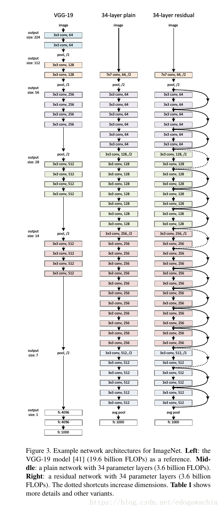

上面是对vgg和没有residual learning结构的plain network结构的对比，右边是34层的ResNet。

可以看出，ResNet的结构是由若干小的block组成的，每个block的结构如下所示：

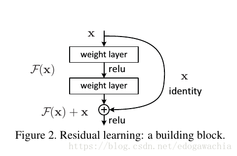

为何要引入shortcut？原因在于如下这样一个现象：

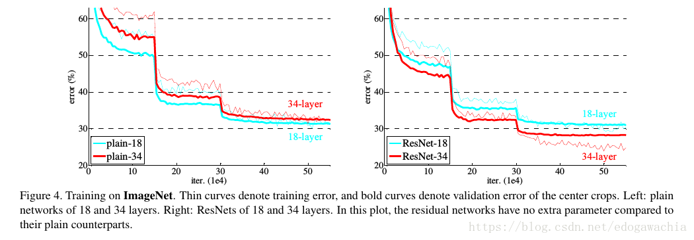

这个现象被称为**degradation problem**，指的是在网络层数到一定程度后，训练的误差和测试误差都较高而且不再下降的问题。**上图中的degradation因为训练集的error也下不去，显然不是因为过拟合，而是因为网络太深，导致没法很好的optimize。**

由于前面的文章已经证明了，网络的深度有助于更好的提取和表征数据特征，从而容易得到更好的效果。所以我们希望能从增加网络层数这一条路径继续下去从而提高网络性能。当然，googlenet的论文中提到过，网络过深容易overfit。但是这里作者指出了另一个问题，就是所谓的**梯度消失或者梯度爆炸 vanishing/exploding gradients** 现象，也就是在训练过程中可能出现的问题。

作者是这样论证这个问题的：**深度网络理论上至少不会比比它更浅的网络的train error更大，因为每一个深网络都可以看成是一个浅的网络加上一些层以后形成的，那么如果我们将这些新加入的层做成恒等映射层 （identity map），那么最终的结果就是浅层网络的最优解。因此说明深层网络也存在一个这样的解，或者说至少要达到浅层的水平。那么实际中没法达到或者没法在可以接收的时间内达到，就需要改变训练策略。**

ResNet的策略就是不让layer直接学习一个映射，而是学习一个residual，也就是说，若是想学习H(x)，那么就改成学习F(x) = H(x) - x，就是上面的block的图中所示的那样。We hypothesize that it is easier to optimize the residual mapping than to optimize the original, unreferenced mapping. 最极端的情况，如果最优解就是一个恒等映射的话，那么把residual push 为0，也就是将输入通过神经网络后变成0，是很容易办到的。

作者展示了用这种residual learning的block组成的网络可以很容易优化，还能得到accuracy gain。

更6的是，作者用这种结构把网络做到了1000+层….最开始的Lenet也就5个卷积层，号称深度的vgg也就19个，googlenet也是二十左右，而ResNet由于这种结构可以训练，直接提高到了上百甚至上千层。

**residual learning**

The degradation problem suggests that the solvers might have difficulties in approximating identity mappings by multiple nonlinear layers. 作者从degradation中猜测，可能深度网络不太能很好的表征恒等映射（因为按照前文的思想实验深层只要是恒等映射就能达到浅层网络的最优解，然而没有），所以直接拉过来一根跳线，即如果需要恒等映射就直接走跳线。另外，在实际case中，一般恒等映射，也就是不变换不太可能是最优解，但是可能最优解相比于接近0来说更接近输入本身，所以我们学的是对于reference的扰动，而不是本身，这可以通过观察Learned residual function具有更小的response来说明。

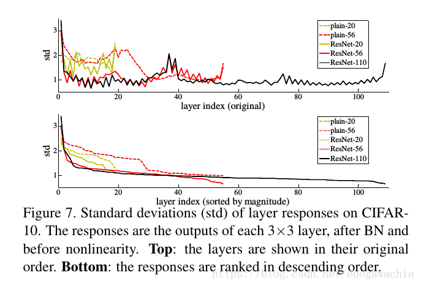

上图可以看出，plain网络具有degradation，即深层比浅层error还大，而ResNet就没有这一现象了。

作者这里说这种优化的困难不太像是vanishing gradient引起的，因为加了BN层，保证了variance非零，而且反传的gradient的norm也是正常的。作者认为是由于收敛率指数型导致的收敛速度太慢。We conjecture that the deep plain nets may have exponentially low convergence rates, which impact the reducing of the training error3 . The reason for such optimization difficulties will be studied in the future.

为了减小运算量，以便用更深的网络，作者改变了block结构，加上了1×1的bottleneck

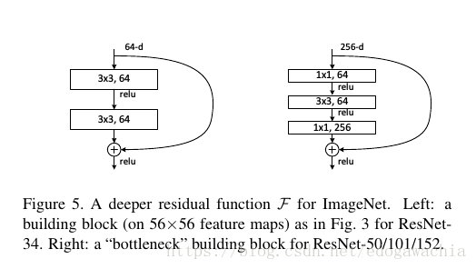

**关于恒等映射（identity map）**

在16年的一篇文章中（Identity Mappings in Deep Residual Networks 作者就是ResNet的原作者们），通过推导论证了一个结论：**Our derivations reveal that if both h(xl) and f (yl) are identity mappings, the signal could be directly propagated from one unit to any other units, in both forward and backward passes.** 这里的h，f以及xl和yl如下图：

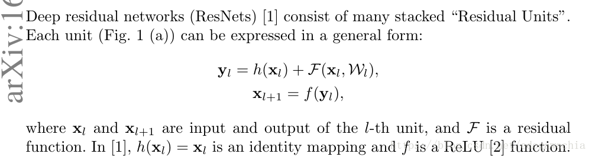

如果不考虑激活函数和BN，而h又是identity map的话，就可以做下面的推导：

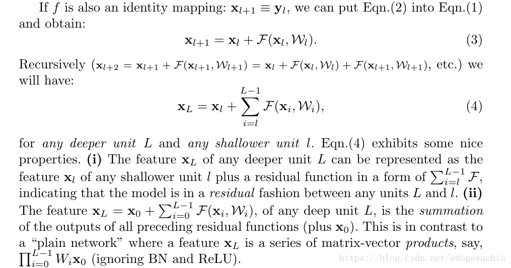

可以看到，某一个block的输入可以写成前面某项的输入加上一个和式，这个和式表达的是前面某项到该输入之间的若干个矩阵卷积后再激活的结果，由于是和表达式，求导后仍然是和式，所以某项的梯度可以直接传到其他项。

而如果是plain network，正如最后一句话说的，那么某一个xL就可以写成一个乘积表达式，那么求导就自然会有连乘，也就是说某一项的gradient不一定能较好地传给其他项。

那么如果h是一个x的正比例函数，即系数不是1的情况呢？

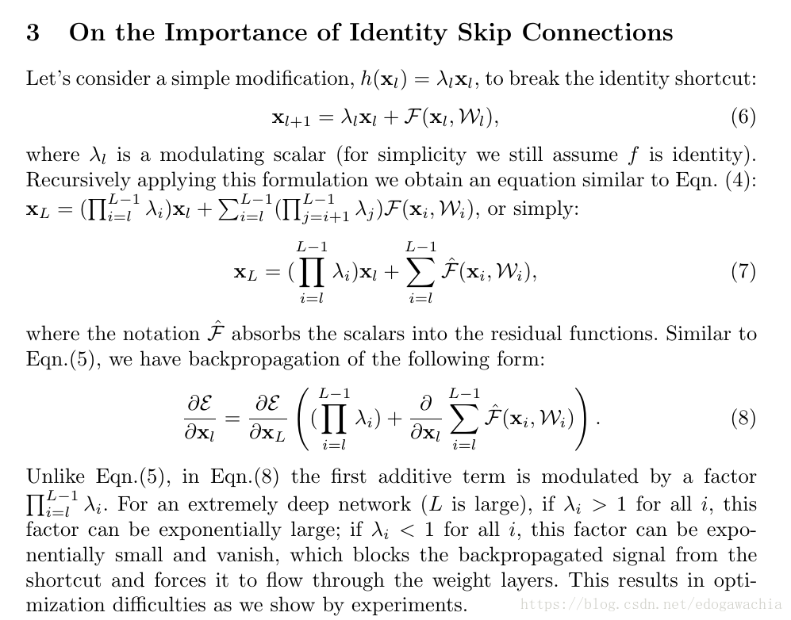

经过推导可以看出，这样的话会导致要么梯度过小，从而消失，也就是关闭了shortcut，强制让信号从卷积层流过来；要么就是太大，可能会梯度爆炸。这就是选择identity map 的理由。
从ensemble的角度理解

Residual Networks Behave Like Ensembles of Relatively Shallow Networks 一文中提出，可以将ResNet理解为一个不同长度的多路径的集合的一个ensemble-like的东西，并且发现只有短的path在训练中是有必要的，因为long path不贡献gradient。这篇文章的摘要如下：

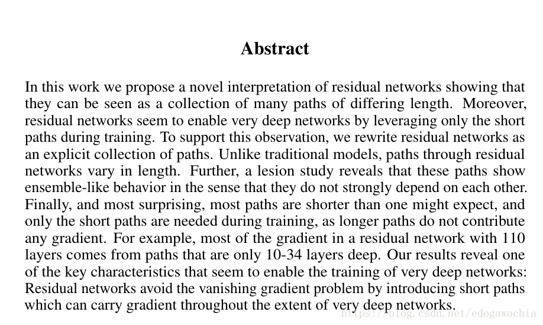

把ResNet展开就是下面的右图：

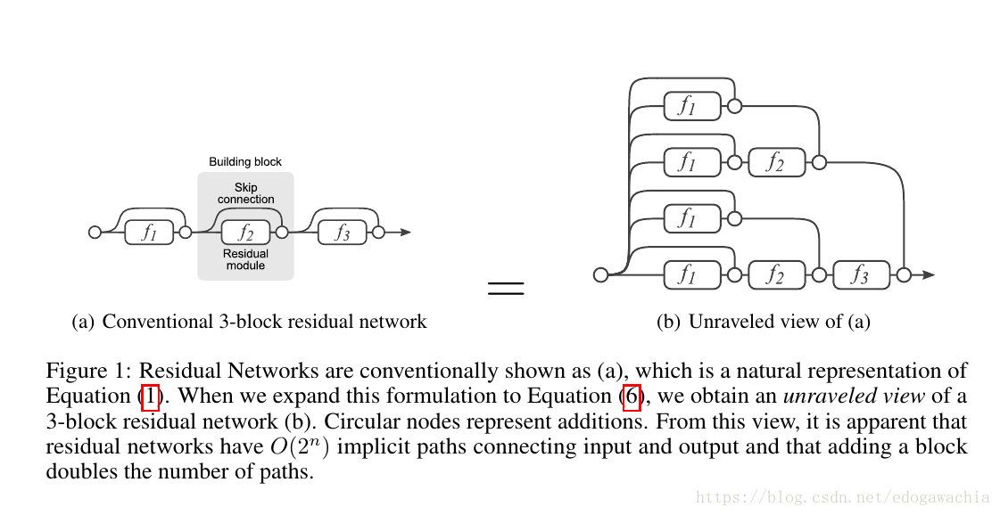

实际上，这个展开图和前面文章的展开式是同一个东西。下面是一个实验：在vgg中删去任何一个path，test error 会变大且随机，而对于ResNet则影响甚微。

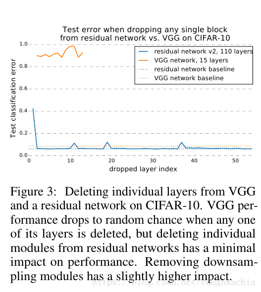

作者的解释是：It shows that residual networks can be seen as a collection of many paths. As illustrated in Figure 2 (a), when a layer is removed, the number of paths is reduced from 2n to 2n−1 , leaving half the number of paths valid. VGG only contains a single usable path from input to output. Thus, when a single layer is removed, the only viable path is corrupted. This result suggests that paths in a residual network do not strongly depend on each other although they are trained jointly. **ResNet因为是一个path的集合，去掉某个仍然有一般的路径可走；而vgg只有一条可行路径，删除了某个layer，这个路径就不存在了。**

####GoogLeNet

> Going Deeper with Convolutions Christian Szegedy1, Wei Liu2, Yangqing Jia1, Pierre Sermanet1 , Scott Reed3, Dragomir Anguelov1 , Dumitru Erhan1 , Vincent Vanhoucke1 , Andrew Rabinovich4 CVPR 2015

模型简介：

googlenet并没有采用之前的sequential的conv，pooling，fc这样的序列的结构，而是在**串行中引入了并行操作**，使得每个并行的操作都成为了一个模块，每个模块就叫做一个**inception**，每个inception里包含了不同大小的卷积核和池化层。因此具有更好的表达能力，并且为了在应用inception这种模块的时候降低运算量，引入了bottleneck机制。该模型是2014年的ImageNet的冠军。

模型结构

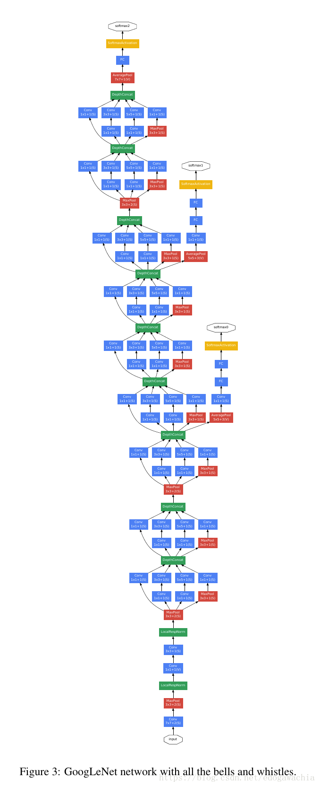

该结构基于Hebbian principle 和 multi-scale processing 的intuition。秉承 ‘we need to go deeper’ 的原则，在两方面进行了deep的改进，第一就是Inception module 的引入，另一个就是常规的网络深度的deepen。

Inspired by a neuroscience model of the primate visual cortex, Serre et al. [15] used a series of fixed Gabor filters of different sizes to handle multiple scales. We use a similar strategy here. However, contrary to the fixed 2-layer deep model of [15], all filters in the Inception architecture are learned. Furthermore, Inception layers are repeated many times, leading to a 22-layer deep model in the case of the GoogLeNet model.

inception 模型受到下面这个模型的影响，这个模型是用一系列的 gabor 滤波器来实现的多尺度的处理。

> [15] T. Serre, L. Wolf, S. M. Bileschi, M. Riesenhuber, and T. Poggio. Robust object recognition with cortex-like mechanisms. IEEE Trans. Pattern Anal. Mach. Intell., 29(3):411–426, 2007.

不过 googlenet 中虽然也是多尺度，但是所有的滤波器都是学出来的。

另外，在NiN模型的启发下，引入了1×1的convolutional layers，一方面可以减少参数，从而打破计算瓶颈，从而可以将网络做的更大，另一方面也可以用来在不太降低performance的情况下增加网络的width。

utilizing low-level cues such as color and texture in order to generate object location proposals in a category-agnostic fashion and using CNN classifiers to identify object categories at those locations.

这里是受到R-CNN的启发，把问题分解为两个方面，一方面考虑low-level的cue在不区分类别的情况下找到location proposal，另一方面用分类器对这些位置上的对象种类进行识别。
Motivation and High Level Considerations

最直接的提高DNN的performance的方法就是增加它的体量。但是这也会导致一些问题，比如容易过拟合，为了避免过拟合，就要有特别多的labeled样本，但是标记很费人工。另一方面，还会导致计算量过大，难以承受。

一个解决这一问题的理论工作给出了一个结论：如果一个数据集的概率分布可以被一个很大的稀疏的DNN来表征的话，那么最优的网络拓扑结构可以通过如下方法逐层生成，即分析前面的layer的activation的correlation，把那些高度相关的神经元聚类起来。实际上这个和Hebb规则很像（hebb规则：neurons that fire together，wire together）

**Architectural Details**

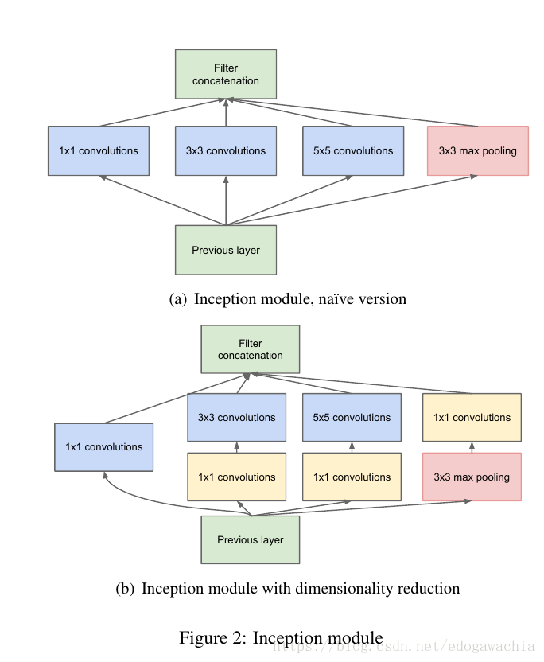

上面展示了inception的结构，a图是最基础的构思，就是把上一层用1,3,5三个尺寸的卷积层操作，加上一个3的max pooling，最后concat起来。但是直接这样操作会产生大量的参数，因此考虑引入bottleneck结构，也就是在卷积操作前先对fm的个数做一个缩减，1×1的conv之前介绍过，实际上就是在不改变局部信息的前提下对通道间做一个线性加权处理（如果接了activation就是非线性），这样可以通过选择1×1卷积后的fm的数量来进行fm 的 channel的降维操作，从而降低计算量。除了降低计算量，they also include the use of rectified linear activation making them dual-purpose。

Furthermore, the design follows the practical intuition that visual information should be processed at various scales and then aggregated so that the next stage can abstract features from the different scales simultaneously.

GoogLeNet的一个incarnation如下所示：

**结论**

Still, our approach yields solid evidence that moving to sparser architectures is feasible and useful idea in general. This suggest future work towards creating sparser and more refined structures in automated ways on the basis of [2], as well as on applying the insights of the Inception architecture to other domains.

说明模拟一个最优的稀疏结构的方法（也就是这里提到的【2】中的理论方法）是可行的，并且可以探索其他稀疏表征方法，或者把inception用在其他领域。

> [2] S. Arora, A. Bhaskara, R. Ge, and T. Ma. Provable bounds for learning some deep representations. CoRR, abs/1310.6343, 2013.

