基于CNN 的目标检测是通过CNN 作为特征提取器，并对得到的图像的带有位置属性的特征进行判断，从而产出一个能够圈定出特定目标或者物体（Object）的限定框（Bounding-box，下面简写为bbox）。和low-level任务不同，目标检测需要预测物体类别及其覆盖的范围，因此需关注高阶语义信息。传统的非CNN 的方法也可以实现这个任务，比如Selective Search 或者DPM。在初始的CNN 中，也采用了传统方法生成备选框。

**传统目标检测方法**

#### Selective Search

#### Deformable Part Model

**基于CNN 的目标检测**

---

**Two-stage 方法**

所谓Two-stage 的方法，指的是先通过某种方式生成一些备选框，然后对备选框里的内容进行分类，并修正备选框的位置的方法。由于包含了region proposal 和detection 两个步骤，因此称为two-stage（两阶段）方法。最开始的CNN 目标检测就是两阶段的。

#### R-CNN

R-CNN 是最早利用CNN 实现目标检测任务的方法，由rbg（Ross Girshick）等人提出。这里的R 指的是Region，R-CNN 即“Regions with CNN features”，即对不同的区域进行CNN 特征提取和分类。

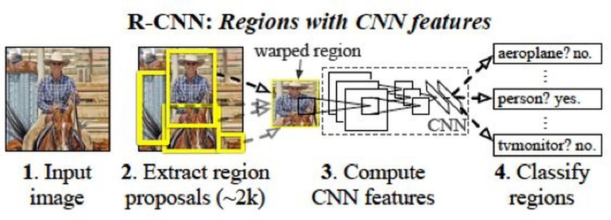

图1.1: R-CNN 方法pipeline

鉴于CNN 在整图分类任务中的优异性能，很自然的想法是将其用于目标检测领域，将CNN 强大的数据驱动的特征提取能力迁移到比整图分类更细致和复杂的任务中。R-CNN 的思路相对容易理解，它主要有以下几个步骤：

1. 通过Selective Search（SS）方法筛选出一些备选的区域框（Region proposal）。

2. 将这些备选的proposal 缩放到指定尺寸，用于输入CNN 进行分类（根据某种规则将各个proposal 分成正负样本）。其目的在于通过训练CNN，得到每个region proposal 的定长特征向量。

3. 用每个proposal 中提取的特征向量训练SVM，得到最终的分类结果。

4. 利用非极大值抑制(Non-Maximun Suppresion) 方法，对最终得到的bbox 进行筛选。

5. 分类完成后，对bbox 进行回归，修正bbox 中的坐标的值，得到更精确的bbox。

详细来说，第一步中，SS 可以得到大量的备选框，这些框中都有可能有某个类别的目标，因此都需要进行后续的处理。这个步骤是不区分类别的。第二步骤中，由于第一步SS 得到的proposal 没有指定大小和比例（长宽比），因此用普通的CNN（R-CNN 中用的是AlexNet）无法得到一样长度的特征向量。R-CNN 采取的对策是直接用缩放的方式将所有proposal 强行整理成同样的大小。这里的缩放并不确切，实际上是某种形变（warp），因为这种操作可能会导致proposal 的长宽比例发生改变，导致目标物体也发生形变。缩放完成后，剩下的步骤就是普通的整图分类时的结果，即输入CNN，输出每个类别的概率的向量。由于这个任务上（Image classification）已经有了很多在ImageNet 这种大数据集上预训练好的模型，因此可以直接借用，进行微调（fine-tune）。这个过程并不是最终的分类结果，而是只用来得到最后一层的特征向量。然后，将特征向量用来训练SVM，得到最终的分类。（这种先CNN 再SVM 的方法，仅仅将CNN 作为feature extractor，这种策略在有些场景下效果要比直接CNN 输出结果要好。这个实际上就是用SVM 替换了CNN 的最后一个LR。）

这里有一个注意点，即正负样本如何确定（CNN 和SVM 都需要有监督的样本）。这里，也是采用了groundtruth（GT）和SS 的proposal 之间的IoU 来进行确定。如果一个proposal 和某个类别的GT 的IoU 大于某个阈值，那么，这个proposal 的样本就被视为该类别的正样本。

最后要进行的是NMS 操作，这个是为了避免很多大小类似且只有微小位移的框（它们实际上框定的是同一个object）都被输出，导致框的重叠和冗余。NMS 的过程如下：

    输入：所有预测结果大于阈值的bbox，包含四个位置坐标（角点的x 和y，以及长w 宽h），以及一个置信度c。
    输出：过滤了重复和冗余后的bbox 列表。
    过程：
    首先，将所有预测出的bbox 按照c 进行降序排列。另外，维护一个输出列表list，初始化为空。然后进行遍历，每次取出一个bbox。如果该bbox 与list 中的某个bbox 具有超过阈值thr 的IoU，那么不输出该bbox。否则，将该bbox 加入list。当所有预测的bbox 都被遍历完后，NMS 算法结束。 

可以看出，如果bbox 和list 中的某个已有的决定输出的bbox 重叠较大，那么说明它们只需要留下一个即可。根据置信度，我们肯定选择留下置信度高的那个。由于已经按照置信度排好序了，所以先进入list 的自然置信度更高，所以直接舍弃后面的即可。

最后一步，利用特征预测边框的位置，即bbox 回归。该过程的输入是CNN 的特征，这里用的是pool5 的特征，需要回归的目标值并不是实际的x,y,w,h。由于我们已经用SS 给出了一个位置，所以只需要预测两者的**差异**即可。具体公式为：

    tx = (Gx − Px)/Pw
    tx = (Gy − Py)/Ph
    tw = log(Gw/Pw)
    th = log(Gh/Ph) 

公式中G 表示ground-truth，P 表示predict。根据公式，这样的目标变量相对比较稳定，便于回归。R-CNN 在SS 过程中需要花费较多时间，且对每个proposal 都要过一遍CNN，因此效率较低。基于R-CNN的一些问题和缺陷，后面的方法做了不同程度不同方向的修正，从而形成了以R-CNN 为源头的一条清晰的研究线路。

#### SPP-net

SPP-net 是何恺明、孙健等人的作品。SPP-net 的主要创新点就是SPP，即Spatial pyramid pooling，空间金字塔池化。该方案解决了R-CNN 中每个region proposal 都要过一次CNN 的缺点，从而提升了效率，并且避免了为了适应CNN 的输入尺寸而图像缩放导致的目标形状失真的问题。

在R-CNN 中，整个处理流程是这样的：

    图像- 候选区域 - CNN - 特征- 输出 

而对于SSP-net 来说，上面的过程变成了：

    图像- CNN - SPP - 特征- 输出 

可以看出，R-CNN 中，每个区域都要过一次CNN 提取特征。而SPP-net 中，一张图片只需要过一次CNN，特征提取是针对整张图进行的，候选区域的框定以及特征向量化是在CNN 的feature map 层面进行的，而非直接在原始图像上进行（R-CNN）。

R-CNN 之所以要对候选框进行缩放后再输入CNN，是为了保证输入图片尺寸一致，从而得到定长特征向量（全连接层的存在使得CNN 需要输入同样大小的图像）。如果直接用不同的region proposal 的框来限定某个区域，就需要有某种办法保证也能得到不受输入尺寸影响的定长向量。这种办法就是SPP。

SPP 实际上是一种自适应的池化方法，它分别对输入的feature map（可以由不定尺寸的输入图像进CNN得到，也可由region proposal 框定后进CNN 得到）进行多个尺度（实际上就是改变pooling 的size 和stride）的池化，分别得到特征，并进行向量化后拼接起来。如图。

和普通的pooling 固定size 不同（一般池化的size 和stride 相等，即每一步不重叠），SPP 固定的是池化过后的结果的尺寸，而size 则是根据尺寸计算得到的自适应数值。这样一来，可以保证不论输入是什么尺寸，输出的尺寸都是一致的，从而最终得到定长的特征向量。

图1.2: SPP 结构

 

SPP 的window size 和stride 的计算如下：

    win = ceil(a/n), str = floor(a/n) 

除了SPP 外，SPP-net 也沿用了hard negative sampling 和NMS 等技术。

 

#### Fast R-CNN

Fast R-CNN 是rbg 对之前提出的R-CNN 的改进版。主要结构如下：

图1.3: Fast R-CNN 结构

 

从SPP-net 的分析中其实可以看出，制约R-CNN 速度的实际上就是对一张图片的多个ROI 进行的很多重复的CNN 计算。因此，只需要对一张图片计算一遍CNN 的feature map，然后对各个ROI 分别整理出特征就可以了。SPP 中的所谓“金字塔”结构和解决R-CNN 的速度问题关系不太大，主要还是由于SPP 对各个ROI的feature map 直接提特征导致了效率的提高。因此，R-CNN 也沿用这个思路进行了改造升级，变成了Fast R-CNN。

Fast R-CNN 提出了ROI pooling 的结构，实际上就是一种特殊的SPP（相当于SPP 的金字塔层数设置为了1，即只计算一次池化）。

Fast R-CNN 的另一个改造是，将最终的SVM 分类去掉了，直接做成了端到端的一个网络结构。对这个网络进行多任务训练，即分类和回归，得到物体类别和bbox 的位置。这个多任务的损失函数如下：

    L = loss_cls(p, u) + [u ≥ 1]loss_loc(tu, v) (1.3) 

其中，losscls 为分类损失，形式为−log pu，pu 为真实类别上的预测概率。而lossloc 为位置损失，只在非背景（u=0 是背景，u ≥ 1 表示非背景的类别）才进行位置损失的优化。位置损失的函数形式为smooth-L1 损失，即在自变量小于1 的时候为平方项，而大于1 的时候为L1 损失。之所以采用L1 损失，是因为回归的预测没有范围限制，L1 函数可以较好地抑制异常点的影响。

#### Faster R-CNN

Faster R-CNN 在Fast R-CNN 的基础上又进行了改进。主要的改进点是利用 **RPN 网络（Region Proposal Network）** 代替了Selective Search 生成备选框。另外，引入了 **anchor** 的概念，anchor 方法在后面的模型中也一直被沿用了下来。

首先介绍RPN 网络。在前面的模型中，计算时间效率的时候都排除了预先SS 生成候选框的过程的时间消耗。但是实际上这一部分占据了较多的时间。因此，在Faster R-CNN 中，不再预先利用SS 生成候选框，而是利用一个与检测器共享部分权重的RPN 网络来直接对图片生成候选框，然后基于RPN 得到的候选框进行分类和位置回归。

基于RPN 的Faster R-CNN 网络的结构如下：

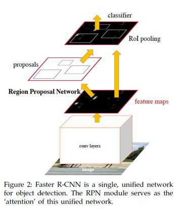

图1.4: Faster R-CNN 结构

 

可以看出，RPN 的region proposal 也是基于前面的CNN backbone 提取的feature map 进行的，而检测则是基于ROI pooling，和之前一样。整个过程中，原始图像过了一遍CNN，所有的操作都是基于整图的featuremap 进行的。

RPN 网络是基于anchor box 的方式进行的。过程示意图：

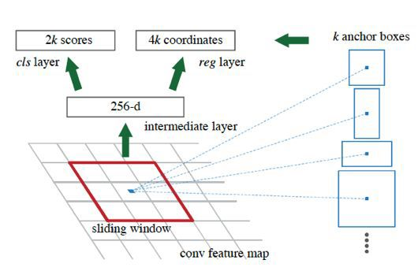

图1.5: RPN 的过程

 

首先，定义anchor box 的尺寸（scale）和比例（aspect ratio）。按上图，预先定义了k 个anchor box。在实际的RPN 网络实现中，共采用了3 个不同的scale（大中小）和3 种不同的比例（宽中窄）。然后通过组合，得到了9 个anchor box，即k=9。在训练RPN 的过程中，对于每个feature map 上的像素点，都生成k 个anchorbox 的预测。由于预测需要有两个输出用来分类（前景/背景），以及4 个用来定位（x,y,w,h），所以RPN 的分类层生成的是2k 维度的向量，RPN 的回归层生成的是4k 维度的向量。

既然要训练RPN 的分类，就需要定义正负样本。在RPN 中，正样本被定义为满足如下条件之一的那些anchor box：1. 在anchor box 中具有最高的GT IoU；2. GT IoU 大于0.7。而对于负样本来说，只要满足GTIoU 小于0.3，即被认定为负样本。除了上面的正负样本以外，其他的anchor box（即不满足正样本也不满足负样本条件的）不参与训练，对损失函数优化没有贡献。

RPN 的损失函数和Fast R-CNN 的类似，分类损失根据预测和GT 的类别计算，回归损失只用label=1，即有object 的那些预测结果的框计算。回归仍然用的是smooth L1 损失。基于anchor box 回归边框的目标值和基于SS 的类似，也是用proposal 的值作为基准，只回归一个位移和缩放。由于Faster R-CNN 中采用了网络做region proposal 和检测，所以训练方式与之前有所不同。在实现中，首先用ImageNet 预训练做初始化，然后训练RPN，训练好RPN 后就可以生成region proposal 了，然后用RPN 的proposal 单独训练Fast R-CNN，即检测网络。然后再用检测网络初始化RPN，并保持公共的层的权重固定，对检测网络的非共享层进行微调。

Faster R-CNN 由于可以端到端的进行，无需SS 提前准备备选框，因此可以做到近实时的速度（near real time），所有过程可以5fps 的速度实现。

-----

**One-stage 方法**

与two-stage 方法不同，one-stage 的思路是直接对图像进行各个位置上的候选框的预测和分类，不需要预先生成一些备选框。以YOLO 和SSD 等方法为代表的就是one-stage（单阶段）方法。

#### YOLO (v1)

“YOLO”是一句美语俚语“you live only once”的缩写，字面意思是“人生只有一次”，引申义即“及时行乐”，表达一种人生态度。本模型的名称借鉴了YOLO 这个说法，全名是：You Only Look Once，表示只需要看一次即可完成识别，主要是为了与之前的两阶段（看两次）进行区分。我们人类看到某个场景时，并不会先看一下有没有物体，物体在哪，然后再确定这个物体是什么，而是“只看一次”，就完成目标位置和内容的判断。

YOLO 的模型结构和之前的以R-CNN 为基础的模型差别较大，整个过程如下所示：

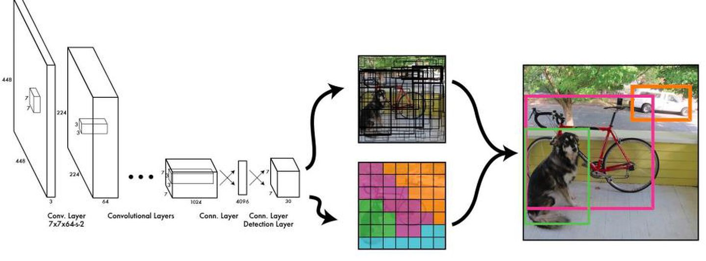

图1.6: YOLO v1 网络结构

 

YOLO 的过程如下：首先，将整个图像分成S × S 的小格子（cell），对于每个格子，分别预测B 个bbox，以及C 个类别的条件概率（注意是条件概率，即已经确定有目标的情况下，该目标属于哪个类别的概率，因此不需要对每个bbox 分别预测类别，每个格子只预测一个概率向量即可）。每个bbox 都有5 个变量，分别是四个描述位置坐标的值，以及一个objectness，即是否有目标（相当于RPN 网络里的那个前景/背景预测）。这样一来，每个格子需要输出5B+C 维度的向量，因此，CNN 最终的输出的tensor 的形态为**S × S × (5B + C)**。

在YOLO v1 的实现中，采用了7*7 的cell 划分，每个cell 预测2 个bbox，在Pascal VOC 数据集上，共有20 类，因此C=20。所以输出的结果是一个7 × 7 × 30 的tensor。

YOLO 的训练过程如下：首先，对于每个GT bbox，找到它的中心位置，该中心位置所在的cell 负责该物体的预测。因此，对于该cell 中的输出，其objectness 应该尽可能的增加，同时其位置坐标尽可能拟合GTbbox（注意，由于每个cell 可以输出多个备选的bbox，因此这里需要选择和GT 最相近的那个预测的bbox 进行调优）。另外，根据其实际的类别，对类别概率向量进行优化，使其输出真实的类别。对于不负责任何类别的那些cell 的预测值，不必进行优化。

YOLO 的损失函数如下：

图1.7: YOLO 损失函数

 

YOLO 模型虽然速度快，但是对于小物体检测不敏感，以及具有一些固有的缺陷，如定位准确性差等等。在YOLO v1 的训练过程中，还用到了dropout 和一些数据增广的策略方法。这个是YOLO 的初版，后续还有很多改进版本。

#### SSD

SSD 的全称是**Single Shot MultiBox Detector**。SSD 也是一种one-stage 的直接检测的模型。它相比起YOLO v1 主要的改进点在于两个方面：1. 利用了**先验框（Prior Box）**的方法，预先给定scale 和aspect ratio，实际上就是之前Faster R-CNN 中的anchor box 的概念。2. **多尺度（multi-scale）预测**，即对CNN 输出的后面的多个不同尺度的feature map 都进行预测。下图是SSD 论文作者给出的SSD 与YOLO 的结构的比较：

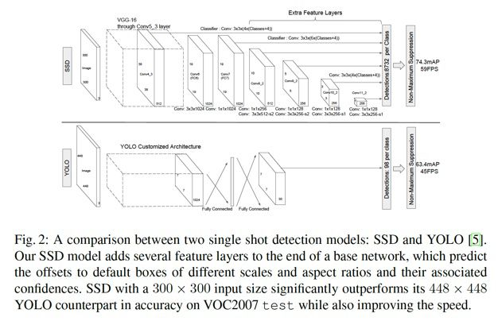

图1.8: SSD 的结构及其与YOLO 的区别

可以看出，相比于YOLO，SSD 在不同尺度上进行预测，这个过程的具体操作如下：首先，根据不同feature map 的尺寸，或者说缩放比例，找到每个feature map 和原图的尺寸的对应关系。然后，设计不同比例的先验框。对于每个GT bbox，分别在不同尺度下考察各个点上的各个比例的先验框，找到最相似的，用来负责预测。

如下图中，狗的尺寸较大，因此用到了更靠后的feature map（越靠后所代表的原图中的比例越大），而猫的尺寸较小，用的是前面的feature map。同时，还要适配各自的长宽比。

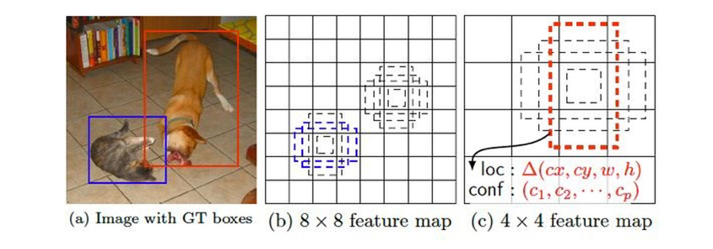

图1.9: SSD 的多尺度先验框预测

通过上面的改进，SSD 提高了速度，同时也提升了准确率，另外还对于低分辨率图像也能有较好的预测结果。

#### YOLO v2

YOLO v2 是对YOLO v1 的改进版本。论文中叫做YOLO9000，因为它可以识别9000+ 的类别的物体。

YOLO v2 的主要改进为以下几个方面：

对所有卷积层增加了BN（BatchNorm）层。

用高分辨率的图片fine-tune 网络10 个epoch。

通过k-means 进行聚类，得到k 个手工选择的先验框（Prior anchor box）。这里的聚类用到的距离函数为1 - IoU，这个距离函数可以很直接地反映出IoU 的情况。

直接预测位置坐标。之前的坐标回归实际上回归的不是坐标点，而是需要对预测结果做一个变换才能得到坐标点，即x = tx × wa − xa （纵坐标同理），其中tx 为预测的直接结果。从该变换的形式可以看出，

对于坐标点的预测不仅和直接预测位置结果相关，还和预测的宽和高也相关。因此，这样的预测方式可以使得任何anchor box 可以出现在图像中的任意位置，导致模型可能不稳定。在YOLO v2 中，中心点预测结果为相对于该cell 的角点的坐标（0-1 之间），如下：

多尺度训练（随机选择一个缩放尺度）、跳连层（paththrough layer）将前面的fine-grained 特征直接拼接到后面的feature map 中。

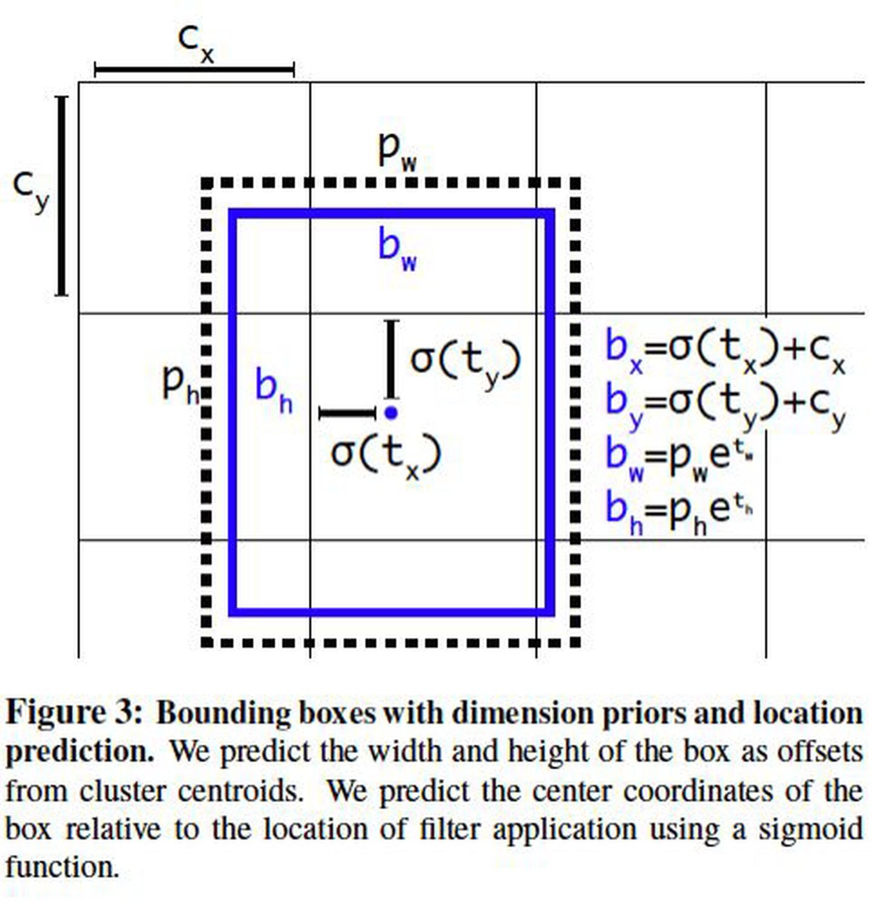

图1.10: YOLO v2 预测bbox 的坐标

YOLO v2 的backbone 被称为**Darknet-19**，共有19 个卷积层，间以Maxpool。其中，3x3 conv filter 和1x1 conv filter 交替的方式被采用。最后利用一个Avgpool（GAP，Global Average Pooling）输出预测结果。

除了上述对于模型结构以及训练过程的改进，**YOLO9000 的另一个亮点在于它利用了标签的层级结构（Hierarchy）**。由于ImageNet 的label 来自于WordNet，作者将WordNet 转化为了WordTree，预测的时候实际上预测的是条件概率，即如果属于父节点的概念（标签），那么他属于子节点的概率为多大。所以，对于某个叶子节点的类别，他的实际的预测概率是整个路径的预测值的乘积。

由于每个条件概率在对应的节点上应该归一（sum to one），所以，softmax 应该对该节点的所有类别进行，而非全部类别做softmax。这是利用WordTree 做标签训练的一个注意点。

#### FPN

FPN 全称Feature Pyramid Network，其主要思路是通过特征层面（即feature map）的转换，生成语义和低层信息都很丰富的特征金字塔，用于预测。

如图所示，(a) 表示的是图像金字塔（image pyramid），即对图像进行放缩，不同的尺度分别进行预测。这种方法在目标检测里较为常用，但是速度较慢，因为每次需要对不同尺度的图像分别过一次CNN 进行训练。(b)表示的是单一feature map 的预测。由于图像金字塔速度太慢，索性直接只采用最后一层输出进行预测，但这样做同时也丢失了很多信息。(c) 表示的是各个scale 的feature map 分别进行预测，但是各个层次之间（不同scale）没有交互。SSD 模型中就是采用了这种策略，将不同尺度的bbox 分配到代表不同scale 的feature map上。(d) 即为这里要将的FPN 网络，即特征金字塔。这种方式通过将所有scale 的feature map 进行打通和结合，兼顾了速度和准确率。

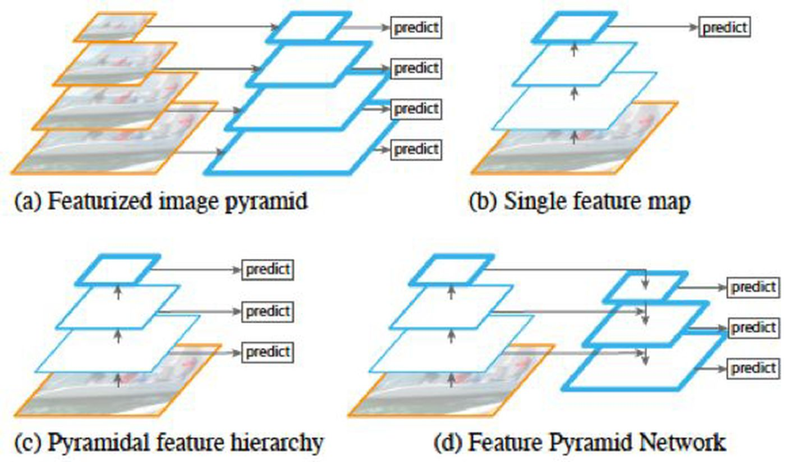

图1.11: 图像、特征金字塔的处理方式对比

 

FPN 在每两层之间为一个buiding block，结构如下：

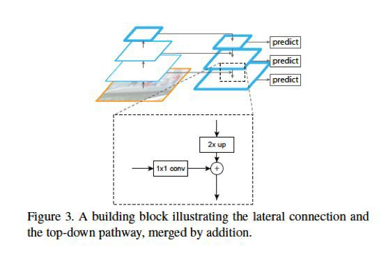

图1.12: FPN 特征金字塔结构

FPN 的block 结构分为两个部分，一个自顶向下通路（top-down pathway），另一个是侧边通路（lateral pathway）。所谓自顶向下通路，具体指的是上一个小尺寸的feature map（语义更高层）做2 倍上采样，并连接到下一层。而侧边通路则指的是下面的feature map（高分辨率低语义）先利用一个1x1 的卷积核进行通道压缩，然后和上面下来的采样后结果进行合并。合并方式为逐元素相加（element-wise addition）。合并之后的结果在通过一个3x3 的卷积核进行处理，得到该scale 下的feature map。

#### RetinaNet

RetinaNet 的最大的贡献不在于网络结构，而是在于提出了一个one-stage 检测的重要的问题，及其对应的解决方案。这个问题就是one-stage 为何比two-stage 的准确率低，两者的区别在哪里？解决方案就是平衡正负样本+ 平衡难易样本的focal loss。下面详细介绍。

首先，RetinaNet 的作者发现，two-stage 和one-stage 的目标检测方法的一个很大的区别在于：two-stage的方法通过SS 或者RPN 给出了一些预先选好的先验框，这个数量一般是1 2k 左右，从而保证正负样本的比例大概在1:3 左右。而在one-stage 方法中，这个过程被省略了，导致负样本比例大约为100k 的量级。这样悬殊的正负样本比例，使得在训练one-stage 模型的过程中，那些容易区分的负样本占据了主导地位，而难分的正样本（我们更关注的）则不太容易得到较好地训练。

基于这个发现，作者设计了一种新的损失函数的形式，以取代普通的分类问题中的交叉熵损失。Focal loss 的数学形式如下：

$FocalLoss(p_t) = -\alpha(1-p_t)^\gamma \log(p_t)$

其中，alpha 表示正负样本的权重系数，这个在处理正负样本不均衡的情况下是常用的方法。

pt 当实际label 为1 时，取值为p（即输出的正样本预测概率），当实际label 为0 时，取值为1-p（实际上表示负样本的概率）。可以看出，pt 表示的是预测出的真实值的概率。因此，(1 − pt) 表示的就是预测结果距离真实结果的差距。比如，本来应该是正样本，预测应该为1，此时如果p=0.8，那么说明还有0.2 的差距。类似地，对于负样本，应该预测为0，如果此时p=0.3，则差距为0.3。

这个差距实际上度量的就是该样本可分性的难易程度。差距越大，说明该样本越难分。于是，我们将该差距作为系数（进行了幂次处理后），和前面的正负样本权重系数一起，组成新的权重。这样一来，这个损失函数一方面调整了正/负样本之间的不均衡，还兼顾了难/易样本之间的不均衡。

指数参数γ 叫做聚焦参数（focusing parameter），它控制着难易样本权重的差别程度。比如，当γ = 2 时，预测结果为0.9 的正样本的系数仅为0.01，而预测结果为0.6 的正样本的系数为0.16。相差16 倍。如果指数为1，那么差距仅为4 倍。

RetinaNet 的网络结构沿用了FPN 的基本构件，并且设计了分类子网络和回归自网络，分别进行类别预测和bbox 回归。如图：

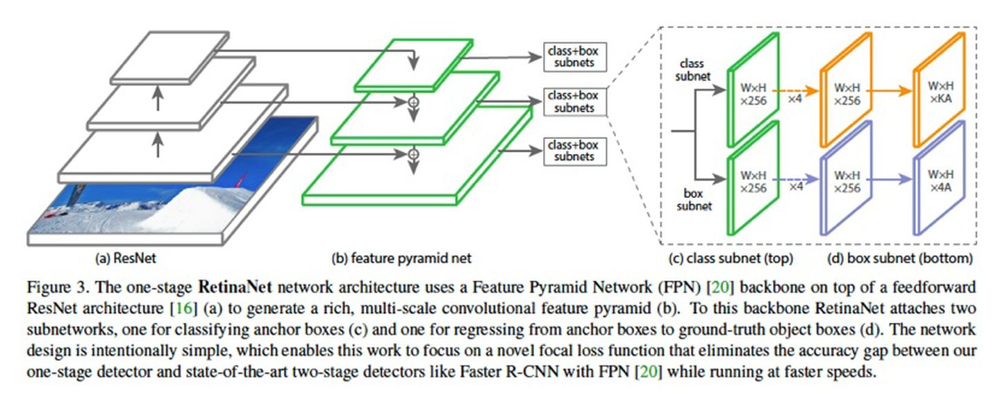

图1.13: RetinaNet 网络结构

#### Mask R-CNN

Mask R-CNN 顾名思义，是为每个目标物体生成一个mask。本模型将实例分割（instance segmentation）与目标检测（object detection）两个任务相结合，并在两个任务上都达到了SOTA。

Mask R-CNN 的基本结构如下：

整个过程的pipeline 如下：首先，输入图片，根据RoI 进行RoIAlign 操作，得到该区域内的特征，然后将该特征feature map 进行逐点sigmoid（pixel-wise sigmoid），用于产生mask。另外，还有一个支路用于分类和回归。

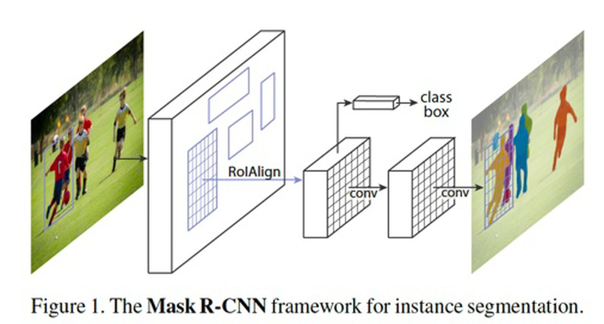

图1.14: Mask R-CNN 网络结构

Mask R-CNN 中的分类和mask 生成之间是解耦的。这种方式和常见的直接对所有类别做逐像素的softmax不同。

下面介绍**ROIAlign**。ROIAlign 的基本出发点是在ROI pooling 中的两次量化（quantization）。第一次是从原图的bbox 映射到feature map 的时候，由于尺寸不一致，需要缩放，并对准像素点（取整），此为第一次量化。第二次是根据fixed length 特征向量，计算pooling 的步长的过程中，由于可能会除不尽，从而需要再一次地取整。这两次量化使得最终的结果与原图差异较大，位置不准。因此，提出RoIAlign 进行改进。

ROIAlign 的基本过程如下：如图，首先对一个不定尺寸的ROI 进行切分，完全平均分为四块，此时可能分割点不是整数（没有落在某个像素上），然后，在每个小块内平均地取四个点，这四个点也不需要是整数。取出这四个点的值，对于不落在实际像素点上的点的情况，通过插值方法根据四周像素点的值进行计算。计算完毕后，每个块内取其四个值的max，类似max pool，得到每个块的输出值。这样即可得到一个2x2 的输出结果。

Mask R-CNN 的损失函数由三个部分构成，分别是cls、reg 和mask。

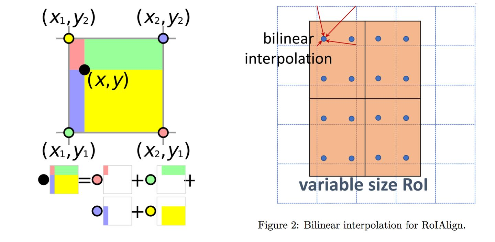

图1.15: ROIAlign 原理（https://tjmachinelearning.com/lectures/1718/instance/instance.pdf）

#### YOLO v3

YOLO v3 是针对YOLO 模型的又一次改进版本，如作者自称，是一个incremental improvement，并无太大创新，基本都是一些调优和trick。主要包括以下几个方面。

1. 用单类别的binary logistic 作为分类方式，代替全类别的softmax（和mask R-CNN 的mask 生成方式类似）。这样的好处在于可以处理有些数据集中有目标重叠的情况。
2. YOLO v3 采用了FPN 网络做预测，并且沿用了k-means 聚类选择先验框，v3 中选择了9 个prior box，并选择了三个尺度。
3. backbone 做了改进，从darknet-19 变成了darknet-53，darknet-53 除了3x3 和1x1 的交替以外，还加入了residual 方法，因此层数得到扩展。

#### 目标检测模型改进思路总结

最早的目标检测方法实际上就是图像分类方法，只是以ROI 中的区域代替整图进行，如R-CNN，过程为：选区域-CNN 提取特征-SVM 分类。然后，考虑到重复计算的冗余，SPP-net 提出，用空间金字塔池化，即自适应stride 的池化，保证任意大小都能得到定长特征向量。然后是Fast R-CNN，沿用了ROI pooling 的思路，并且加入了新的改进，即多任务学习，直接网络端到端回归bbox，并进行分类，去掉了SVM。到此为止，模型已经确定了，只是ROI 的方法还是利用Selective Search，导致预处理速度较慢，拖慢了整体的速度。因此，Faster R-CNN 引入了一个和检测网络共享部分权重的RPN 网络，用网络进行region proposal，从而提高了整体的效率，去掉了Selective Search。

上述的方法都是two-stage，即先给出候选框，然后在进行分类和微调位置。于是，另一种新的思路，即直接进行预测bbox 和类别，这就是one-stage 的方法。代表就是YOLO 模型，通过对图像划分成多个区块，直接输出一个和区块数相同的tensor，每个区块的预测向量里包含了其是否有目标，是什么类别，以及具体位置的修正。SSD 基于YOLO 的基本思路，考虑了多尺度的情况，将不同尺度的GT bbox 分配到不同尺度去预测，不同尺度的预测即通过不同层的feature map 进行。后续的YOLO v2 提出了对位置的直接预测方法，以及用k-means 聚类来手工得到先验框的方法，并利用darknet-19 作为backbone 网络。FPN 网络的基本思路是将不同尺度的feature map 通过网络连接的方式进行融合，并在每一层进行预测，从而可以利用不同尺度的信息。

RetinaNet 基本沿用了FPN 的思路，但是提出了focal loss 来处理样本比例不均衡的问题，对数量较少的正样本，以及难分样本给予较多的关注。Mask R-CNN 将实例分割与目标检测进行结合，融合了分类、回归、mask三个损失进行优化。YOLO v3 采用了具有residual 模块的darknet-53 作为backbone，并且用了binary logistic代替全局softmax，以及FPN 网络等trick，提升了性能。

