Video Denoising 经典模型梳理

**CONTENTS**

- Deep Burst (ECCV 2018) 利用RNN捕捉前后帧联系

- DVDnet (ICIP 2019) 先空域滤波再时域滤波

- Non-Local Video Denoising by CNN （CVPR 2019）non-local搜索+CNN
- ViDeNN （CVPR 2019）盲去噪，噪声建模模拟

- FastDVDnet （CVPR 2020）end-to-end，Unet代替光流估计
- EMVD（CVPR 2021）轻量化视频去噪，DWT+正交kernel+前后帧融合

---

##### Deep Burst Denoising

ECCV 2018 paper

本文main idea：利用RNN的结构去capture前后帧之间的联系。将image denoising问题转化为一个video denoising问题，并对所有帧进行恢复。

burst 指的是短时间内拍摄的多帧相同的图片（可能有少量的位移），用于提高信噪比。

由于对于低光情况下，信噪比低是由于光子数量少，那么，增加曝光时间就可以提高光子数量，从而提高SNR。但这种思路现实中不可行，因为增加了曝光时间会引入两个新的问题，1. 高光强的地方过曝；2. 快门时间越长，设备不稳定性越大，容易有模糊。因此，采用了burst，即 短曝光时间+多帧图片+算法融合 的方法来解决这个问题。

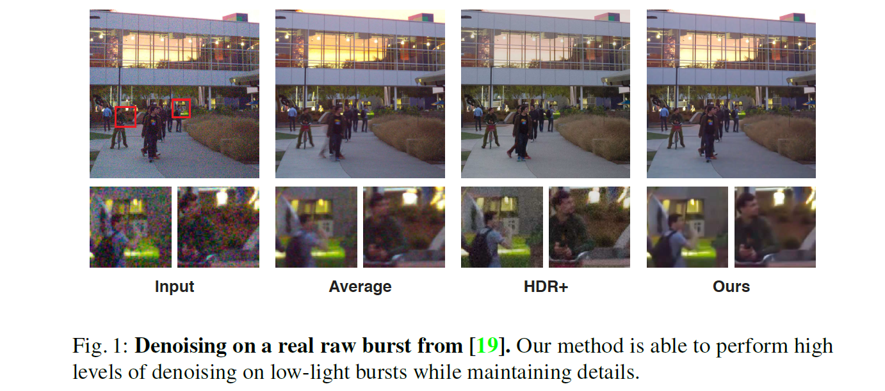

本文虽然说是为了更高信噪比的图像而采用的burst，但是在method部分，作者指出他们的target是将其作为视频恢复的任务，即不只是denoise一个reference image，而是所有frame。而且希望可以generalize到any frame number，并且对motion robust，以及保持temporal coherence。

模型的基本结构：

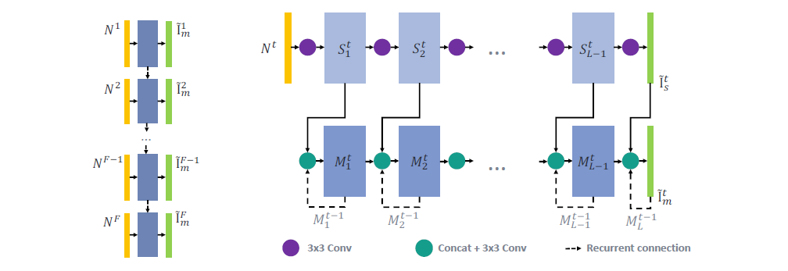

结合上图，参考代码：https://github.com/pminhtam/DeepBurstDenoising/blob/master/train.py （unofficial），可以看出，对于多帧图像（视频），可以采用SFD（single）或者MFD（multi），即单帧分别训练，以及多帧训练。对于单帧训练，输入即为当前 t 的 image，输出为当前 t 的denoised。对于多帧训练，输入为当前 t 的 image 再加上上一帧的 feature list，其中包含了上一个时刻（t-1）的网络每层的output。

参考上图，一个多帧的denoise模型需要输入当前的image和上一帧的所有feature，并且将本时刻的feature与上一时刻的feature根据层的level对应结合。另外，上一层的前一帧和当前帧的feature融合后，还要一起送入下一层。本时刻最后，只需要输出一个融合后的结果即可。这些conv层都是对不同时刻权重共享的，因此这个是一个多层的RNN。本方法就是通过RNN的结构，学习帧之间的temporal相关性。

loss为：

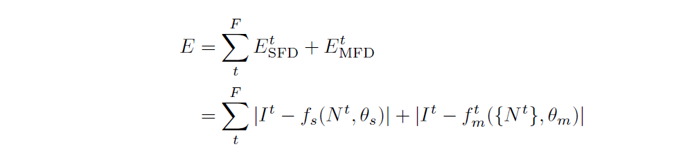

也就是结合了SFD和MFD的损失函数，都采用了 l1 loss（MAE）。

训练方法：先训SFD，即单帧训练（大部分都是采用这样的两阶段训练方法），然后将训练好的作为initialize，去训练MFD。

本文源码基于caffe，不过好像没有开源。

---

##### DVDnet: A Fast Network for Deep Video Denoising

ICIP 2019

主要思路：先空间滤波，再时间滤波。空间滤波相当于做 image denoising，需要光流估计进行多帧合并。（需要noise map）

code：https://github.com/m-tassano/dvdnet

基本思路：分为两个stage：空域滤波（frame-wise的去噪），得到的结果经过warp后concat送入 时域滤波（temporal），最终一个frame seq 只负责生成中间那一帧的denoise结果。

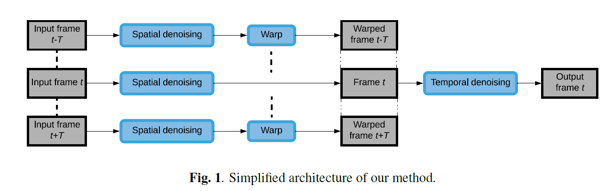

两个 denoising block 结构简单，类似DnCNN或FFDNet的无pool全卷积结构。

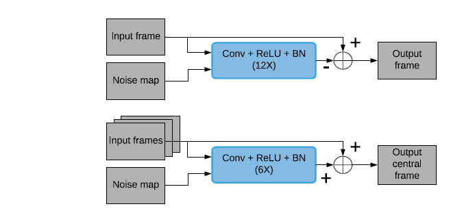

训练的tricks：

- spatial 和 temporal 两个网络分别训练，spatial的训练只需要image数据集即可，temporal需要多帧视频数据集。
- 训练需要切patch，并且输入noise map，非blind。
- warp 指的是通过光流估计进行处理，用的是DeepFlow。用于对齐有变化的临近frame。
- 训练前面的几十个epoch的时候，需要对conv layer的weight进行orthogonality的约束，具体操作：对weight进行svd，然后去除U和V进行相乘，换到conv weight上，相当于强行令奇异值为1。code:

~~~python
def svd_orthogonalization(lyr):
	r"""Applies regularization to the training by performing the
	orthogonalization technique described in the paper "An Analysis and Implementation of
	the FFDNet Image Denoising Method." Tassano et al. (2019).
	For each Conv layer in the model, the method replaces the matrix whose columns
	are the filters of the layer by new filters which are orthogonal to each other.
	This is achieved by setting the singular values of a SVD decomposition to 1.

	This function is to be called by the torch.nn.Module.apply() method,
	which applies svd_orthogonalization() to every layer of the model.
	"""
	classname = lyr.__class__.__name__
	if classname.find('Conv') != -1:
		weights = lyr.weight.data.clone()
		c_out, c_in, f1, f2 = weights.size()
		dtype = lyr.weight.data.type()

		# Reshape filters to columns
		# From (c_out, c_in, f1, f2)  to (f1*f2*c_in, c_out)
		weights = weights.permute(2, 3, 1, 0).contiguous().view(f1*f2*c_in, c_out)

		# Convert filter matrix to numpy array
		weights = weights.cpu().numpy()

		# SVD decomposition and orthogonalization
		mat_u, _, mat_vh = np.linalg.svd(weights, full_matrices=False)
		weights = np.dot(mat_u, mat_vh)

		# As full_matrices=False we don't need to set s[:] = 1 and do mat_u*s
		lyr.weight.data = torch.Tensor(weights).view(f1, f2, c_in, c_out).\
			permute(3, 2, 0, 1).type(dtype)
	else:
		pass
~~~

- 用了data aug，主要包括 rescale + flip

实验结果：

与 V-BM4D 和 VNLB 进行了对比，结果表示再low noise的情况下VNLB会由于DVDNet，因为dvdnet容易over-smooth。其他噪声强度下，dvdnet更好。

dvdnet的速度与同等级performance的传统方法比，有数量级的提高。但是整体效果比较慢。GPU 每帧约 8s。分析后发现 8s 中有 6s 是由于motion compensation。（可以看出运动补偿制约速度较大，需要考虑替代方案。）

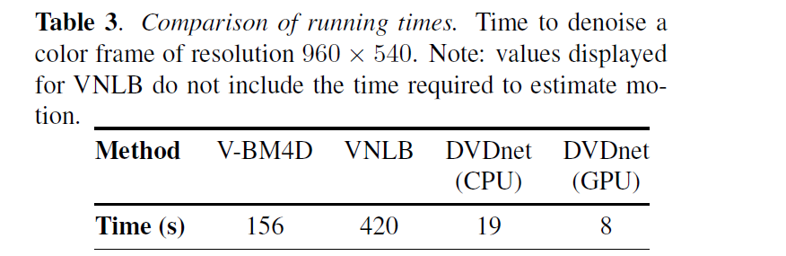

---

##### Non-Local Video Denoising by CNN

CVPR 2019

主要结构： non-local search + DnCNN

code：https://github.com/axeldavy/vnlnet

pipeline如下：

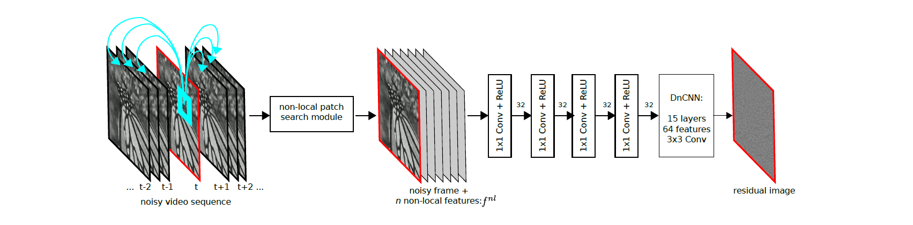

实现方式：首先，对video各帧进行预处理，找到non-local 相似的patch，作为feature vector 附加在原noisy图像后面。将这个通道数增加后的 image 过一个1x1 conv，相当于对non-local patch进行一个融合，再DnCNN，得到结果。

得到 non-local patch 的操作：对 video 中的每个位置（x, t），找到一个 3D 窗口，设置一个 temporal 和 spatial 的 window size，找到最相似的 n 个 patch，将这些patch 的 center 与 目标像素 concat起来，得到 n+1（如果 grayscale）个channel的新输入。将这个输入进行DnCNN操作即可。

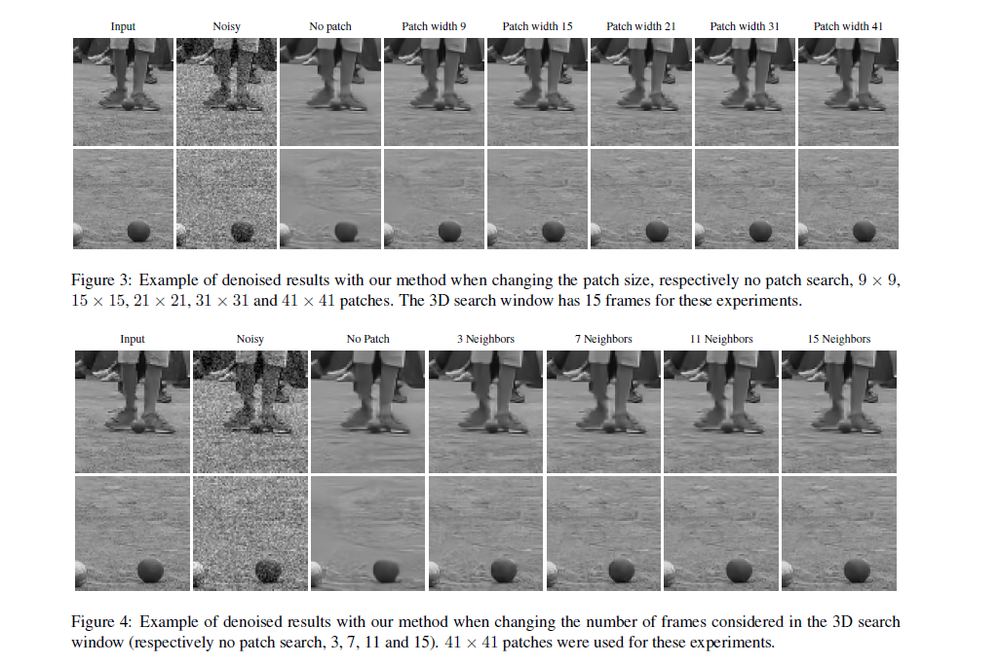

一些实验结果 ↑ ，改变temporal 和 spatial 的滑动窗口尺度。

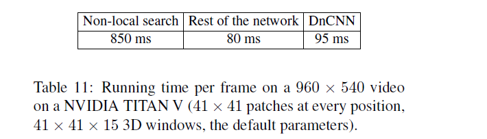

时间消耗主要再 non-local search 方面。代码中作者也进行了工程实现上的加速。

训练details：

对non-local patch search预先算好，然后只用能够取到3D patch的那些部分（首尾去掉），test phase直接将首尾mirror一下即可算全序列。学习率策略为 step lr。

一个实验，oracle即用clean image做non-local匹配（但是取出pixel还是noisy的），得到的结果如下：

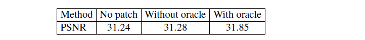

也就是说，如果匹配的更准确，效果也会更好。

---

##### ViDeNN: Deep Blind Video Denoising

cvpr 2019 

数据集：http://ivc.uwaterloo.ca/database/WaterlooExploration/exploration_database_and_code.rar 

主要思路：本方法是 blind denoising，即对于噪声分布blind的盲去噪。

速度慢，titan X HD video速度只有 3fps。

**！！！ 另，本文对real image中的光子散射噪声（Photon shot noise）和读出噪声（read noise）进行了模拟，给出了公式和以sony sensor为例的具体的参数。可供参考。**

噪声建模，简单来说是 Y = X + N，对于低光情况，噪声是与signal相关的，并且在 dark regions 更加明显，此时建模成 Y = H(X) + N。

模型结构如下：

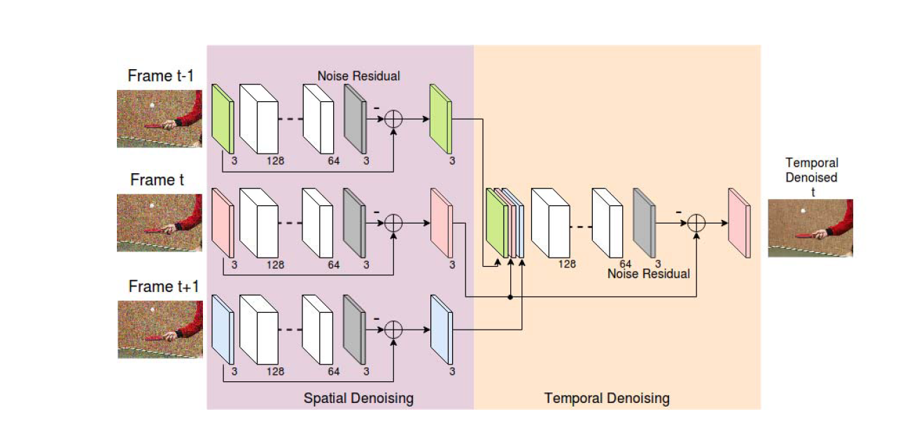

先对各个frame利用residual learning（DnCNN-like）的结构进行去噪，得到各frame的clean estimation，然后将3-frame进行整合，用于训练中间frame的clean estimation。相当于一个spatial一个temporal两个stage结合。训练loss 函数就是 MSE。

可以看出，这个模型的结构设计上比较简单直观。但是另一个创新点在于blind，即盲去噪。由于real noisy image含有H(X)部分，即与signal相关的noise，因此只用AWGN来模拟的噪声再实际使用中flexibility会受限制。因此，这里模拟了两种噪声：photon shot noise（PSN，光子散粒噪声）和 read noise（读出噪声）。公式如下：

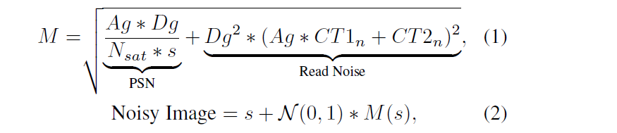

作者还实验说明了，通过AWGN训练的结果应用到合成的 real noise 上结果不佳。如下图：

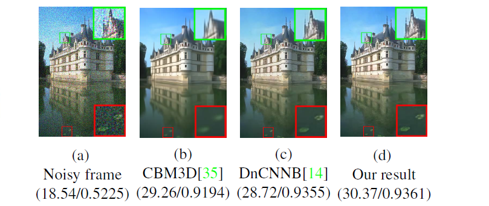

后面的一个stage被称为Temp-3 conv net，因为用了3 frames。作者提到增加融合的frame并不会涨点，最终用了3个。

训练过程分为两步，先训练spatial（按图像的方式），然后训练temporal（采多帧数据），不是end-to-end的。训练时加的噪声有AWGN也有模拟的真实噪声。

实验的部分结论如下：

- 直接temporal比只用spatial的结果还要差，spatial+temporal效果最好。
- 顺序先spatial再temporal 优于 先 temporal 再 spatial。
- 增加frame数（temporal）影响不大，但是增加了计算量。

最后，本方法的一个缺陷是效率低，titan X HD video速度只有 3fps。

---

##### FastDVDnet: Towards Real-Time Deep Video Denoising Without Flow Estimation

main concern：去光流估计（利用另一个多帧的unet绕过了光流估计与运动补偿），提高模型计算速度（也需要noise map）

code：https://github.com/m-tassano/fastdvdnet

图像与video去噪的区别：video可以利用的信息更丰富；video的去噪结果需要保证temporal coherence；对于常见camera，图像分辨率高，需要fast and efficient 的model。

fastdvdnet 为了提速，去掉了motion estimation的过程。对应于dvdnet的2-stage中先image（spatial，需要根据flow做warp）后temporal的思路，将spatial的过程也变成多帧，并且将DnCNN的block变成unet，希望可以自适应处理这种帧间差异和运动补偿。

fastdvdnet 与之前的 dvdnet 的主要区别：

- end-to-end 训练，不再是分开训练。
- unet代替dncnn，主要考虑空间的shift-invariance。
- 上采样用了 pixel-shuffle方法（类似vision transformer里上采样的方式，即将各通道的同一个像素作为空间邻域拼接）

fastdvdnet中经过ablation test验证过的几个操作：

- unet优于dncnn（dvdnet中的block）
- 2-stage优于直接5-frame输入denoise block的1-stage方法
- BN有用，~ 0.2dB
- 多帧融合，5-frame已经够用，增加帧数无明显效果。

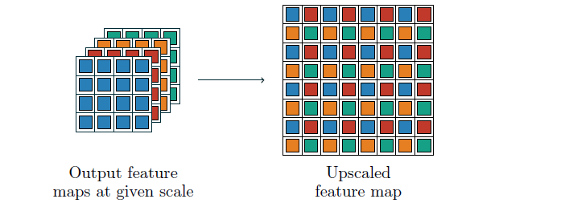

upscale 方法，来源于另一篇 ESPCN 模型。

---

##### Efficient Multi-Stage Video Denoising with Recurrent Spatio-Temporal Fusion

华为诺亚，cvpr 2021

- 思路与目的：

对于无reference的实际噪声视频数据进行去噪。充分利用时空域相似性信息。并通过对kernel进行orthonormal的约束，使其可解释，即可以实现变换和反变换。

unofficial code for ：Efficient Multi-Stage Video Denoising with Recurrent Spatio-Temporal Fusion

https://github.com/Baymax-chen/EMVD

基本思路：利用上帧denoised结果与当前帧noisy结果进行当前帧的denoise。

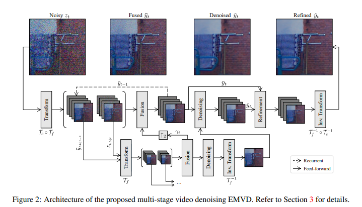

如图所示，主要有三个阶段：Fusion、Denoising、Refinement。

其中，fusion是和上一帧的fused结果和当前的noisy进行fuse（整个过程来看，fusion是一个recurrent的形式做的），通过加权求和的方式，主要用来区分静态和动态的区域，加权的weight map由FCNN得到：

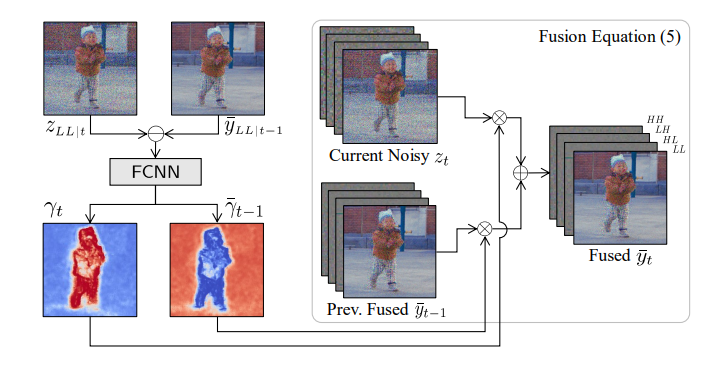

然后是denoise，将fused结果进入到DCNN，进行去噪。去噪后的结果在和去噪前的输入进入RCNN，进行refine，主要是回填一部分细节和纹理。

最后，EMVD还用到了类似小波变换的方式进行下采样和融合，利用多尺度信息，类似MWCNN。