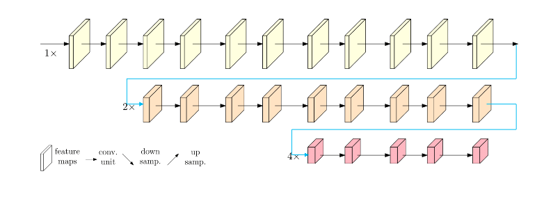
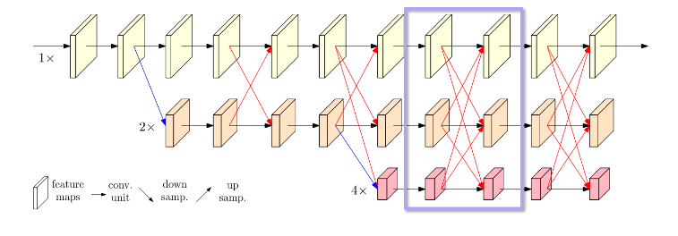
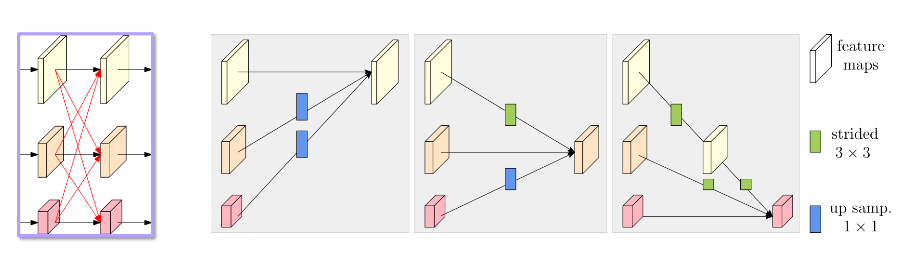
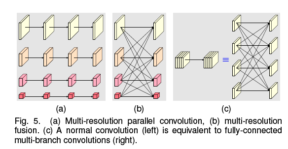
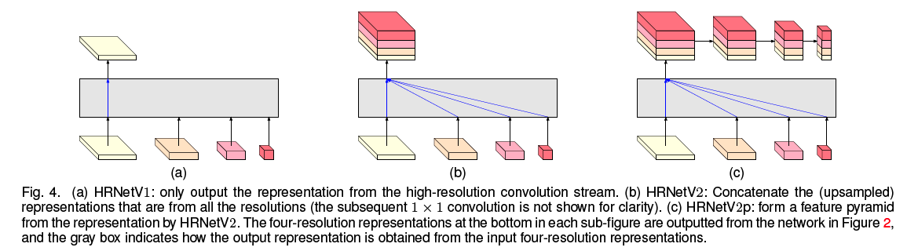

HRNet，作为像素级任务与的backbone网络。

> ref: Wang J, Sun K, Cheng T, et al. Deep high-resolution representation 
> learning for visual recognition[J]. IEEE transactions on pattern 
> analysis and machine intelligence, 2020.
>
> Slides: http://valser.org/webinar/slide/slides/20190828/HRNet-Valse08282019-jingdong%20wang.pdf

 

HRNet的文章。创新点：基本结构采用**并联降采样融合**。基本的concept：maintain rather than recover。

 传统的分割网络的encoder都是串行操作，进行降采样，然后通过decoder恢复，如图

HRNet的改进在于，在网络go deeper的过程中保留了高分辨率的feature map，将降采样视为并行分支，并且在不同分辨率的feature map之间进行融合，如图：

3个compoents：**parallel multi-res**，**multi-res fusion**，**representation head**。

多尺度fusion操作的实现方式：

 

**对于小尺寸到大尺寸：bilinear上采样+1x1 conv**

**对于大尺寸到小尺寸：stride=2 3x3 conv**

 

 

 

作者对hrnet中的parallel卷积和multi-res fusion进行了分析。首先，parallel 卷积可以看出是一个各个通道之间的分辨率不一样（尺寸不同）的一个feature map的分组卷积，即只跟自己的尺寸一样的部分进行卷积，按尺寸分组。那么，分组卷积有1x1xc的kernel来打通各个通道之间的信息，而hrnet中的fusion正好可以看做这样的操作。Fusion过程类似正常的卷积。或者说，正常的卷积可以表示成fusion的形式，如（c）。

所以，hrnet的并联和融合，可以看做是不同尺寸的多通道的分组卷积，或者说分组卷积在不同尺寸多通道feature map上的拓展。

Representation head的三种形式：直接取出最大尺寸、进行多尺度（resize后）的concate、形成一个feature pyramid。三种方式分别称为hrnet v1，v2，v2p

 

