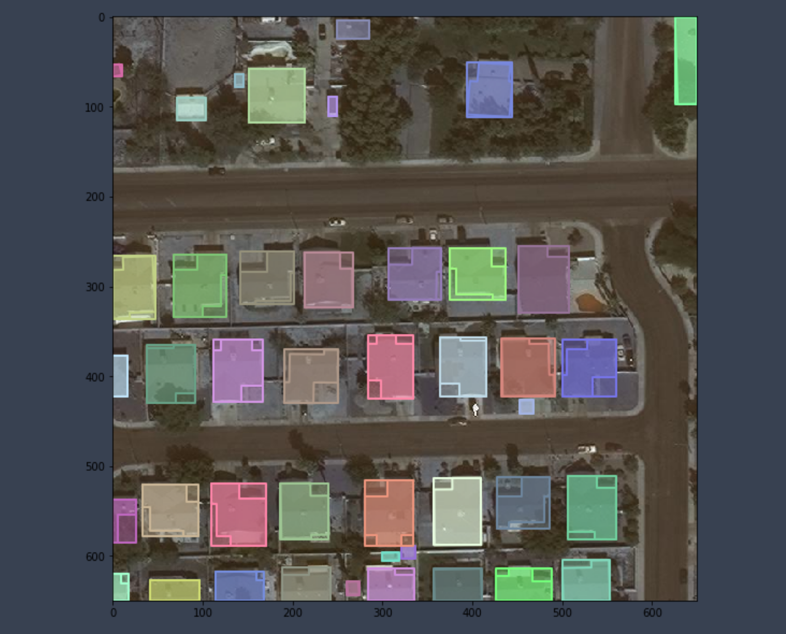

#### pycocotools基本功能的使用方法

pycocotools是针对COCO格式数据集设计的专用api模块，用于加载和解析coco类型数据，主要的api如下：（ref：https://github.com/cocodataset/cocoapi/blob/master/PythonAPI/pycocotools/coco.py）

~~~python
# The following API functions are defined:
#  COCO       - COCO api class that loads COCO annotation file and prepare data structures.
#  decodeMask - Decode binary mask M encoded via run-length encoding.
#  encodeMask - Encode binary mask M using run-length encoding.
#  getAnnIds  - Get ann ids that satisfy given filter conditions.
#  getCatIds  - Get cat ids that satisfy given filter conditions.
#  getImgIds  - Get img ids that satisfy given filter conditions.
#  loadAnns   - Load anns with the specified ids.
#  loadCats   - Load cats with the specified ids.
#  loadImgs   - Load imgs with the specified ids.
#  annToMask  - Convert segmentation in an annotation to binary mask.
#  showAnns   - Display the specified annotations.
#  loadRes    - Load algorithm results and create API for accessing them.
#  download   - Download COCO images from mscoco.org server.
# Throughout the API "ann"=annotation, "cat"=category, and "img"=image.
# Help on each functions can be accessed by: "help COCO>function".
~~~

下面分类介绍各种常用api

#### 各种id的获取

~~~python
from pycocotools.coco import COCO
# 配置好数据集路径
root_dir = "./dataset"
json_name = "spacenet_building_train.json"
img_path = "train_imgs"
anno_file = os.path.join(root_dir, json_name)
# 开始加载数据集
coco = COCO(anno_file)
~~~

此时应该返回如下结果：

~~~python
loading annotations into memory...
Done (t=8.06s)
creating index...
index created!
~~~

表示数据集的标注都已经被load进内存了，下面可以针对该标注文件进行各种操作。比如获取类别id

~~~python
# 获取数据集中的类别id
coco.getCatIds() # 此时返回的是所有category的id
# 获取指定名称的类别的id
coco.getCatIds(catNms="Cat") # 此时返回名字为cat的类别对应的id
~~~

有了类别id，可以将所有含有该类别的image的id提取出来。

~~~python
imgIds = coco.getImgIds(catIds=[1])
~~~

获得的是含有类别1的image的id，格式为list，根据image的id，可以找到它对应的所有的annotation的id，如下：

~~~python
annIds = coco.getAnnIds(imgIds=imgId)
~~~

所有getXXIds类的api基本都是以一个id作为输入，然后返回对应的id列表。

#### load类api

获取了id之后，下一步的任务一般就是根据id将对应的object进行load。比如加载image id对应的图像的信息，anno id 对应的annotation的信息。如下：

~~~python
# 根据image id加载image info
imgInfo = coco.loadImgs(imgId)
# 根据image id加载anno info
# annIds = coco.getAnnIds(imgIds=imgId)
anns = coco.loadAnns(annIds)
~~~

#### 显示图像和对应的mask/bbox

~~~python
# 首先需要手动imread将图片读进来
imPath = os.path.join(root_dir, img_path, imgInfo['file_name'])                     
im = cv2.imread(imPath)
# 开始show
fig, ax = plt.subplots(figsize=(30, 30))
ax.imshow(im)
annIds = coco.getAnnIds(imgIds=imgInfo['id'])
anns = coco.loadAnns(annIds)
# 调用coco的api，showAnns，将bbox和mask叠加在image上显示
coco.showAnns(anns, draw_bbox=True)
plt.show()
~~~

显示结果类似下图：

