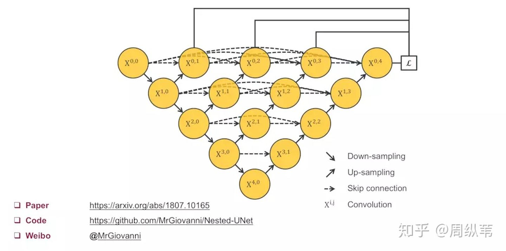
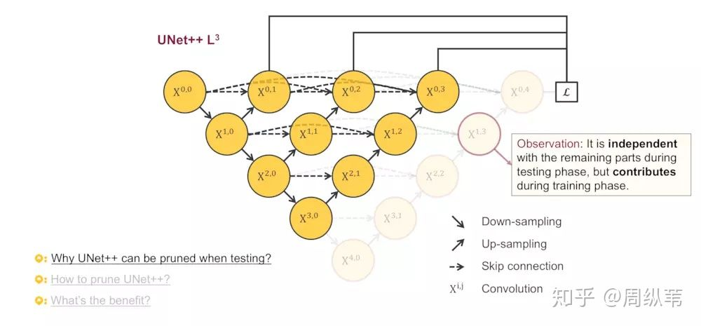

> UNet++: A Nested U-Net Architecture for Medical Image Segmentation

unet++结构：

对比unet：

Unet++，基于unet进行改进的网络，主要创新点是用**多次稠密逐级上采样+融合**替代unet的直接长距离跳线链接。本质上相当于融合了多个不同深度的网络的结果。

文章的主要insights：

1. 逐渐上采样，利用多尺度信息，并且可以形成结构内的ensemble（类似resnet、dropout等结构）。
2. 保留长距离链接，用于直接融合远距离feature map（类似原版unet）。
3. 多级loss融合，即deep supervision的方法。

该结构的另一个好处在于，可以根据validation的结果进行剪枝。如图：

被剪枝的部分用于train但不用于test，这样，即可在测试阶段对不同深度的输出结果进行评估，根据尺寸-精度trade-off选择最终test时真实需要的层数。

