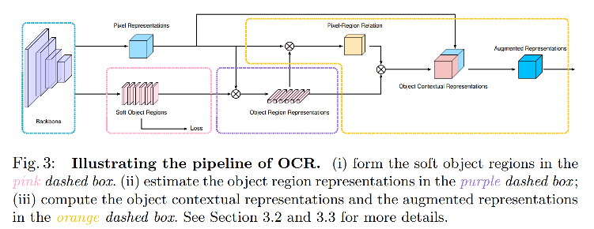

OCRNet，作为segmentation等任务的head。hrnet+ocr在seg任务中基本为当前sota模型（限CNN类模型）

> refer: Yuan Y, Chen X, Chen X, et al. Segmentation transformer:  Object-contextual representations for semantic segmentation[C]//European Conference on Computer Vision (ECCV). 2021, 1.

OCRnet，全称 object contextual representation。本方法的目的在于利用待分类的pixel和object之间的相似性，有针对性地利用周围的contextual信息，而不是像ASPP那样直接按照固定的pattern进行扩充感知范围。

> The motivation is that the class label assigned to one pixel is the category of the object that the pixel belongs to. 

OCRNet的网络结构：

 整个流程大致分为三个部分：

- Object region representations

提取目标区域的表征向量。这一个步骤是通过粗heat map大致估计出区间范围，然后找到每个区间的特征向量。类似于few shot中的提取segmentation map的prototype的过程。

- Object contextual representations

目标上下文表示。通过上一步，得到每个object（区间）的representation，然后将feature map的每个pixel用各个区间的representation加权表示。权重就是pixel和某个类别的相似度。

- Augmented representations

将上面得到的结果与原本的feature map concat起来，形成augmented feature map，用于后续的处理。

具体的实现过程如下：首先，soft object region是用真实的seg mask进行CEloss约束训练的，因此可以获得一个小尺寸的pred heatmap（每个类别一个），然后利用该heatmap对原本的特征加权平均，于是得到了每个类别的表示，即f_k。然后将feature map中的每个feature vector x 与 f_k 经过1x1 conv bn relu 后变换后做向量乘，再对于channel维度做softmax，得到每个点对于每个类别的权重/相似性/相关性，最后，将各个类别的表示f_k经过变换（这里的变换都是1x1conv bn relu），通过上面softmax过的权重加权后，即可得到各个pixel的新向量。**注意：此时的新向量已经融合了同区域/类别的所有点的信息，因此，OCR是一个具有类别差异的non-local的特征增强方法**。

其实，如果用transformer或者attention的机制来解释就更好理解了。ocr的作者后来在arxiv上更新了一版paper，增加了用transformer来解释的部分。如果从attention（transformer）的角度来解释的话，那就是首先用一个简单的heatmap选择出各类别的region，然后计算出一组f_k作为key和value（这里为简单理解，暂时不考虑各种1x1conv的变换），而feature map中的每个点作为query，与key做attn map，并对value加权，形成transformer的输出。最后，transformer的输出与CNN backbone的输出进行结合（concat），得到最终的融合后结果。

