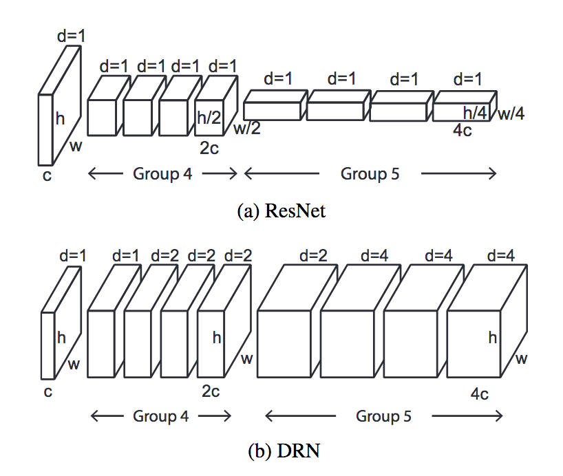
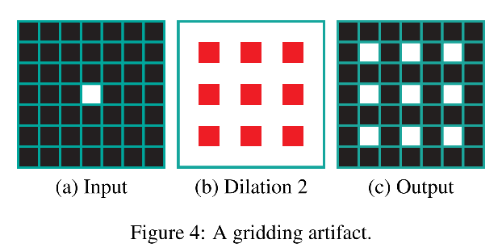
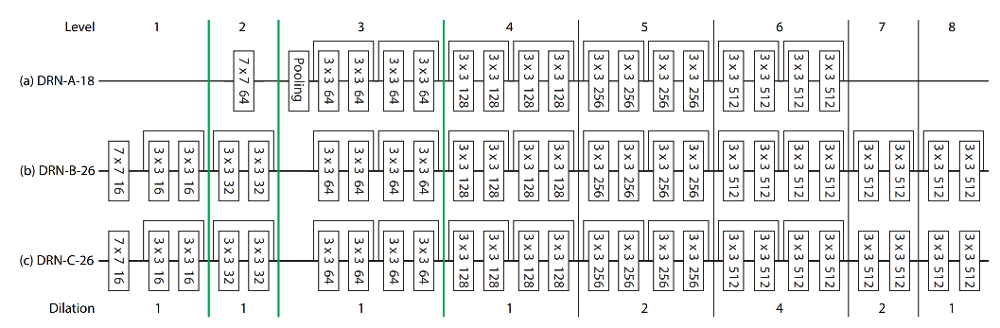

Dilated Residual Networks

https://arxiv.org/pdf/1705.09914.pdf

用dilated conv改造resnet，得到DRN。针对dilated conv引起的gridding问题，提出解决策略。

gridding artifact如下图：

如果输入中有高频成分，超过了dilation的采样率的话，比如图中的中间一个脉冲，经过dilated conv后，就会在有间隔的区域出现棋盘格样式的脉冲信号。

对于feature map因为dilated conv的棋盘格现象，作者根据观察和实验提出了三种修改方法：

1. remove max pooling：既然高频容易引发gridding现象，由于max-pooling操作会带来高振幅高频率的activation，因此，首先需要将max pool去掉，改成conv。
2. adding layers：通过在网络最后增加几层渐进的低dilation的卷积，用来改善gridding现象。
3. remove residual connections：为了让增加的新的conv layer起作用，还需要将跳线去掉，因为如果有跳线还是会有一部分artifact直接通过residual connection传过来。

改进方法如图：

DRN-C表示的就是改进后的结构，可以看出，前面的pooling被移除，后面增加了无跳线的卷积层。

