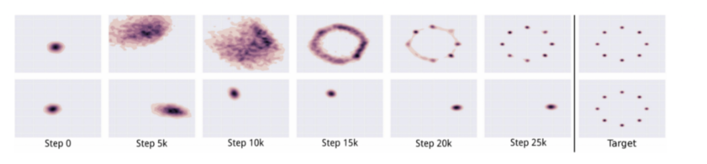
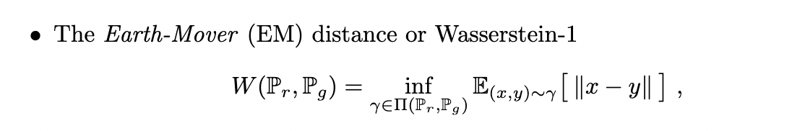
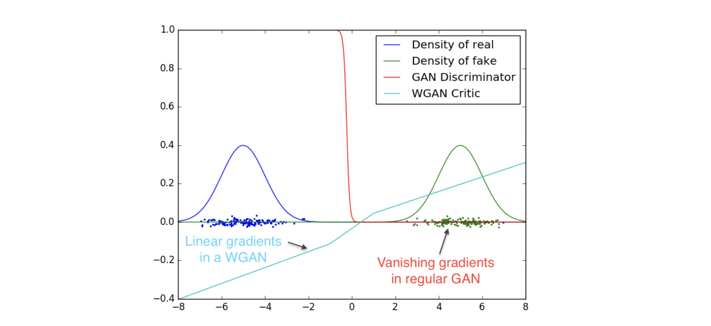
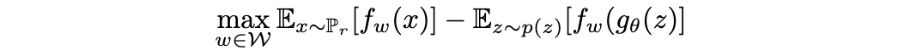
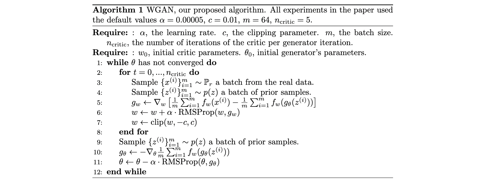

#### Wasserstein GAN 对原始GAN的改进

#### 目的（为什么要用wasserstein loss改进GAN）

首先，对于原始的GAN objective的分析可以看出，**当D确定后，G优化的实际上是一个JS散度**，这个指标在G(z)与x分布没有重叠的情况下，会造成梯度消失。而高维空间中，分布不重叠是极有可能的，因此，**原始GAN loss会造成梯度消失**。

另外，还有一种所谓的 - log D trick，即用-log D 去代替原始GAN loss中的 log(1-D)，这样的损失函数所最终推导出的结论是，它使得G去优化**KL - JS + const**，也就是说，KL和JS的作用是反向的，这并不是一个合理的objective，因为两者都是度量分布的差异。从而造成**训练不稳定**。另一个问题是，这个损失函数理论上对于Pg=0 且 Pr=1惩罚要很小，但是对于Pg=1且Pr=0惩罚极大。换句话说，对于真实分布中的点，如果没生成出来，没有什么惩罚；而对于不在分布中的点，如果生成出来了，也就是说生成了一个错误的点，那么惩罚非常大（inf）。这就导致网络更倾向于生成无用但安全的样本中的某些点（或者是mode），从而只保留了几个代表性的mode的生成能力，没有真正学到分布。这就是**mode collapse**。

#### Wasserstein距离度量的含义

Wasserstein距离又称为推土机（earth mover）距离，他表示的是：在两个分布的某个联合概率中，随机取一个点（x,y），求两者的差距，这个差距的期望在所有可能的联合概率中的下确界是什么。换句话说，假设pr和pg是两个土堆，将pr的土堆变成pg的土堆所最下可能的耗费是多少，这就是推土机距离。

在GAN的场景下，pr和pg就是real和generated两种图片。利用wasserstein距离的好处在于：它在两个分布不重叠的时候也有梯度，也就是说，它的梯度是光滑的，而非JS那样突变的。

但是，wasserstein距离有个inf，不好求解，于是通过对偶，转换为了sup问题，并进一步转换成了一个max问题：

这个转换需要一个lipschitz条件，即导数小于K。这个可以在网络中对weight进行clip实现对于梯度的限制。

最终的Wasserstein的算法流程图：

其中，gw和gtheta是D和G的梯度。可以看出，D和G两者的损失函数去掉了log操作。

#### WGAN代码的改动

1.  去掉了D的最后一层sigmoid，直接输出分数，与上面的loss对应。
2.  loss中去掉了之前交叉熵的log，直接对分数进行均值并优化。
3.  weight clip，保证Lipschitz条件。
4.  用无momentum的gradient descent方法。

