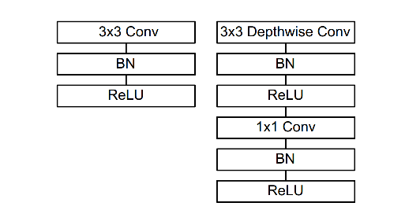
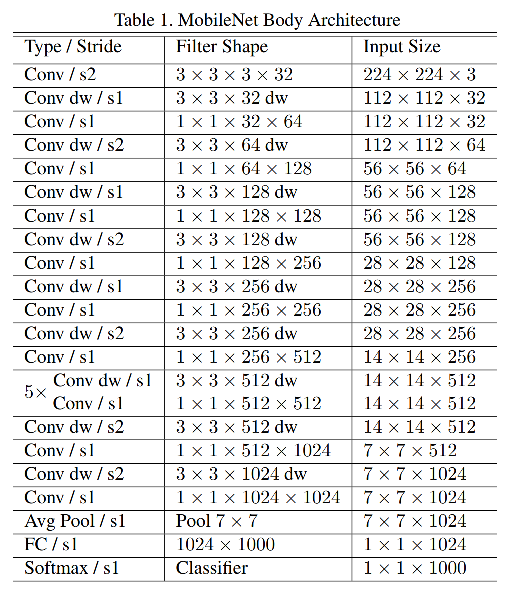
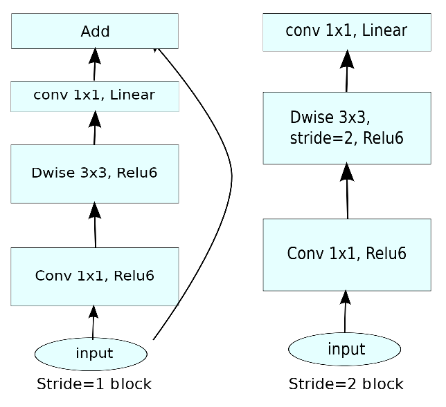
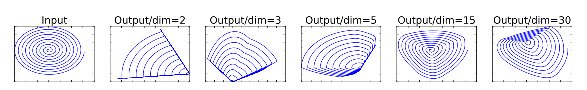
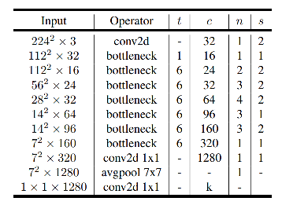
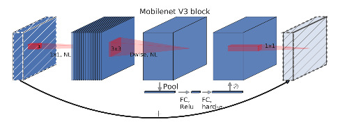
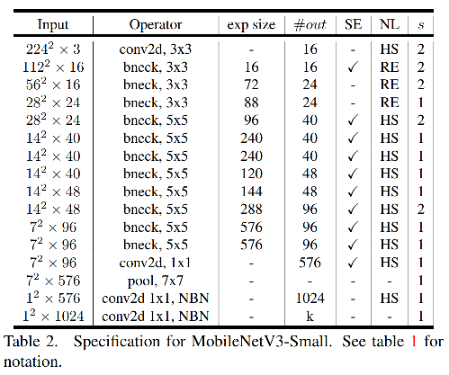
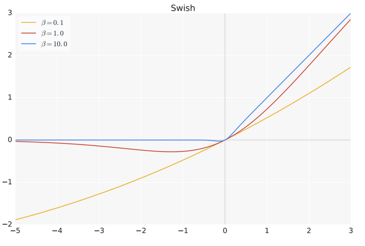
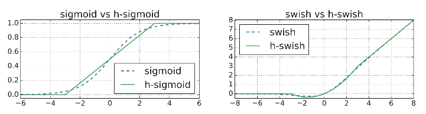
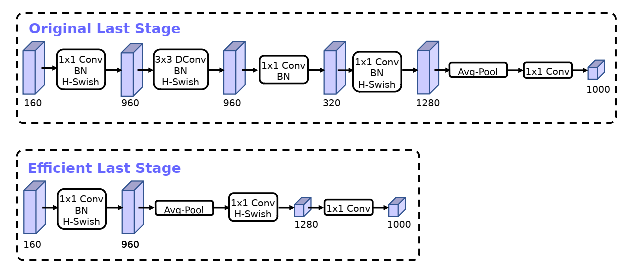

mobilenet v1 - v3

mobilenet系列轻量化模型，主要思路即通过对卷积操作中逐通道的conv拆分成depthwise和pointwise的组合，从而在接近原conv的效果的情况下降低参数量。

#### mobilenet v1

> ref : MobileNets: Efficient Convolutional Neural Networks for Mobile Vision Applications

mobilenet v1的核心思想就是用一个3x3 depthwise conv + 1x1 pointwise conv 来取代原有的直接进行3x3 conv操作。如图：

记输入feature map的通道数为M， 输出通道数为N，输入输出的尺寸都为F，kernel size为K，那么可以计算出计算量的压缩比例：

原始的conv：

$N \times M \times F^2 \times K^2$

改造后的conv：

$ depthwise: M \times F^2 \times K^2$

$pointwise: N \times M \times F^2$

压缩比例为：

$ratio = \frac{M \times F^2 \times K^2 + N \times M \times F^2}{N \times M \times F^2 \times K^2} = \frac{1}{N} + \frac{1}{K^2}$

通常来说，N为通道数，一般较大，K=3的话，后项为1/9。由于都需要遍历整个feature map的pixels，因此，参数量的压缩比例也是上述的值。可以看出，conv的复杂度的主要计算集中在通道相乘的操作上，depthwise conv 处理了通道相乘的问题，因此降低了计算。同理，mobilenet的主要计算量集中在1x1 conv上，因为该操作也有MN（通道数相乘）项。

mobilenet的整体网络结构如图：

除了以上改进外，为了适应工程上的需求，mobilenet还有两个参数可选：**width multiplier** 和 **resolution multiplier**。其中，width multiplier（alpha）的作用是对所有通道数进行等等比例放缩，由于1x1 conv中有通道数相乘，因此alpha也变成了平方，width multiplier可以以约 alpha 平方的比例降低参数量和计算量。而resolution multiplier（beta）乘在feature map的尺寸上，因此也是 beta 平方的比例，但是只降低计算量，参数量不受影响。

#### mobilenet v2

总结：mobile v2的关键点：

1. **inverted residual block**，先升维再降维，pw, dw, pw-linear。最后residual
2. **Pw-linear**操作降低relu对低通道数的feature map的信息损耗。

> ref：MobileNetV2: Inverted Residuals and Linear Bottlenecks
>
> ref : https://machinethink.net/blog/mobilenet-v2/

mobilenet v2的主要改动是设计了 **inverted residual block**。该结构也是沿用了depth conv + 1x1 conv结合的方法，由于与resnet中的block的维度变化正好相反，因此称为inverted。

在resnet block中，一般采用bottleneck结构，即先通过1x1 conv将通道数降低，然后再3x3 conv，最后再1x1 conv将通道数升回来。而inverted residual block则相反，首先通过1x1 conv将通道数升起来，然后做3x3的depthwise conv，最后再用1x1 conv将通道数降下去。如图：

左边为stride=1时的block结构，主要有pw，dw，pw-linear，以及residual add 4个步骤。其中激活函数都是relu6。而在stride=2的block中，只有pw和dw，pw-linear，没有跳线。

注意，这里最后一层采用pw-linear的原因在于：作者发现，在relu类激活函数下，对于低维度信息（通道数少）损失较大。实验如图：

对于一个2维的输入，首先经过一个随机矩阵嵌入到高维，然后经过一个relu，再用矩阵的逆矩阵将其变换回来。可以看到，当映射维度低时，relu对于信息的损失很明显， 而对于高维相对缓和。因为最终inverted res block的输出是低维的，所以直接去掉了relu，减少信息损耗。

为什么需要inverted res block？或者说为什么需要先升维？以为一般的降维bottleneck虽然降低计算，但同时也会压缩特征。而由于mobilenet用的是depthwise conv，因此，即使在维度较高的feature map操作，计算量也比较有限，因为没有通道数相乘的操作。所以，mobilenet v2采取了先升维扩数据信息，再降维减少计算量的操作。

mobilenet v2的整体网络结构：

t表示expansion rate，即inverted resblock升维的比率，c为channels，n为repeated times，s为stride。

inverted residual block的一个代码示例：（ref：https://github.com/tonylins/pytorch-mobilenet-v2/blob/master/MobileNetV2.py）

~~~python

class InvertedResidual(nn.Module):
    def __init__(self, inp, oup, stride, expand_ratio):
        super(InvertedResidual, self).__init__()
        self.stride = stride
        assert stride in [1, 2]

        hidden_dim = int(inp * expand_ratio)
        self.use_res_connect = self.stride == 1 and inp == oup

        if expand_ratio == 1:
            self.conv = nn.Sequential(
                # dw
                nn.Conv2d(hidden_dim, hidden_dim, 3, stride, 1, groups=hidden_dim, bias=False),
                nn.BatchNorm2d(hidden_dim),
                nn.ReLU6(inplace=True),
                # pw-linear
                nn.Conv2d(hidden_dim, oup, 1, 1, 0, bias=False),
                nn.BatchNorm2d(oup),
            )
        else:
            self.conv = nn.Sequential(
                # pw
                nn.Conv2d(inp, hidden_dim, 1, 1, 0, bias=False),
                nn.BatchNorm2d(hidden_dim),
                nn.ReLU6(inplace=True),
                # dw
                nn.Conv2d(hidden_dim, hidden_dim, 3, stride, 1, groups=hidden_dim, bias=False),
                nn.BatchNorm2d(hidden_dim),
                nn.ReLU6(inplace=True),
                # pw-linear
                nn.Conv2d(hidden_dim, oup, 1, 1, 0, bias=False),
                nn.BatchNorm2d(oup),
            )

    def forward(self, x):
        if self.use_res_connect:
            return x + self.conv(x)
        else:
            return self.conv(x)
~~~

#### mobilenet v3

> ref : Searching for MobileNetV3

Mobilenet v3的主要关键点：

1. 基于**NAS**的网络参数搜索
2. **h-swish和hard sigmoid**激活函数
3. block的改进：加入**SE Module**
4. 最后一层修改：**efficient last stage**。将conv放在avg pool的后面，减少计算量。

searching for xxx，可以看出，mobilenet v3是基于NAS方法的。实际上，mobilenet v3是对于MnasNet的一个改进。搜索主要分为两个方面：platform-aware NAS用来搜整体的网络结构，NetAdapt用来做layer-wise的微调。

mobilenet v3的block结构如下：

可以看出，在dw之后，v3的block增加了已给SE的操作，即首先进行pooling，然后经过FC+ReLU，得到隐层，再经过FC+hard sigmoid，得到weight向量，乘到feature map上，再去通过最后的1x1 conv。

整体网络结构（以small为例）：

可以看到，non-linearity用了两种，分别是relu和h-swish。浅层仍然用relu进行简单计算，深层再使用hswish。作者认为，非线性在深层比在浅层用成本更低，因为深层的分辨率变低了。另外，swish也在深层效果更明显，因此就用在了深层的block中。下面介绍h-swish：

h-swish即hard swish，首先，swish激活函数形式如下：

$swish(x) = x \cdot Sigmoid (\beta x)$

beta是可学习的参数。该激活函数在beta非常大时，sigmoid变成step function，于是swish就成了relu，而在beta=0时，就成了x/2。当beta很小时，sigmoid的非饱和区范围占主导，则变成有下界的曲线。如图：

由于swish函数中涉及到sigmoid的exp计算，复杂度较高，因此可以用hard-sigmoid代替sigmoid，从而得到h-swish：

$ hswish(x) = x \cdot hSigmoid(x) = x \frac{ReLU6(x+3)}{6}$

这里的hard sigmoid用mobilenet中常用的relu6进行表示。

最后，mobilenet v3在last stage也进行了调整：

之前的1x1 conv + hswish是在avg pool之前的，因此还需要计算7x7的conv，再进行pooling。改动之后，最后一层直接对dw的输入进行 avg pooling，去掉了dw和后面的pw-linear，然后对avg pool之后的结果（1x1尺寸）进行1x1 conv + hswish。从而降低了计算量。

