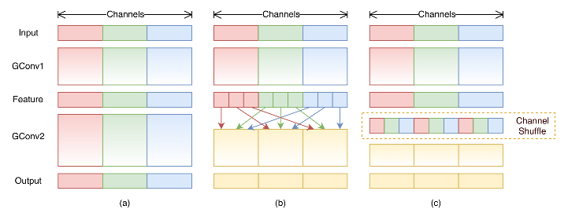
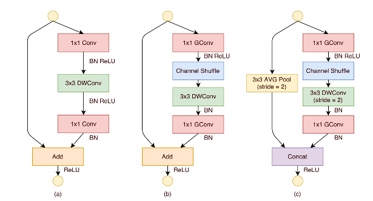
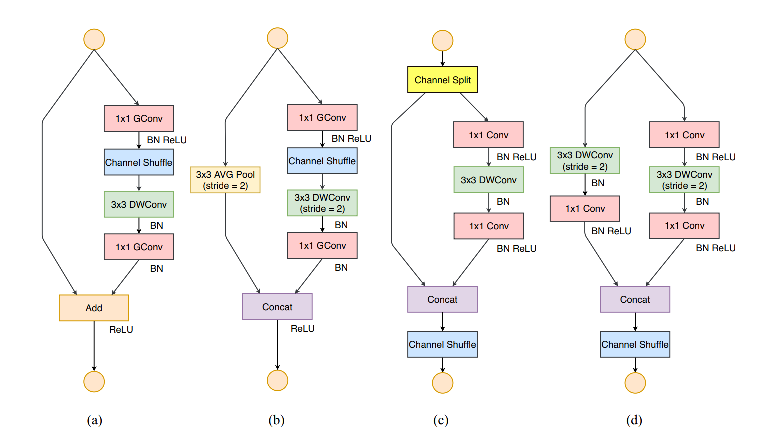

Shufflenet v1 v2基本思路

#### shufflenet v1

shufflenet v1的关键点：

1. 利用**GConv（分组卷积）**来降低复杂度。
2. 针对GConv中各组信息不连通的问题，提出**channel shuffle**的策略进行补偿。

> ShuffleNet: An Extremely Efficient Convolutional Neural Network for Mobile Devices 【CVPR 2018】

首先，根据mobilenet的实验结果可以知道，轻量化模型的flops瓶颈主要来源于通道处相乘的项，即全部通道的1x1 conv，因此，shufflenet采用group-wise conv，即将输入channel数分成k个组，然后各自在组内做全部通道的conv。（depthwise conv是group conv的一种特殊形式）

这样一来，计算量就会有显著下降，如果原来的1x1 conv计算量为：MN，其中M和N分别为输入和输出的通道数，那么分成k组后，显然计算量就成了MN/k。

但是这个操作的问题在于，分组卷积后，随着网络的前传播，各组信息是独立的。为了避免这个结果，采用shuffle的方式，手动将各个通道打散，然后重新组合。**这里的shuffle是按顺序的shuffle，而不是随机。**如上图中，如果用（1，2）表示第1组第2通道，那么（i，1）都被shuffle到第1组，（i，2）都被shuffle到第2组。。。**在代码实现中，只需要将channel维度变成 【组数】x【每组通道数】，然后permute一下，再merge回去即可实现上述操作。**

Channel shuffle 代码示例：

~~~python
def channel_shuffle(x, group_num):
    bat_sz, num_ch, h, w = x.size()
    ch_per_group = num_ch // group_num
    # reshape
    x = x.view(bat_sz, group_num, ch_per_group, h, w)
    # transpose [b,g,c,h,w] -> [b,c,g,h,w]
    x = torch.transpose(x, 1, 2).contiguous()
    # restore
    x = x.view(bat_sz, -1, h, w)
    return x
~~~

Shufflenet 的基本单元结构如下：

shufflenet单元基本沿用了res block结构，主要做了以下改动：加入GConv和shuffle和DWConv的组合，代替之前的全通道卷积；在1x1 GConv后加入channel shuffle；去掉了DWConv后的ReLU激活。对于需要降采样的，在dw conv时直接设stride=2，之前的identity map也进行 stride=2 的 3x3 avg pool，用来降低分辨率。最后将conv后的结果和直接pooling后的结果进行concat。

#### shufflenet v2

shufflenet v2 的关键点：

1. 根据实际的目标platform上的速度进行优化，而非间接优化FLOPs。
2. 给出了FLOPs以外的评价指标优化的几个guideline，并根据这些guideline更新了shufflenet unit。

首先，作者指出，在实际开发移动端轻量模型时，除了FLOPs以外，还有一些因素需要考虑，如MAC（memory access cost），即内存访问开销，以及不同运行平台的区别。根据该指导思路，分析得到以下几个guideline：

G1. **输入输出通道数相同**可以最小化MAC（根据均值不等式可证）。

G2. 过度使用**分组卷积**会增大MAC开销。

G3. **多路径**的fragment类module（如inception模块）会降低并行度（考虑到synchronize等问题）。

G4. **element-wise操作**的开销（如ReLU, addTensor, addBias等）也是需要考虑的。

根据上述原则，shufflenet v2的设计具有以下特点：

1. 通道数相同
2. 少用分组卷积
3. 降低多路径程度
4. 减少元素级别运算

结构如下：

(a) (b) 为 shufflenet v1的结构。(c) (d) 为v2的结构。可以看出，v2主要做了如下改动：首先，去掉了分组卷积的操作（符合G2），但是在**开始处进行channel split**，将通道一分为二，本质上也是做了一次分组。然后，进入右边的一支需与进行1x1 conv，dw conv，1x1 conv，**过程中保持channel数相同**（符合G1），最后得到结果，和另一支路的直接相加。另一支路不进行计算（符合G3）。最后，对concat的结果进行channel shuffle。

对于需要下采样的，就不再进行channel split，两个支路分别计算，然后concat，再进行shuffle。这样，channel数 x2，同时分辨率 x1/2。

