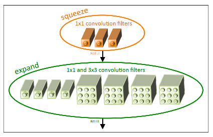
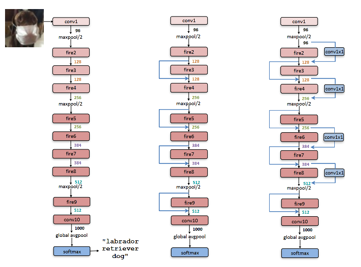
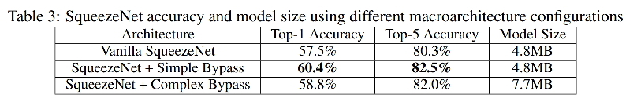

Squeezenet 是较早的轻量化模型

> ref：SqueezeNet: AlexNet-level accuracy with 50x fewer parameters and <0.5MB model size 【ICLR 2017】

Squeezenet的基本思想：

1. **1x1 conv 代替 3x3 conv**，降低计算量和参数量。
2.  对于**需要3x3 conv的，降低通道数**，降低计算量和参数量。
3. **下采样尽量延后**，保留更多feature map信息。

基本结构单元：**fire module**，结构如下：

模块分两个部分：squeeze和expand。squeeze为1x1conv，负责降通道数；expand负责学特征，用1x1和3x3两种conv。在实现过程中，采用1x1 conv 和 3x3 conv 分别计算，然后进行concat。

整体网络结构。三种variant，分解是无residual；简单的residual bypass；复杂的residual bypass

实验结果：

