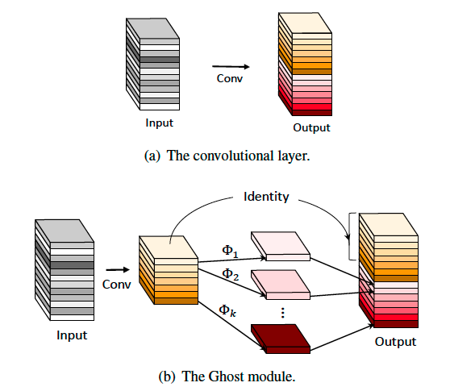
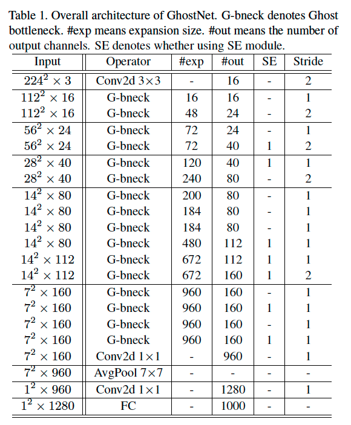

GhostNet

> ref：GhostNet: More Features from Cheap Operations     CVPR 2020

Motivation：大网络的feature中有很多的ghost：

 

换句话说，不是所有点feature map都是intrinsic的，有很多可以看做是一个intrinsic的feature 的某种简单变换得到的一群ghost feature。基于这个思路，对模型进行压缩。

模型结构和创新点主要如下：

 

 

展示一个ghost module。实际上这个操作和先1x1 conv压缩channel数量然后操作，最后在1x1升上去的思路有点相似，但是也有区别，主要在于用到了depthwise卷积，并且和前面的观察相结合来进行解释。Ghost module的主要步骤：首先，进行一个primary conv，但是输出的feature map数量要很少，比如m个，这m个就被认为是intrinsic的feature map。然后，对这m个进行s组 cheap linear transforms，生成多组衍生的feature maps，然后进行concat，包括原来的m个。这样就可以看做并行出来一些映射变化的feature map。

映射方法比如仿射变换、小波变换等都可以常识，但是最终的cheap linear transform还是还是选用了3x3卷积，因为conv可以cover很多种不同的变换，比如smoothing、blurring、motion等。 

Ghostnet的压缩比和加速比都可以约等于s，其中s表示每个intrinsic的ghost feature生成的s个feature map。 

将这样的ghost block进行组合形成ghost bottleneck：

 

再组成ghostnet：（exp指的是expansion ratio，即通道扩展的倍率，输出通道数/输入通道数）。

 

Ghostnet的基本结构是仿照mobilenet v3建构的，其中进行了总共5次下采样，都是通过每个stage最后一层进行stride=2的conv实现的，另外，还引入了SE module，并且丢弃了mobilenet v3的hard-swish 激活函数，从而降低latency。对于这种基本的模型，还可以设置超参：alpha，表示width multiplier，即每个feature map通道数都进行倍增或者缩小。

 

 

对kernel进行可视化，坐标的是原图，右边是通过depthwise transform生成的feature map。可以看出有很强的相关性。

压缩resnet-50的测试结果：

 