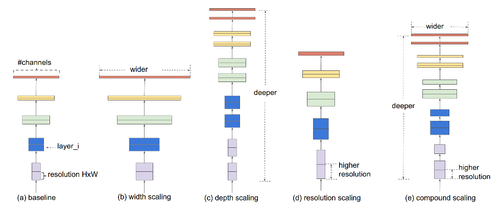
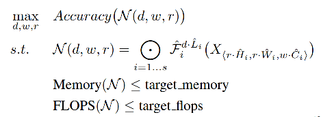
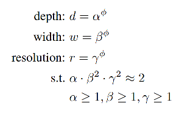
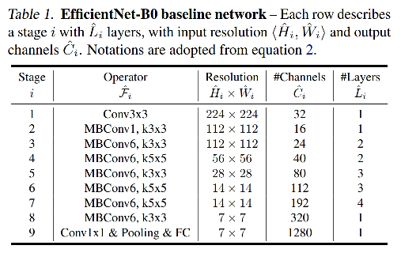
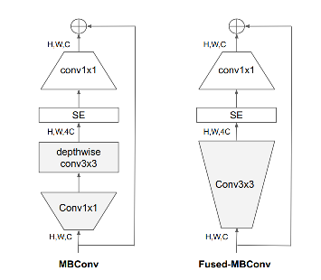
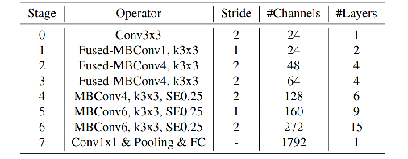

EfficientNet v1 v2 的基本思路

#### EfficientNet v1

EfficientNet v1的关键点：

1. 网络设计视为**scaling优化问题**，用NAS搜索最优结构
2. compound scaling，对**width、depth、resolution进行搜索得到base模型**，并通过**同一个指数进行缩放**，获得各级别模型。

> ref : EfficientNet: Rethinking Model Scaling for Convolutional Neural Networks 

Efficientnet的思路如下：对于网络结构的设计，可以看出是一个scaling的过程。如图

主要有如下几个网络超参可以进行scale，即：width（通道数）、depth（网络深度，即block堆叠层数）、resolution（分辨率，即feature map尺度）。对于这三个要素进行compound scaling，就可以通过搜索得到最优的模型结构。根据此思路，模型设计可以被归结为一个有约束的优化问题：

即在一定的memory和flops的约束下，找到acc的最优解。

搜索方法采用的是grid search，待搜的变量为depth、width、resolution。FLOPs 与 $d \times w^2 \times r^2$ 成正比（conv 计算量和前后的通道数的乘积有关，因此是w的平方，r的平方显然），因此约束这个乘积即可约束FLOPs。

上式定义中，指数项 phi 是一个用户指定的参数，根据资源情况进行修改。由于约束条件中，$\alpha \beta^2 \gamma^2 \sim 2$，因此，如果以phi取值为1为baseline，那么整体FLOPs就是$2^\phi$ 倍的baseline。

搜出来的结果为EfficientNet-B0，下面，通过两个步骤，得到B1-B7的模型。第一步：固定phi，做一个小规模grid search，搜出alpha，beta，gamma；第二步：固定 alpha beta gamma，用phi进行scale up，得到EfficientNet B1-B7。

注意：搜索用的MBConv即为mobilenet v2 中的 inverted block。

#### EfficientNet v2

EfficientNet V2的关键点：

1. 搜索block从单一的MBconv变成{MBconv, fused-MBConv}。
2. training-aware NAS，优化acc，parameter efficiency，training efficiency。
3. Progressive learning（渐进式学习），先用小图小正则，后用大图大正则。

> ref : EfficientNetV2: Smaller Models and Faster Training

fused-MBConv：

用一个常规的3x3 conv取代之前的 1x1 conv + 3x3 dw conv。

自适应正则化的渐进式学习：

Efficientnet v2 的整体结构：

EfficientNet v1 和 v2 的对比（ref：https://zhuanlan.zhihu.com/p/362437659）

