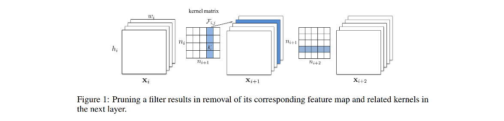
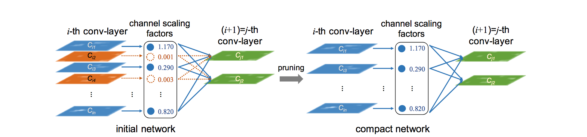

模型剪枝的一些经典方法

#### 用卷积核进行评价和操作的剪枝 2017 ICLR

> Li H, Kadav A, Durdanovic I, et al. Pruning filters for efficient convnets[J]. arXiv preprint arXiv:1608.08710, 2016. https://arxiv.org/abs/1608.08710

对卷积核的各个weight求L1 norm，并进行排序，剪掉权重最小的卷积核。

注意：该方法删除了某层的卷积核后，由于后面的feature map也少了一个，因此和这个feature map相连的后面一层的kernel的这个通道也要对应的删去。如图：

#### 基于BN的剪枝 2017 ICCV

> Liu Z, Li J, Shen Z, et al. Learning  efficient convolutional networks through network  slimming[C]//Proceedings of the IEEE international conference on  computer vision. 2017: 2736-2744. https://arxiv.org/pdf/1708.06519.pdf

采用了【预训练-剪枝-finetune】的pipeline。为了让权重不趋于一致，有较明显区别，施加了L1稀疏化loss。

剪枝阶段，考虑到BN中的两个参数，gamma（权重）和beta（偏置），其中，gamma就可以用来衡量featuremap中不同通道的重要性。以此为依据进行剪枝。

