超分模型轻量化baseline


#### Content List

IMDN：通道split + 多次递归蒸馏 block，Information Multi-distillation

ECBNet：边缘增强的重参数化策略

RFDN：改进版的IMDN，用conv代替split的distillation


---

##### Lightweight Image Super-Resolution with Information Multi-distillation Network

2019年，西电的文章，AIM等比赛的冠军方案

main contribution:

- 用multi-distillation 作为基本block（多次split，处理一半，继续进行上述步骤）
- 可以高效处理任意尺寸SR
- 经验结论 关于哪些factor影响推理速度。


motivation：主要目标是如何对通道进行挑选。最直接的方法是通过统计各个feature的一些信息，然后对于已经学到细节的和无重要细节的进行分别处理。IMDB实际上是以学习的方法取代这个过程，再网络forward过程中，尽可能保留一部分有细节的feature，对其他的feature进行继续处理。相当于实现了不同统计量feature的不同处理方法。


IMDN：information multi-distillation network

IMDB：information multi-distillation blocks


本文主要关注SR的小模型，传统的SR模型参数多，轻量化通过公用参数可以压缩模型，但是对同一个block重复计算还是有calculating time的问题。

information distillation network (IDN) 首次采用split channel（一半保持一半conv）的方法做SR。本文实际上是一个extension。


模型的主要结构：

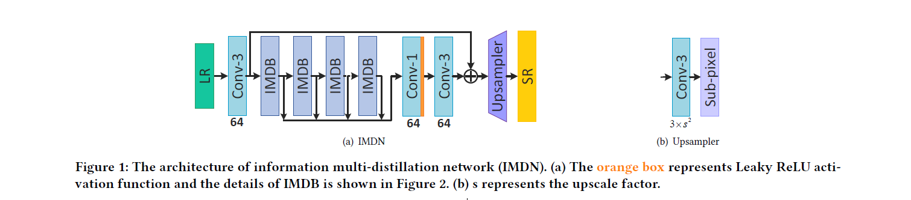

整体流程：常规部分：开始的conv和最后的几个conv+upsample，跳线连接等。主要创新点在于中间堆叠的block：

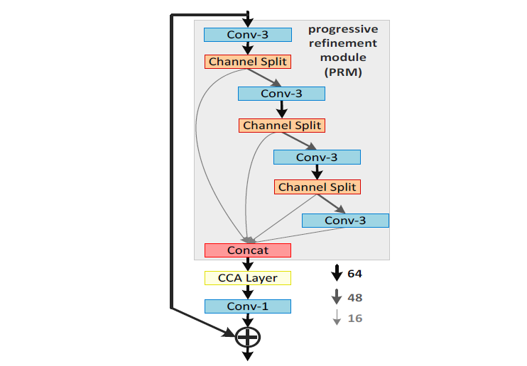

这个block包括三个部分：PRM，CCA，以及一个普通的conv。首先，PRM通过多次split channel，将一半直连，一般再过conv，并将conv后的继续split。最后，将不同split层级的结果concat起来，进入CCA module。

CCA的意思是contrast-aware channel attention。如下：

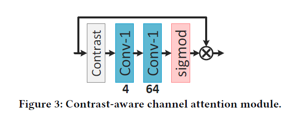

这里的CCA实际是一个attention模块，但是和通常的SE module不同，它这里用的不是avg pooling，而是各个channel的mean+std，即：

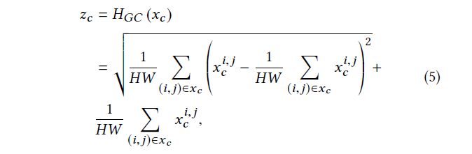

用contrast degree来衡量各个feature map。最后，经过conv，activate，skip connection，得到输出。


##### adaptive cropping strategy (ACS)

任意比率 SR。处理方式：加两个downsample，让LR和HR尺寸大小一样，然后经过网络学习。这里的问题就只剩下如何处理边长不是4的倍数的问题了。方法就是切块：

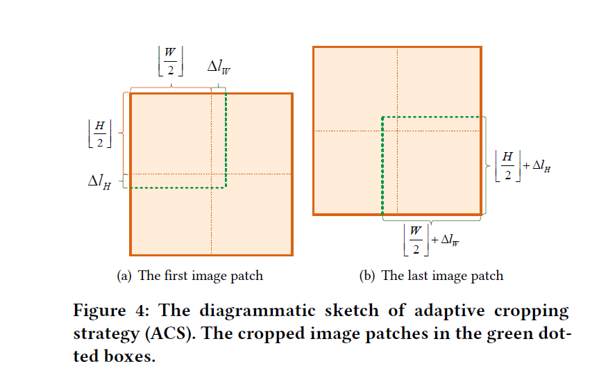


**performance vs params**

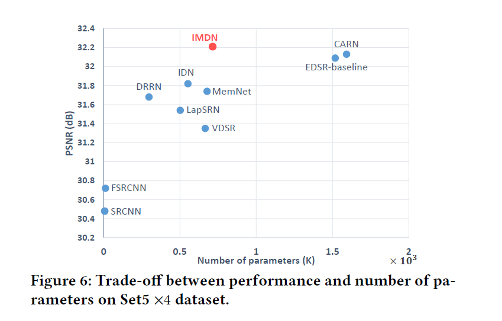


---

##### Edge-oriented Convolution Block for Real-time Super Resolution on Mobile Devices

ECBSR，端侧模型，实时；阿里达摩院，ACMMM 2021

main idea：加入方向性，用sobel算子和laplacian算子处理feature map

核心module：**Edge-oriented Convolution Block (ECB)**


light-weight SR model的两个方向：low model params；low FLOPs

对于参数量，可以通过weight sharing实现；对于计算量，可以采用low-flops 或者 flops-free ops，比如group conv、depth-wise conv、pixelshuffle、splitting、concat等。

但是，降低参数量和flops不一定能保证再端侧速度快。因此，本文主要针对端侧设计网络。


主要思路：通过重参数化（re-parameterization），将图像的先验，比如edge，加入到网络中。通过重参数化的方式，implicitly 插入可学的edge-aware filter groups。这样既可以对边缘敏感，同时又没有增加参数量。

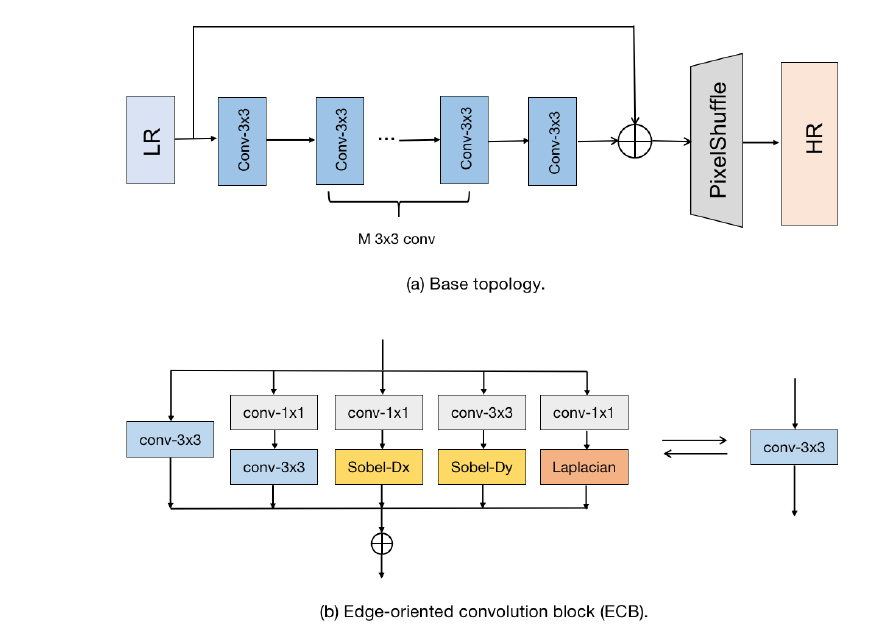

首先，展示了一个base topology，这个是大部分SR通用的结构，即先一系列卷积然后pixelshuffle上去。本文的ECB结构如下：首先，保持一个conv3x3，然后并联一些1x1conv expand后再3x3squeeze的操作，另外，直接将sobel和laplacian接在后面，强制学习sharp edge。最后，将所有的结果加起来，然后过PReLU。

在inference阶段，这里采用了所谓的re-parameterization（重参数化）方法，即用一个同等的conv表示一系列的操作。重参数化的方法再high level task中已经有了很多应用。the AC block [9], the RepVGG Block [11]
and the DB block [10].

训练数据集：DIV2K；eval数据集：DIV2K；Set5；Set14；BSD100 etc.

四种其他的re-param方法：

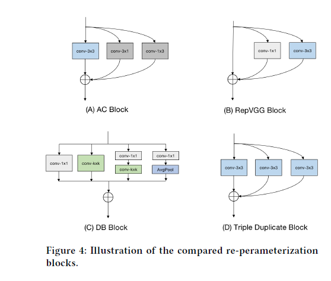

ECB module的官方代码：

~~~python
class ECB(nn.Module):
    def __init__(self, inp_planes, out_planes, depth_multiplier, act_type='prelu', with_idt = False):
        super(ECB, self).__init__()

        self.depth_multiplier = depth_multiplier
        self.inp_planes = inp_planes
        self.out_planes = out_planes
        self.act_type = act_type
        
        if with_idt and (self.inp_planes == self.out_planes):
            self.with_idt = True
        else:
            self.with_idt = False
        
		# 普通的3x3 conv
        self.conv3x3 = torch.nn.Conv2d(self.inp_planes, self.out_planes,\
                                       kernel_size=3, padding=1)
        # 1x1 后 3x3
        self.conv1x1_3x3 = SeqConv3x3('conv1x1-conv3x3', self.inp_planes, \
                                      self.out_planes, self.depth_multiplier)
        # 1x1 后 sobelx
        self.conv1x1_sbx = SeqConv3x3('conv1x1-sobelx', self.inp_planes, \
                                      self.out_planes,-1)
        # 1x1 后 sobely
        self.conv1x1_sby = SeqConv3x3('conv1x1-sobely', self.inp_planes, \
                                      self.out_planes, -1)
        # 1x1 后 laplacian
        self.conv1x1_lpl = SeqConv3x3('conv1x1-laplacian', self.inp_planes, \
                                      self.out_planes, -1)

        if self.act_type == 'prelu':
            self.act = nn.PReLU(num_parameters=self.out_planes)
        elif self.act_type == 'relu':
            self.act = nn.ReLU(inplace=True)
        elif self.act_type == 'rrelu':
            self.act = nn.RReLU(lower=-0.05, upper=0.05)
        elif self.act_type == 'softplus':
            self.act = nn.Softplus()
        elif self.act_type == 'linear':
            pass
        else:
            raise ValueError('The type of activation if not support!')

    # 全部加起来，结果算出来，你学会了吗？
    def forward(self, x):
        if self.training:
            y = self.conv3x3(x)     + \
                self.conv1x1_3x3(x) + \
                self.conv1x1_sbx(x) + \
                self.conv1x1_sby(x) + \
                self.conv1x1_lpl(x)
            if self.with_idt:
                y += x
        else:
            # inference 阶段需要调用re-param，直接变成一个conv操作，节省时间
            RK, RB = self.rep_params()
            y = F.conv2d(input=x, weight=RK, bias=RB, stride=1, padding=1) 
        if self.act_type != 'linear':
            y = self.act(y)
        return y

    # 重参数化，ECB module级别的re-param简单，就是将各个并行模块的weight和bias加起来即可。
    # 具体到各个不同的layer的不同的re-param方法，已经在各自的rep_params函数中被实现。
    def rep_params(self):
        K0, B0 = self.conv3x3.weight, self.conv3x3.bias
        K1, B1 = self.conv1x1_3x3.rep_params()
        K2, B2 = self.conv1x1_sbx.rep_params()
        K3, B3 = self.conv1x1_sby.rep_params()
        K4, B4 = self.conv1x1_lpl.rep_params()
        RK, RB = (K0+K1+K2+K3+K4), (B0+B1+B2+B3+B4)

        if self.with_idt:
            device = RK.get_device()
            if device < 0:
                device = None
            K_idt = torch.zeros(self.out_planes, self.out_planes, 3, 3, device=device)
            for i in range(self.out_planes):
                K_idt[i, i, 1, 1] = 1.0
            B_idt = 0.0
            RK, RB = RK + K_idt, RB + B_idt
        return RK, RB
~~~

ECB模块的实现方式很清晰和直观，下面是各个不同的branch的实现方法：

~~~python
class SeqConv3x3(nn.Module):
    def __init__(self, seq_type, inp_planes, out_planes, depth_multiplier):
        super(SeqConv3x3, self).__init__()

        self.type = seq_type
        self.inp_planes = inp_planes
        self.out_planes = out_planes

        if self.type == 'conv1x1-conv3x3':
            self.mid_planes = int(out_planes * depth_multiplier)
            conv0 = torch.nn.Conv2d(self.inp_planes, self.mid_planes,\
                                    kernel_size=1, padding=0)
            
            # 各层的weight和bias都记录下来，以便再inference阶段进行re-param
            self.k0 = conv0.weight
            self.b0 = conv0.bias

            conv1 = torch.nn.Conv2d(self.mid_planes, self.out_planes, kernel_size=3)
            self.k1 = conv1.weight
            self.b1 = conv1.bias
            
        elif self.type == 'conv1x1-sobelx':
            conv0 = torch.nn.Conv2d(self.inp_planes, self.out_planes,\
                                    kernel_size=1, padding=0)
            self.k0 = conv0.weight
            self.b0 = conv0.bias

            # init scale & bias
            scale = torch.randn(size=(self.out_planes, 1, 1, 1)) * 1e-3
            self.scale = nn.Parameter(scale)
            # bias = 0.0
            # bias = [bias for c in range(self.out_planes)]
            # bias = torch.FloatTensor(bias)
            bias = torch.randn(self.out_planes) * 1e-3
            bias = torch.reshape(bias, (self.out_planes,))
            self.bias = nn.Parameter(bias)
            # init mask
            self.mask = torch.zeros((self.out_planes, 1, 3, 3), dtype=torch.float32)
            for i in range(self.out_planes):
                self.mask[i, 0, 0, 0] = 1.0
                self.mask[i, 0, 1, 0] = 2.0
                self.mask[i, 0, 2, 0] = 1.0
                self.mask[i, 0, 0, 2] = -1.0
                self.mask[i, 0, 1, 2] = -2.0
                self.mask[i, 0, 2, 2] = -1.0
            self.mask = nn.Parameter(data=self.mask, requires_grad=False)

        elif self.type == 'conv1x1-sobely':
            conv0 = torch.nn.Conv2d(self.inp_planes, self.out_planes,\
                                    kernel_size=1, padding=0)
            self.k0 = conv0.weight
            self.b0 = conv0.bias

            # init scale & bias
            scale = torch.randn(size=(self.out_planes, 1, 1, 1)) * 1e-3
            self.scale = nn.Parameter(torch.FloatTensor(scale))
            # bias = 0.0
            # bias = [bias for c in range(self.out_planes)]
            # bias = torch.FloatTensor(bias)
            bias = torch.randn(self.out_planes) * 1e-3
            bias = torch.reshape(bias, (self.out_planes,))
            self.bias = nn.Parameter(torch.FloatTensor(bias))
            # init mask
            self.mask = torch.zeros((self.out_planes, 1, 3, 3), dtype=torch.float32)
            for i in range(self.out_planes):
                self.mask[i, 0, 0, 0] = 1.0
                self.mask[i, 0, 0, 1] = 2.0
                self.mask[i, 0, 0, 2] = 1.0
                self.mask[i, 0, 2, 0] = -1.0
                self.mask[i, 0, 2, 1] = -2.0
                self.mask[i, 0, 2, 2] = -1.0
            self.mask = nn.Parameter(data=self.mask, requires_grad=False)

        elif self.type == 'conv1x1-laplacian':
            conv0 = torch.nn.Conv2d(self.inp_planes, self.out_planes,\
                                    kernel_size=1, padding=0)
            self.k0 = conv0.weight
            self.b0 = conv0.bias

            # init scale & bias
            scale = torch.randn(size=(self.out_planes, 1, 1, 1)) * 1e-3
            self.scale = nn.Parameter(torch.FloatTensor(scale))
            # bias = 0.0
            # bias = [bias for c in range(self.out_planes)]
            # bias = torch.FloatTensor(bias)
            bias = torch.randn(self.out_planes) * 1e-3
            bias = torch.reshape(bias, (self.out_planes,))
            self.bias = nn.Parameter(torch.FloatTensor(bias))
            # init mask
            self.mask = torch.zeros((self.out_planes, 1, 3, 3), dtype=torch.float32)
            for i in range(self.out_planes):
                self.mask[i, 0, 0, 1] = 1.0
                self.mask[i, 0, 1, 0] = 1.0
                self.mask[i, 0, 1, 2] = 1.0
                self.mask[i, 0, 2, 1] = 1.0
                self.mask[i, 0, 1, 1] = -4.0
            # 所有的weight、scale和bias都用nn.Parameter的方式手动加入param list去学习，因此mask要手动设置一下requires_grad = False。
            self.mask = nn.Parameter(data=self.mask, requires_grad=False)
        else:
            raise ValueError('the type of seqconv is not supported!')

    def forward(self, x):
        if self.type == 'conv1x1-conv3x3':
            # conv-1x1
            # 为了让self.bx, self.kx能参与训练，直接用F.conv2d代替了nn.Conv2d
            y0 = F.conv2d(input=x, weight=self.k0, bias=self.b0, stride=1)
            # explicitly padding with bias
            y0 = F.pad(y0, (1, 1, 1, 1), 'constant', 0)
            b0_pad = self.b0.view(1, -1, 1, 1)
            y0[:, :, 0:1, :] = b0_pad
            y0[:, :, -1:, :] = b0_pad
            y0[:, :, :, 0:1] = b0_pad
            y0[:, :, :, -1:] = b0_pad
            # conv-3x3
            # 第二个是conv时，weight就是self.k1，否则，是scale x mask
            y1 = F.conv2d(input=y0, weight=self.k1, bias=self.b1, stride=1)
        else:
            y0 = F.conv2d(input=x, weight=self.k0, bias=self.b0, stride=1)
            # explicitly padding with bias
            y0 = F.pad(y0, (1, 1, 1, 1), 'constant', 0)
            b0_pad = self.b0.view(1, -1, 1, 1)
            y0[:, :, 0:1, :] = b0_pad
            y0[:, :, -1:, :] = b0_pad
            y0[:, :, :, 0:1] = b0_pad
            y0[:, :, :, -1:] = b0_pad
            # conv-3x3
            # 这里的就是scale x mask
            y1 = F.conv2d(input=y0, weight=self.scale * self.mask,\
                          bias=self.bias, stride=1, groups=self.out_planes)
        return y1
    
    def rep_params(self):
        device = self.k0.get_device()
        if device < 0:
            device = None

        if self.type == 'conv1x1-conv3x3':
            # re-param conv kernel
            RK = F.conv2d(input=self.k1, weight=self.k0.permute(1, 0, 2, 3))
            # re-param conv bias
            RB = torch.ones(1, self.mid_planes, 3, 3, device=device)\
            		* self.b0.view(1, -1, 1, 1)
            RB = F.conv2d(input=RB, weight=self.k1).view(-1,) + self.b1
        else:
            tmp = self.scale * self.mask
            k1 = torch.zeros((self.out_planes, self.out_planes, 3, 3), device=device)
            for i in range(self.out_planes):
                k1[i, i, :, :] = tmp[i, 0, :, :]
            b1 = self.bias
            # re-param conv kernel
            RK = F.conv2d(input=k1, weight=self.k0.permute(1, 0, 2, 3))
            # re-param conv bias
            RB = torch.ones(1, self.out_planes, 3, 3, device=device)\
            		* self.b0.view(1, -1, 1, 1)
            RB = F.conv2d(input=RB, weight=k1).view(-1,) + b1
        return RK, RB
~~~


---

##### Residual Feature Distillation Network for Lightweight Image Super-Resolution

ref：https://arxiv.org/abs/2009.11551

改进版的IMDN，网络结构与block代码：

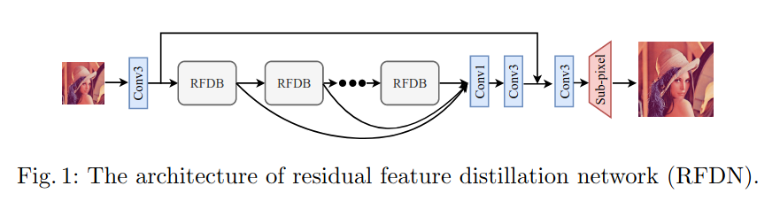

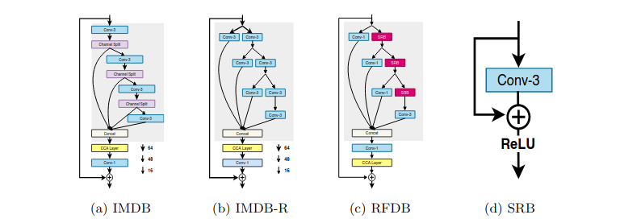

主要改动：

- 等价替换，将split换成conv-1和SRB（一个简单的resblock）
- ESA 代替 CCA

block代码：

```python
class RFDB(nn.Module):
    def __init__(self, in_channels, distillation_rate=0.25):
        super(RFDB, self).__init__()
        self.dc = self.distilled_channels = in_channels//2
        self.rc = self.remaining_channels = in_channels
        self.c1_d = conv_layer(in_channels, self.dc, 1)
        self.c1_r = conv_layer(in_channels, self.rc, 3)
        self.c2_d = conv_layer(self.remaining_channels, self.dc, 1)
        self.c2_r = conv_layer(self.remaining_channels, self.rc, 3)
        self.c3_d = conv_layer(self.remaining_channels, self.dc, 1)
        self.c3_r = conv_layer(self.remaining_channels, self.rc, 3)
        self.c4 = conv_layer(self.remaining_channels, self.dc, 3)
        self.act = activation('lrelu', neg_slope=0.05)
        self.c5 = conv_layer(self.dc*4, in_channels, 1)
        self.esa = ESA(in_channels, nn.Conv2d)

    def forward(self, input):
        distilled_c1 = self.act(self.c1_d(input))
        r_c1 = (self.c1_r(input))
        r_c1 = self.act(r_c1+input)

        distilled_c2 = self.act(self.c2_d(r_c1))
        r_c2 = (self.c2_r(r_c1))
        r_c2 = self.act(r_c2+r_c1)

        distilled_c3 = self.act(self.c3_d(r_c2))
        r_c3 = (self.c3_r(r_c2))
        r_c3 = self.act(r_c3+r_c2)

        r_c4 = self.act(self.c4(r_c3))

        out = torch.cat([distilled_c1, distilled_c2, distilled_c3, r_c4], dim=1)
        out_fused = self.esa(self.c5(out)) 

        return out_fused
```

ESA模块结构：

```python
class ESA(nn.Module):
    def __init__(self, n_feats, conv):
        super(ESA, self).__init__()
        f = n_feats // 4
        self.conv1 = conv(n_feats, f, kernel_size=1)
        self.conv_f = conv(f, f, kernel_size=1)
        self.conv_max = conv(f, f, kernel_size=3, padding=1)
        self.conv2 = conv(f, f, kernel_size=3, stride=2, padding=0)
        self.conv3 = conv(f, f, kernel_size=3, padding=1)
        self.conv3_ = conv(f, f, kernel_size=3, padding=1)
        self.conv4 = conv(f, n_feats, kernel_size=1)
        self.sigmoid = nn.Sigmoid()
        self.relu = nn.ReLU(inplace=True)

    def forward(self, x):
        c1_ = (self.conv1(x))
        c1 = self.conv2(c1_)
        v_max = F.max_pool2d(c1, kernel_size=7, stride=3)
        v_range = self.relu(self.conv_max(v_max))
        c3 = self.relu(self.conv3(v_range))
        c3 = self.conv3_(c3)
        c3 = F.interpolate(c3, (x.size(2), x.size(3)), mode='bilinear', align_corners=False) 
        cf = self.conv_f(c1_)
        c4 = self.conv4(c3+cf)
        m = self.sigmoid(c4)
        
        return x * m
```

结构示意图：

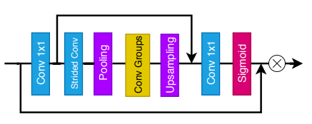

ESA相等于将输出结果先过一个大感知域的类unet形式的conv net，然后sigmoid形成weightmap，对原始的feature map进行加权refine。


