小样本分割（Few shot segmentation, FSS）领域idea比较有代表性的几篇论文整理。

**OSLSM** 2017 （最早用Pascal 5i做交叉验证，weight hashing，sup和que最终特征做w和b进行logistic回归）

**SG-One** 2018 （mask pooling + cosine sim）

**Prototype Alignment Network (PANet)** 2019 （alignment，一种类cycle loss）

**FSS-1000（relation net）** 2019 （主要是数据集FSS-1000，适用于小样本分割的数据集）

**CANet: Class-Agnostic Segmentation** 2019（对结果进行 refinement）

**BMVC 2018**  2018（网络设计较复杂）

**Prototype Mixture Models（PMM）** 2020  （将prototype拆成多个）

**Prior Guided Feature Enrichment Network（PFENet）** 2020（先生成无须训练的prior，后接多特征融合）

**FSIL（Few shot Seg Image Level）** 2020 （利用image-level的弱监督信息做few shot seg）

---

####  One-shot learning for semantic segmentation（OSLSM）

【BMVC 2017】

BMVC 2017的papercode：https://github.com/lzzcd001/OSLSM 最早利用support监督生成prediction的文章。之前都是基于对support进行finetune实现few shot learning。PASCAL 5i的划分方式和benchmark就是由该paper设置。 题目是one shot，但是也可以处理k-shot，只不过仍然是以one-shot形式逐个进行，然后将所有的结果进行OR运算，得到最终的分割输出。 网络结构：  

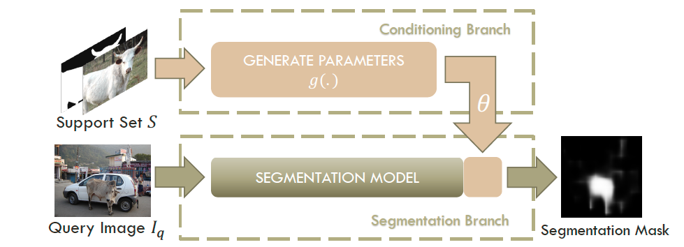

具体实现方法： 

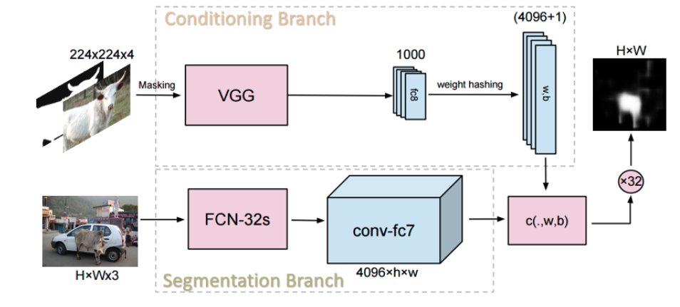

首先，用vgg对support img提特征，得到1000维的vec， 然后通过weight hashing，扩充到4096维。对于query，进入FCN-32s，得到fc7的feature，也是4096维，然后将condition brach，即support的特征向量作为w和b，和query的feature map做pixel wise的logistic reg，然后上采样输出分割结果。 loss函数就是log似然。下降方法用SGD，并且由于VGG比fc层overfit更快，因此对learning rate进行了调整。 OSLSM用的backbone为vgg，而且分割网络FCN，现在看来效果都受到限制，最终的结果如下：

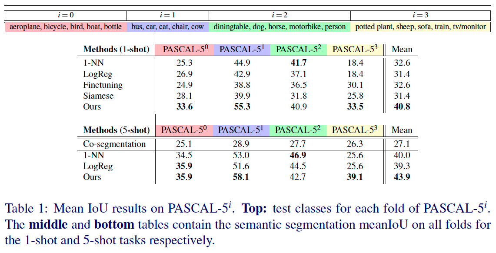

---

#### SG-One: Similarity Guidance Network for One-Shot Semantic Segmentation

【IEEE Transactions on Cybernetics 2018】

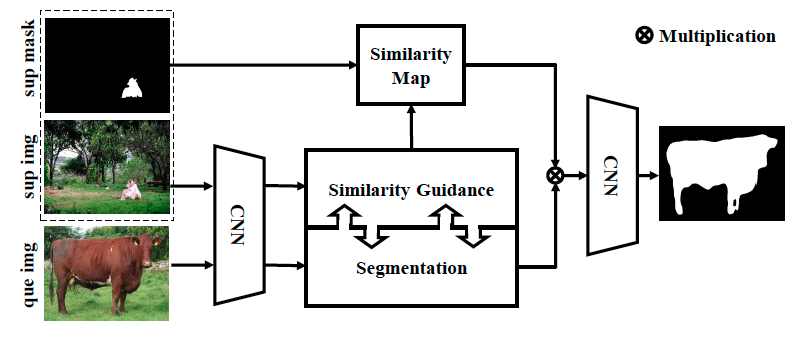

本文方法相对比较早，因此也比较简单，网络结构如下

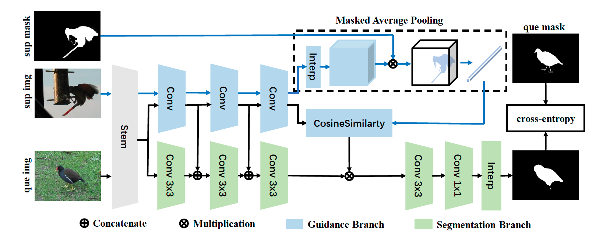

其中，（ sup img, sup mask ）和 que img一起作为一个episode，将sup和que的img过一个guidance branch的网络，que img得到的是各个pixel的feature vec，sup img通过interp和mask avg pooling，得到prototype。最后，将feature vec与prototype进行cosine相似度计算，得到的是一个[-1, 1]之间的相似度map。除了guidance branch，还用另一个网络做实际的segmentation，将cosine 相似度map乘到下面的feature map中，优化最终的prediction，即和que mask计算cross entropy。

这个方法天然就是one shot任务的，如果是K shot，可以这样处理：

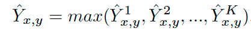

也可以直接平均K representation vectors，然后用avg来作为guidance。

---

#### PANet: Few-Shot Image Semantic Segmentation with Prototype Alignment

【ICCV 2019】

prototype类方法实际上就是将一个传统的segment模型分成了两个独立的部分，即：prototype extraction和non-parameteric metric learning。proto的作用就是生成一个representation。

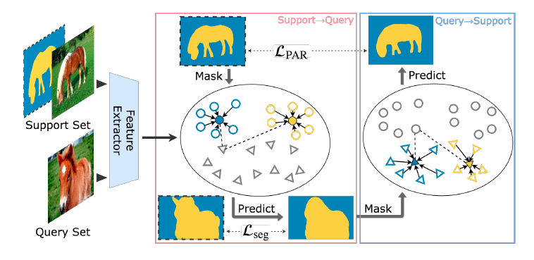

 **Prototype Alignment Network** **(PANet)**

本文的方法通过reverse的过程，用query和对应的predicted mask学习，去segment support set的样本。从而使得模型generate出对于support和query比较一致的prototype。 具体过程如下：

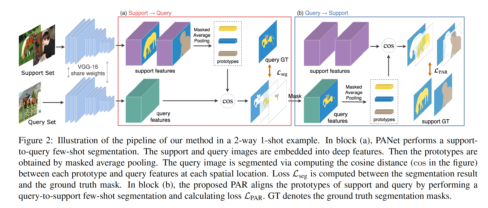

如果只看左边一部分，其实就是一个base版本的protonet的方法，即从support里学各个prototype，然后，通过无参数的metric classification，将query数据进行分类。但是PANet又进行了另一步骤，即从query的predict mask开始，将它作为真实的mask，然后生成query的prototype，返回去对support进行预测，再和support的gt进行比较。于是得到了正向和反向的两个loss。有点类似cycleGAN的思想。 这个策略被叫做**PAR：prototype alignment regularization**，用来约束embed得到的prototype更加consistent 和 robust。 

Prototype learning中对于mask的使用：首先， 在最初喂进网络时进行mask，只保留当前的class（early fusion）；另外，在生成了feature map以后，再进行mask，直接分离开BG和FG，生成两者的prototype（late fusion）。本文采用了第二种，即late fusion。

 Non-parametric metric learning：与各个prototype分别计算距离，并softmax over classes（protos）：

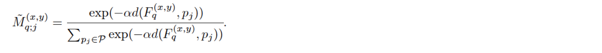

距离函数用的是cosine距离，cos距离更stable，效果相对更好。 PANet的loss由两部分组成，seg loss和PAR loss：

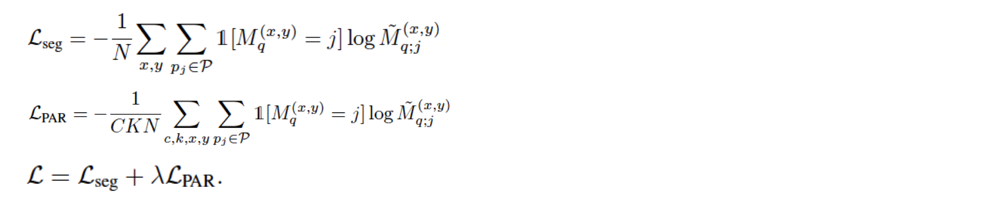             

整体算法流程如下：

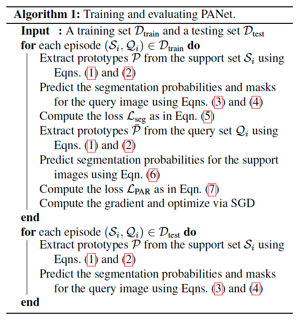

该方法也支持弱标签：

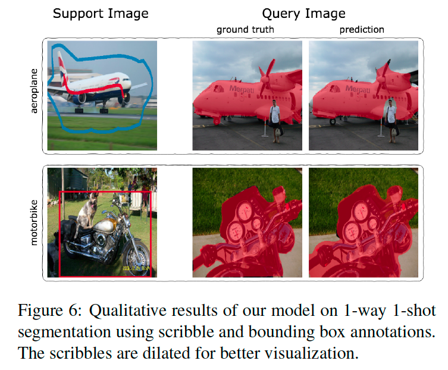

---

#### FSS-1000: A 1000-Class Dataset for Few-Shot Segmentation

【CVPR 2019】

FSS-1000是为few shot 问题专门设计的dataset。它共有1k类，但是每个类别只有10张图，总共有1w张图片。 

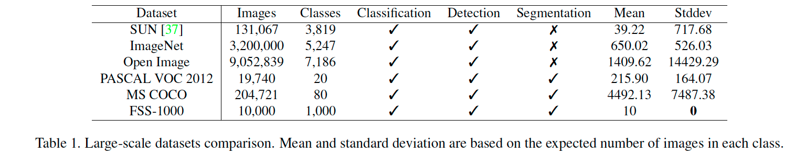

和通常用的pascal 和 coco相比，FSS-1000类别多，而且各类数量分布平均。并且包含了一些其他数据集中没有的类别。

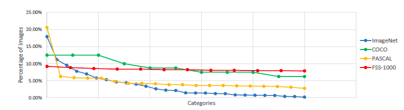

常见数据集都或多或少有长尾效应，FSS各类都一样多。

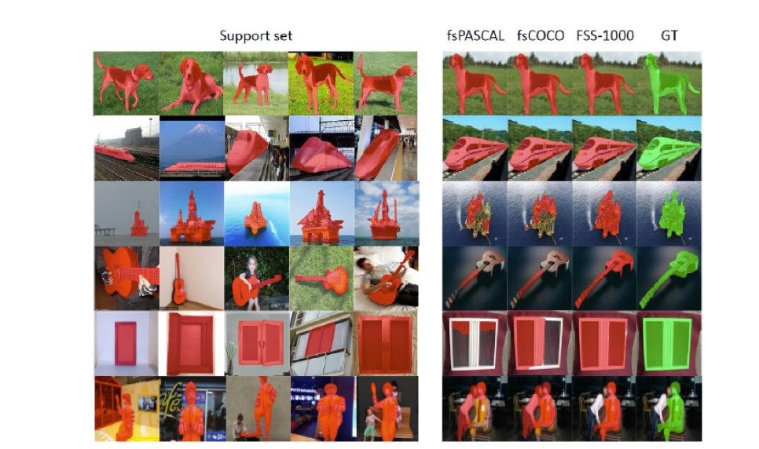

上图为了展示数据集的效果。在only FSS-1000上训练后，再用pascal-5i进行测试，比在pascal上训练得到的模型效果还好。证明这个数据集适合做fewshot segment。 support set中的object的位置和朝向很重要。下图展示的是好的support set与不好的support set得到的结果。

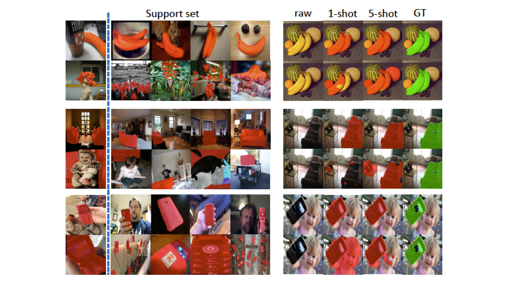

在上面的实验中，数据集作者用的baseline模型如下。模型比较简单，分三个部分：encoder、relation、decoder。用support和query分别过一遍encoder，得到的feature进行relation，其实就是concat后进行conv，得到的结果进入decoder中得出最后的prediction。loss用的是bce。整个过程可以简单写成如下形式： 

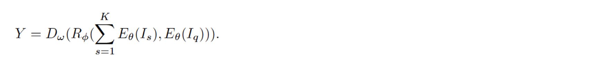

网络结构如下：

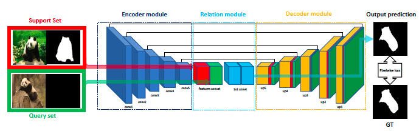

实验benchmark的数据配置：  For FSS-1000, we build the validation/test set by randomly sampling 20 distinct sub-categories from the 12 super-categories; the other images and labels are used in training. The train/validation/test split used in the experiments consists of 5,200/2,400/2,400 image and label pairs. 共240个test类别，其余760类作为trainval，其中520个训练，240个验证。

---

#### CANet: Class-Agnostic Segmentation Networks with Iterative Refinement and Attentive Few-Shot Learning

【CVPR 2019】 

 CANet的基本思路是通过学习一个support和query的multi-level feature comparison，然后对结果进行iterative refine，最终得到prediction mask。结构如下： 

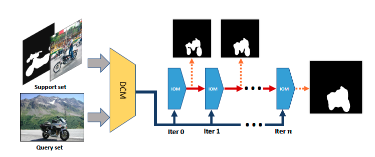

DCM：dense comparison moduleIOM：iterative optimization module 这里的dense comparison实际上就是masked average pooling of support features。考虑到transferable的目的，middle-level的特征相比于low和high level（class-specific）更有效。最终在dense comparison时用的是multi-level的特征。 由于category组内方差的影响，只做comparison并不充分，因此再后面增加了refinement阶段，即IOM。用于生成fine-grained mask。 CANet的一个新的特性：可以用weak annotation作为label，也可以达到pixel-wise label的support的一个comparable performance。实验显示，在换成box annotation后，只掉了两个点： 

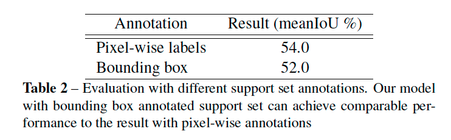

one-shot情况下的网络结构如图所示：

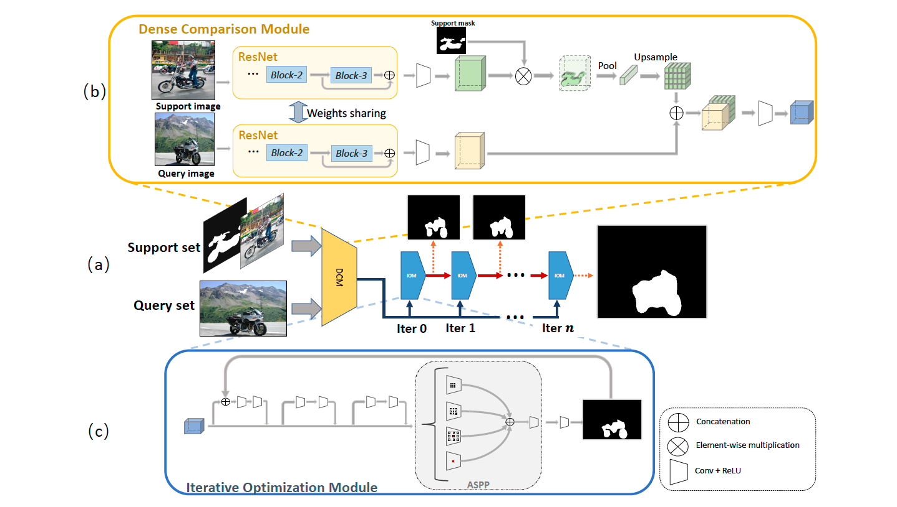

DCM阶段就是一个标准的protonet的方法，先过一个feature extractor，然后对support做masked average pooling，得到prototype，再与query进行比对。这里使用了resnet的block2和3，即中间的midlevel feature。之后都使用dilated conv保持分辨率。 IOM阶段的操作如下：首先，将提取到的feature map与上一个iteration得到的prediction mask进行concat，然后经过一系列网络，最后再通过ASPP获取multi-scale信息，输出prediction mask。这一步得到的mask继续在下一次iteration时和提取的feature map结合，重新进行refine。另外，在训练中，有一定的概率将prediction mask置零，类似于dropout（可能是为了防止在prediction mask与feature map concat的步骤中，学习到一个从prediction到prediction的通路，从而忽略了feature map的更新）。 以上是one-shot的情况，对于k-shot，还需要一个attention操作，用来生成各个support sample的weight，用于最终feature的merge。（所有权重都是softmax过的，最后乘到当前sample的feature上）

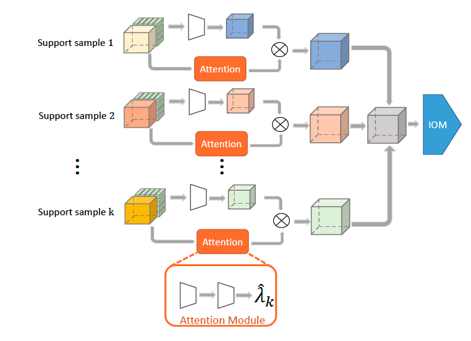

 CANet在几个benchmark数据集上的结果： 

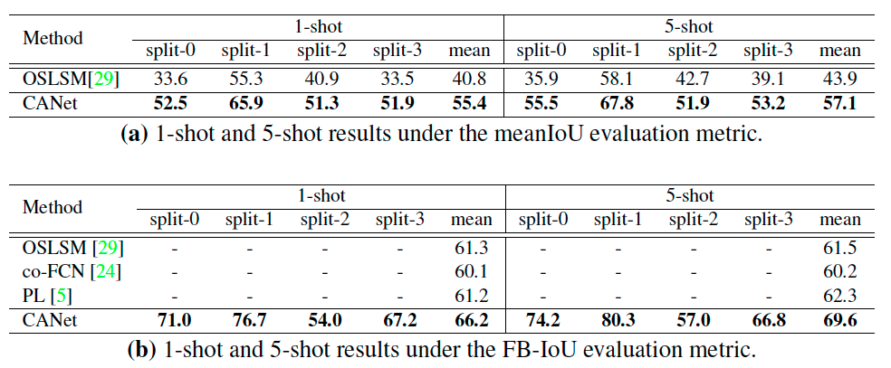

 FB-IoU指的是foreground-background iou，即不考虑类别的iou。由于有些object体积很小，因此，即使没有预测出object，它的background准确率依然很高（类似于数据不均衡时候的acc指标）。因此，FB-IoU相对不太能反应真实情况，而且数值上也比mean IOU要高很多。 CANet在PASCAL 5i数据集上的one-shot mean IoU达到55.4。（在PMM文章中报的结果为53.96，相差不大，可能是数据集原因）

---

#### Few-Shot Semantic Segmentation with Prototype Learning

【BMVC 2018】

BMVC 2018 基于prototype的思路，这里的prototype指的是一个category里面最具有代表性的element。这里指的是具有high-level discriminative info的feature。 few shot 的 training loss是这样的：

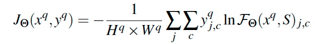

q代表query，S代表support， 也就是说，优化的是在S上训练出来的模型在xq和yq上的cross entropy。few shot的一个episode表示随机选择N个class，然后后从整个N-way中进行样本选择，构建support和query。然后进行优化。support和query都参与训练过程。 模型结构：

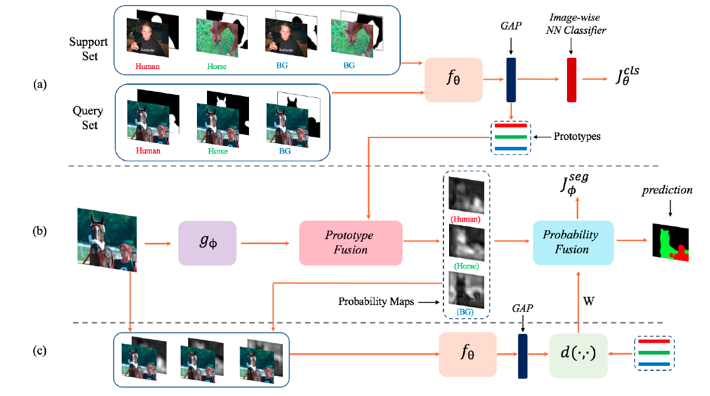

 基本流程：首先，用support set和query set训练一个网络ftheta，在feature extractor后面接一个GAP模块，生成各个N-way的prototype。然后，将prototype加入到segmentor的训练中（也就是b部分），方法是将上面得到的prototype进行up pooling，然后与g phi的输出进行add操作。这样，就可以得到各个way的feature map了，然后再在后面接一个1x1的conv，再进行bilinear interpolation，得到最后的logits，也就是probability map。将这个prob map通过加权的方式进行fusion，获得最终的结果。这些prob map的训练需要先和img进行组合成pair，然后输入进f，即prototype learner中，将得到的feature vec与prototype计算距离，作为加权，参与到segmentor的训练中。 下面看几个loss：首先，J theta cls是训练prototype的aux loss，

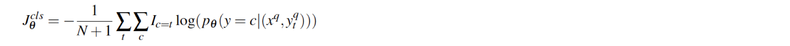

 希望分类准确。这里的p theta是预测的query上的概率分布，是通过metric的方式得到的，方法如下：support上的prototype如下：

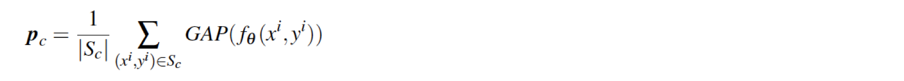

对于query，各个类别的概率分布如下得到（metric learning方式）

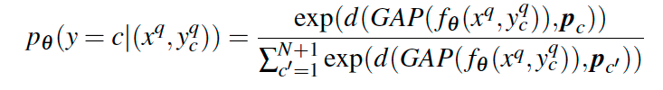

主网络中的prob map加权：

Permutation training：每次训练segmentation model之前，对prototype进行重新排序：

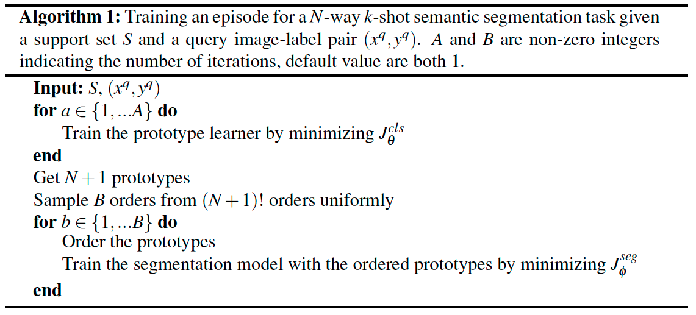

 实验结果：

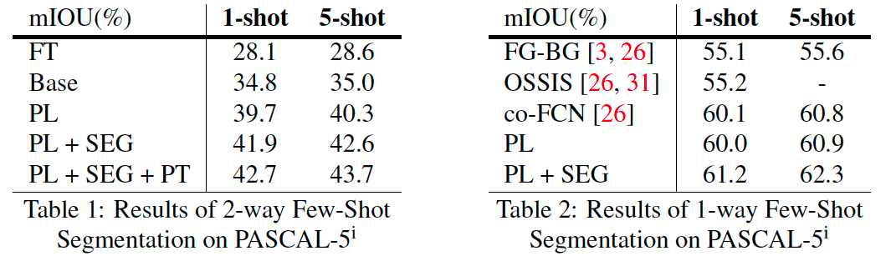

---

#### Prototype Mixture Models for Few-shot Semantic Segmentation

【ECCV 2020】

 本文需要解决的问题是GAP生成prototype时，由于丢弃了空间域的各个part的信息而导致的表示能力的下降。 

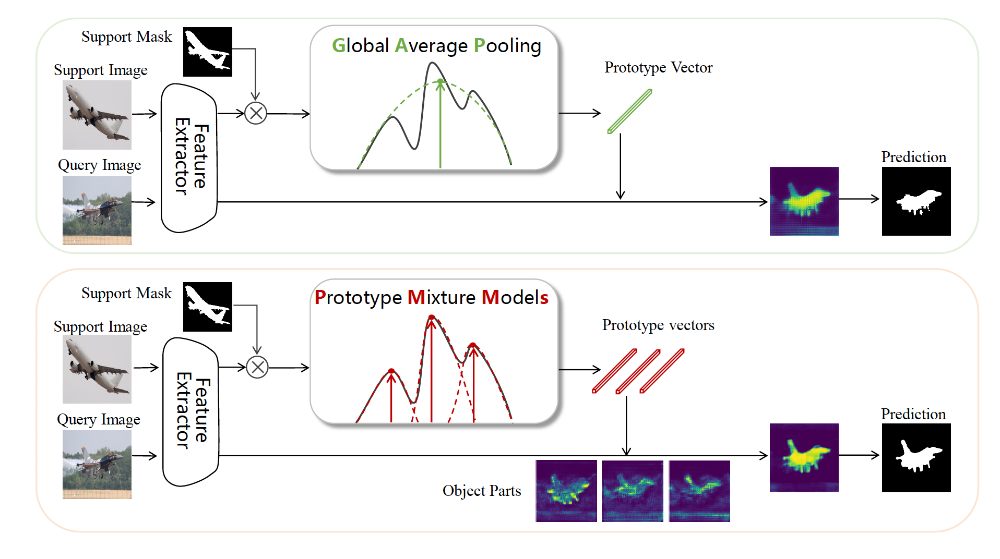

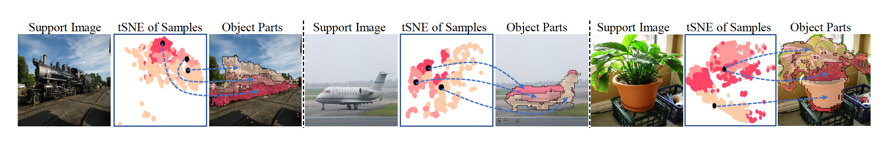

如图，可以看出，一个object的分布是多个part组成的，而GAP的prototype只能进行平均，而如果将各个部分分别建模，获得多个prototype来表征各个部分的特征，那么prototype的表征能力更强，而且应该对于位置角度变化更加鲁棒。这是本文的基本的intuition。 网络结构图：

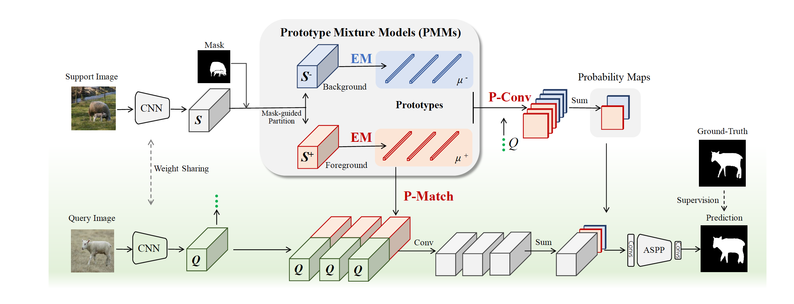

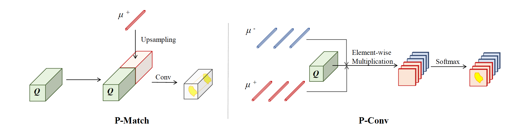

这里的P-Match即将prototype vec直接上采样concat到query 网络中，自动地学习预测。而P-Conv则是相当于一个距离度量的方法，即拿各个prototype vec与Q的feature map做点乘，相当于计算出了整张图的每个pixel对于各个proto vec的相关性，于是得到了比较直接的prob map。然后将prob map接到query net的最后，用于输出。 这个思路简单来说就是一方面先将proto vec作为feature map使用，另一方面则是作为真正的proto（类似knn的中心点）去直接做预测，然后将两者进行合并。作者称为：PMM as representation和 PMM as classifier。 注意：p conv的时候，得到的是各个part的proto的相关性map，因此需要进行class-wise的summation，得到各个类别的最终的prob map。 本文用的是一个mixture model进行建模，考虑向量的表示形式，最终可以将p(si | theta)改写成下面的形式：

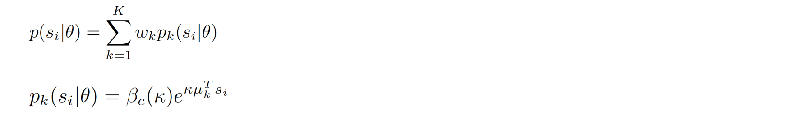

 这个PMM（prototype mixture model）的optimization过程用的是EM算法：

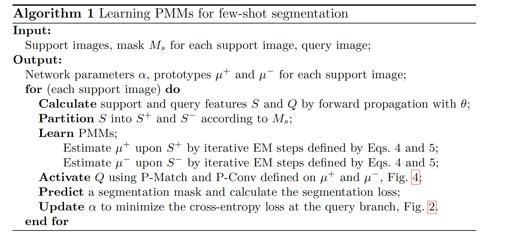

混合分布中的各个均值 mu 实际上就是通过EM优化出来的prototype vec。整个算法流程梳理一下： 先用网络作为feature extractor，获得各个pixel的feature，高维度，作为多个样本，进行EM，获得优化后的prototype vec，然后加入query net中（通过pmatch和pconv），实际上就是生成上面的feature map的那个网络（weight sharing）。然后，用网络的forward获得一个prediction（query），就可以做loss了，然后，对网络进行BP，完成一轮更新。更新后，再对support 的feature 进行提取，结果就不一样了，因此需要重新EM，重新forward。以此进行循环，直到收敛。 一种enhancement的方案，Residual PMM：

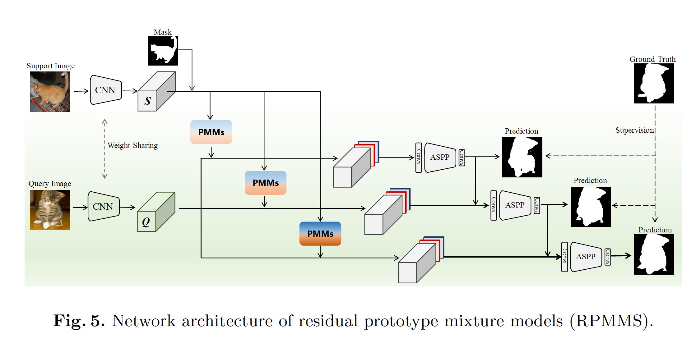

实验结果可视化：

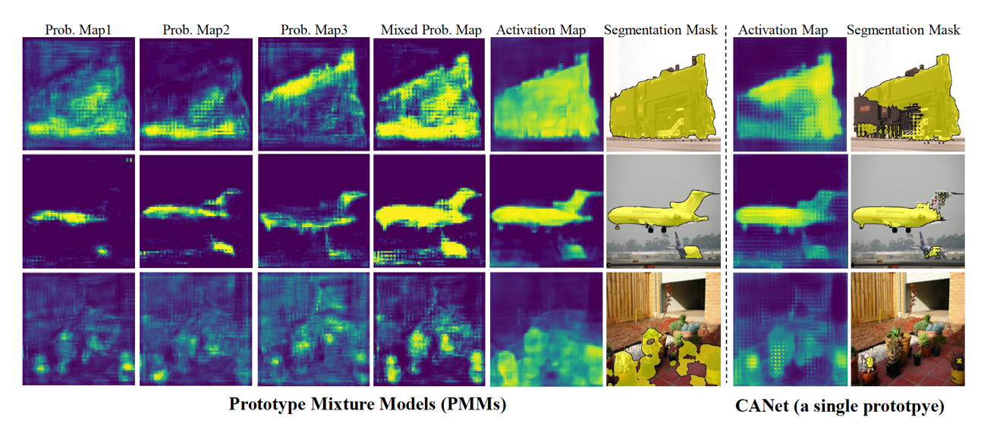

---

#### Prior Guided Feature Enrichment Network for Few-Shot Segmentation

【TPAMI 2020】

模型名称：PFENet 文章提出了few shot seg的两个problem：generalization loss due to misuse of high-level features；以及spatial inconsistency between support and query。 本文的主要思路即生成一个无须训练的prior heatmap，然后结合support feature 通过Feature enrichment module对query feature进行adaptively refine。 

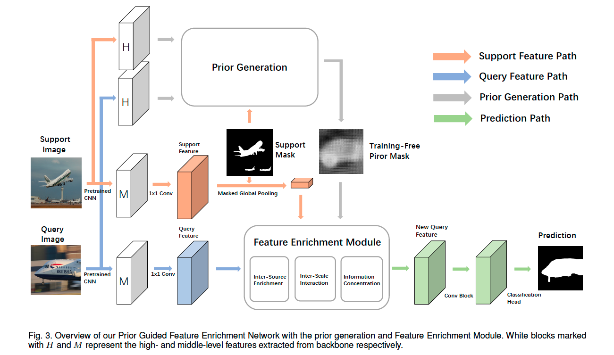

Training free prior generation:用imagenet上训练好的模型，作为特征提取器，得到support和query的特征，然后做cos sim。取出query中的每个特征与support中所有特征cos sim最大的，作为该点和support的correspondence。然后归一化到0-1之间，成了prior mask。这个mask不需要在trainset上训练，保证不会拟合到已知的class特征上。 H和M分别代表高阶特征和中阶特征，由于高阶特征容易拟合到已知类别，而这是不期望的，因此用中阶特征进行处理。 Feature enrichment module结构如下：（FEM） 

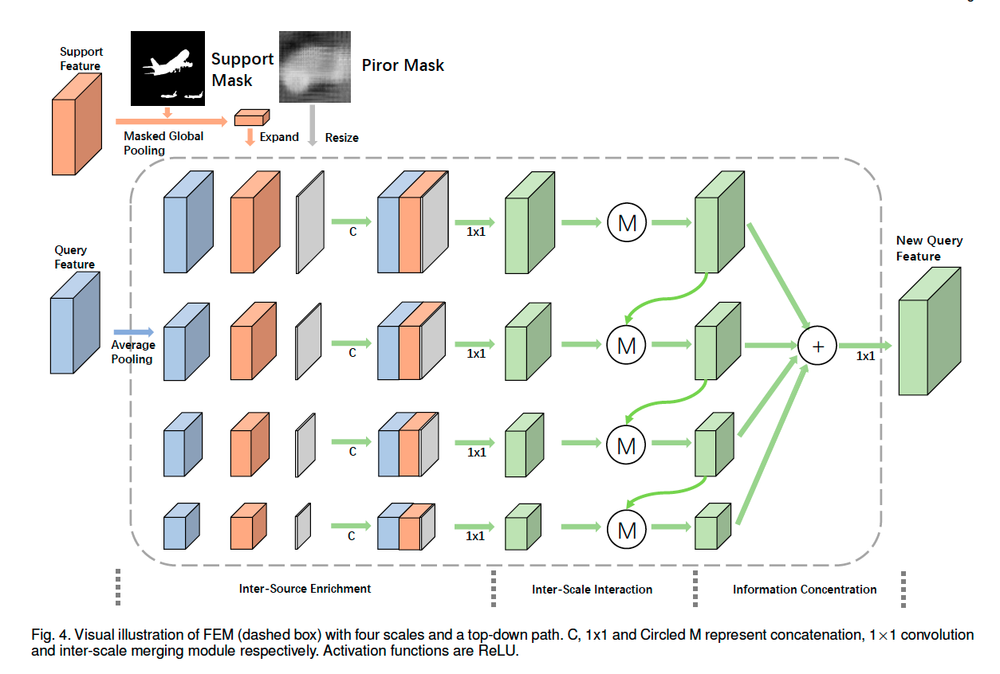

其中的M代表merge 模块，如下：

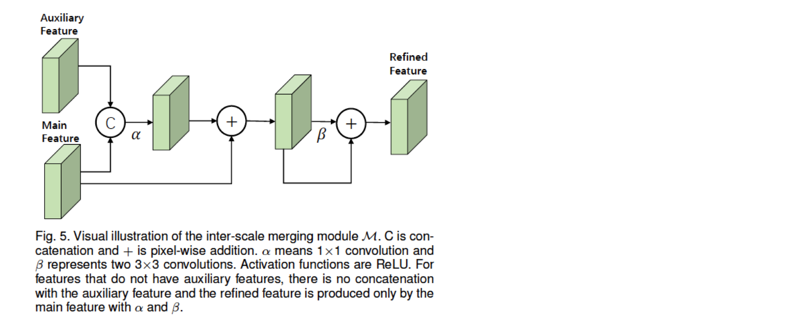

不考虑FEM，网络的pipeline如下：

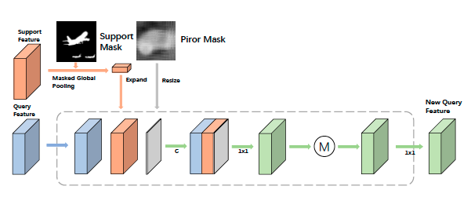

---

#### Few-Shot Semantic Segmentation Augmented with Image-Level Weak Annotations（FSIL）

【arxiv 2020】

2020 arxiv 该文章的基本思路就是利用和support 同类别的weak annotation，实际上就是image level标注作为辅助，加入n way k shot的训练和测试中，如图：

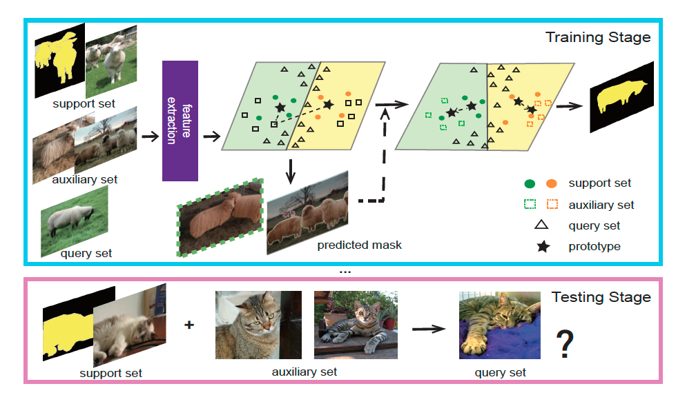

需要预测的为🐑，因此需要有对羊的fine-grained mask。而增加的辅助set只有羊的图片，即图像类别已知，然后将support和auxiliary进行merge，学习一个更好的表示。在测试的时候，也需要用同样的方式，给出mask和auxiliary set。 该方法的名称为Few Shot Image Level。结合image level的主要issue在于image level和segmentation level的不同，以及image中object可能比较分散，位置不固定。

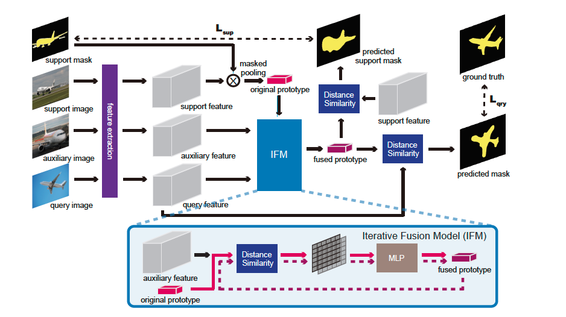

具体实现方法操作步骤： 首先，将sup img, aux img, que img都过一个feature extractor，将得到的support的feature进行mask average pooling，得到初始的prototype，然后将该proto和aux的feature map计算距离相似度，结合距离进行加权，得到fused prototype，也就是aux的pseudo map选定的weighted average of feature map的prototype与之前的original prototype的求和。公式： 

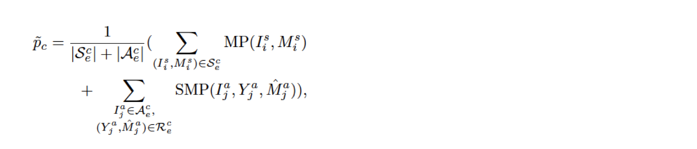

其中，得到的fused prototype还可以继续进行cossim的计算，得到新的dist map，如此，即所谓的IFM，iterative fusion model。还有一个issue，即考虑到背景像素并不是单一的一类，而可能包含着不属于这个类的其他类别，以及可能具有无参考价值的aux img等等。为了选择有效的aux，一种方案就是采用distilled mask average pooling，设定一个阈值，将于prototype距离大于该值的丢弃。IFM这个模块产出的就是一个fused prototype。 产出该prototype之后，考虑到prototype已经经过了修改，为了不至于与原来的由support产生的相差太多，因此需要再增加一个与support求dist map的loss约束。因此，最终的损失函数为： L = Lsup + Lqry。 

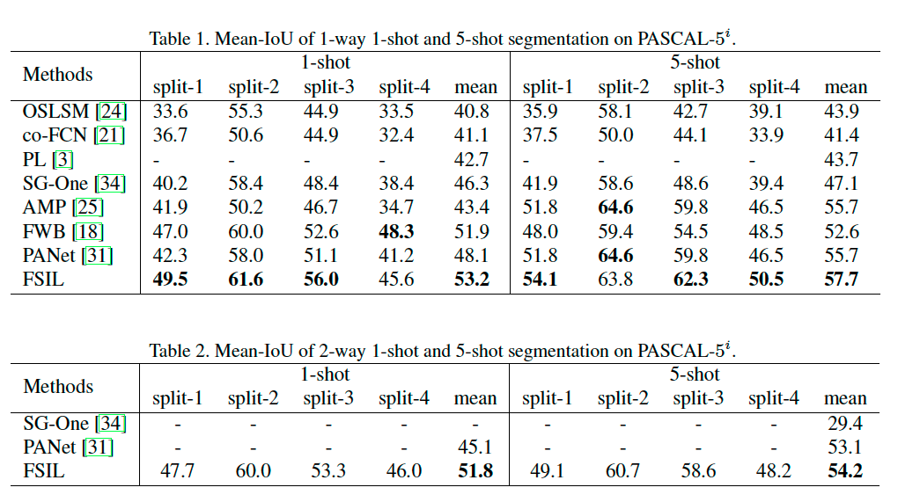

