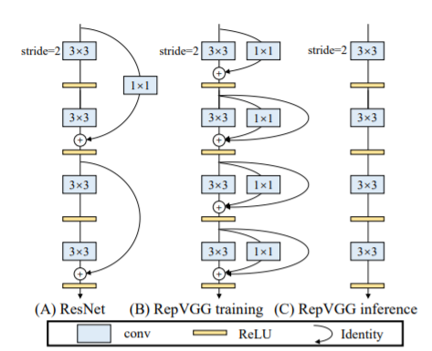
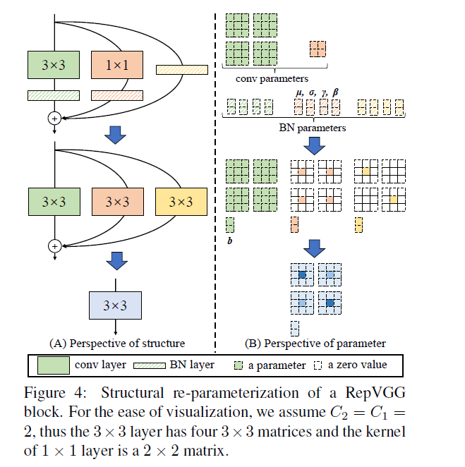

RepVGG

**reference**

arxiv paper：[RepVGG: Making VGG-style ConvNets Great Again](https://arxiv.org/abs/2101.03697)

作者自己的介绍：https://zhuanlan.zhihu.com/p/344324470 

code：https://github.com/DingXiaoH/RepVGG

基本结构：

主要思路：通过训练时的多分支提高表达能力，在infer时合并BN、1x1、identity map得到纯3x3的网络结构（conv3x3在现代的计算库中一般都会有优化，e.g. winograd conv），可以提高效率。同时可以节省内存，计算密度高，灵活性好。

之所以可以让vgg重新达到高精度，主要在于用了reparam的训练策略。作者介绍的motivation是这样的：首先，resnet的效果来源于多分支的ensemble，而我们又不希望部署一个多分支的网络，因此采用了训练多分支，部署单一分支的网络的策略，这种策略的实现方法就是重参数化。

repvgg中的重参数化方式如下：

首先，将1x1和identity写成特殊的3x3形式，然后分别吸收BN的参数，然后相加合并，称为单支路inference网络。

