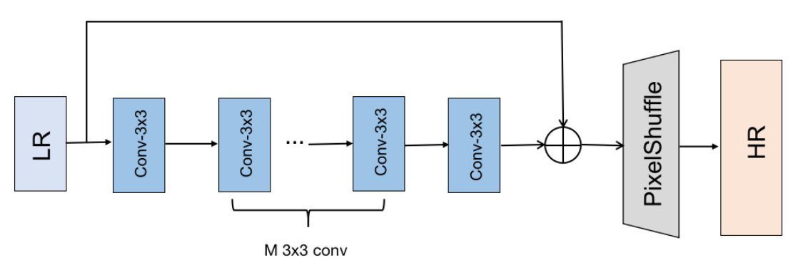
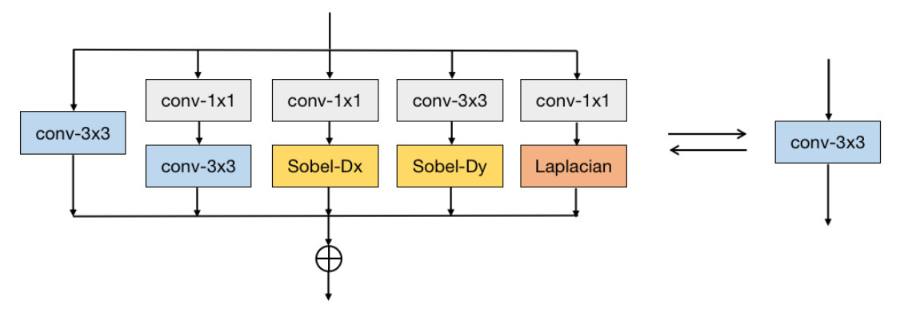

ECBSR：Edge-oriented Convolution Block for Real-time Super Resolution on Mobile Devices

**reference**

[Edge-oriented Convolution Block for Real-time Super Resolution on Mobile Devices](https://www4.comp.polyu.edu.hk/~cslzhang/paper/MM21_ECBSR.pdf)

ECB是重参数化应用于超分的一个工作，主要解决通用的reparam不适用于SR场景的一些问题。

ECBSR注重网络再移动端的性能，因此网络结构比较简单，放弃了多分支，dense链接等类型的操作，并且主要用3x3 conv，其重点在于其重参数化的方式：

主要的几个技术点：

1. 3x3 conv作为base，提高端侧运行效率；
2. 利用1x1进行expand，然后用3x3进行squeeze降维度，增加网络宽度，提高超分效果；
3. 多分支，一阶sobel和二阶laplacian提取边缘特征；sobel和laplacian可以用DWConv实现。

