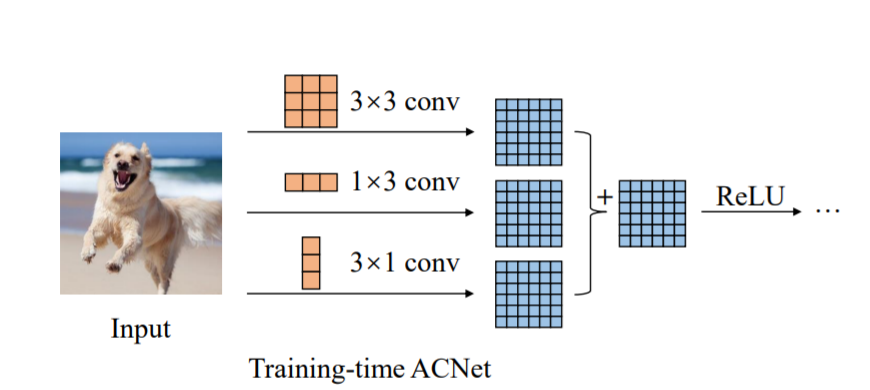

ACNet

**reference**

Paper: https://arxiv.org/abs/2103.13634

Code: https://github.com/hellloxiaotian/ACNet

主要结构是用1x3、3x1、以及3x3进行多分支学习，然后合并为一个3x3。

对于为什么可以提高效果，一种解释是横向和竖向的行列向量可以对水平和竖直方向的flip具有一定的鲁棒性，而这一点正方形kernel不具备。

