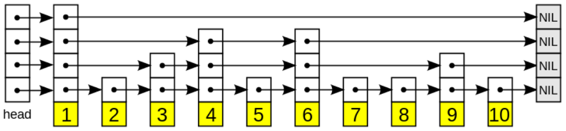

#### 跳表（skiplist）的基本概念

跳表是一种改进版的linked list，目的是解决链表的查找效率低的问题。基本思路是对有序链表建立层级索引，是的高层级遍历时每次可以越过若干数据，直接对后面的进行比较。形式如下：

通过这种结构，跳表可以像数组一样的复杂度实现二分查找。假设每隔一个元素建立上一级索引，那么，查找过程和树结构类似，从上到下，每个层级只需要比较三次（每一个上级区间对应下一级的两个区间，即头、中、尾三个节点）。而层数为logN，因此，搜索速度为O(log N)。

同理，插入和删除本质上对于链表来说本质上就是找到所在位置，还是查找问题，也是O(log N)复杂度。

对于空间复杂度，由于需要维护层级索引，层级索引的数量为N/2 + N/4 + 。。。，最终为O(N)。

**增删的问题：重建索引？**

对于增删，如果直接在最底层的链表中插入或删除，会造成索引间隔不均匀，比如一直在一个上面的区间中插入元素，那么在这个区间中的查找就会退化到普通链表。因此需要调整索引，保证基本均匀。

一般采用的是随机生成索引level，比如，插入（构建时也是一样的）一个元素时，首先进行一次取随机，比如random 0-1，如果p<0.5，在level-1建立索引，如果p<0.25，在level-1和2建立索引，。。。以此类推。一个示例代码如下（来源于redis中的跳表实现）：

~~~c
int zslRandomLevel(void) {
    int level = 1;
    // 随机数，进行比较，如果小于p，则继续向上
    while ((random()&0xFFFF) < (ZSKIPLIST_P * 0xFFFF))
        level += 1;
    // 保证小于设定的最大级别
    return (level<ZSKIPLIST_MAXLEVEL) ? level : ZSKIPLIST_MAXLEVEL;
}
~~~

**时间-空间trade-off**

对于设定的p值，即向上建立索引的概率，p越小，则索引越少，于是空间占用更少，但是查找速度会变慢；相反，如果p较大，则索引较多，占空间大，但是查找更快。

**跳表的优点**

原理和查找树类似（如红黑树），都是通过高级别的边界形成二分搜索。但是跳表对于区间查找（比如查找100<x<140）更简单，效率更高。（方法：找到头结点位置（100）直接向后遍历最底层链表即可。）

