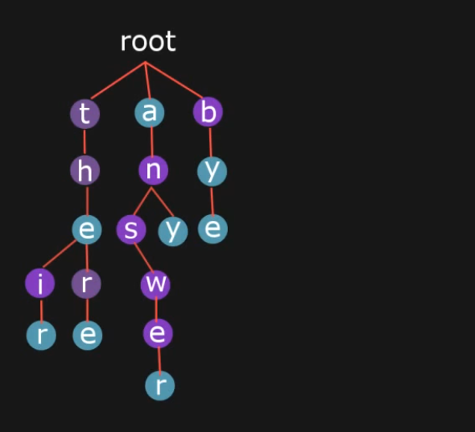

#### Trie（前缀树/字典树）基本原理

Trie字典树是用于高效查找字符串的一种数据结构。

trie的基本原理是利用大量字符串具有共同前缀的特点，将所有字符串存储到树结构上，树中的每个叶子节点以及部分中间节点代表一个字符串（单词），查找时只需要按照待查字符串的前缀从前向后遍历，同时从上到下走查树中的路径即可。如果路径在某个位置断了或者遍历完成后的那个节点没有单词标识符，则查找不成功，否则查找成功。

trie的建立就是不停的插入字典中的新元素。因此只需要考察插入、查找、删除即可。

一个例子：

trie的特点：

根节点没有值，第一个字符从第二层开始。

不同的颜色标注了是否是一个单词，比如the、there、their、any等对应的颜色说明他们是单词，即使不在叶子上。

**插入**

从左到右取出新字符串的字符，与当前trie的层中的字符集合进行比较。

如果当前字符不在该层所有的字符中，那么将其插入，并将后面的字符依次接到这个节点下面。

如果当前字符在该层的字符节点中，那么沿着该节点继续向后遍历。

当新字符遍历完后，将当前节点的单词flag置为True（中间节点或叶子节点）。

**查找**

遍历新字符串中的字符，与trie的当前层的所有字符集合进行比较。

如果当前字符失配（不在当前层集合里面），直接return False

遍历完成，return 当前节点的单词flag

**删除**

由于字典树的中间节点也可能是一个word，因此删除时需要考虑这一点。

先查找，找到待删除的点，然后分类讨论：

- 如果该节点为中间节点，那么直接将flag置为False即可。
- 如果为叶子，删除节点，并向上回溯删除，直到遇到一个flag=True的节点（说明也是一个word，不能删掉），停止删除。如果一直没遇到，回溯到root停止。

Trie树的最坏时间复杂度为O(n)，其中n为字符串长度。

