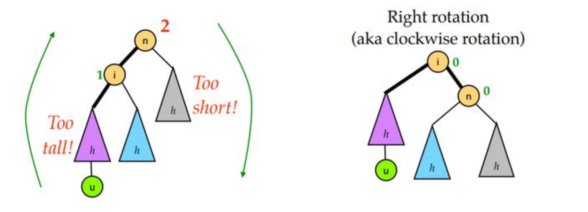
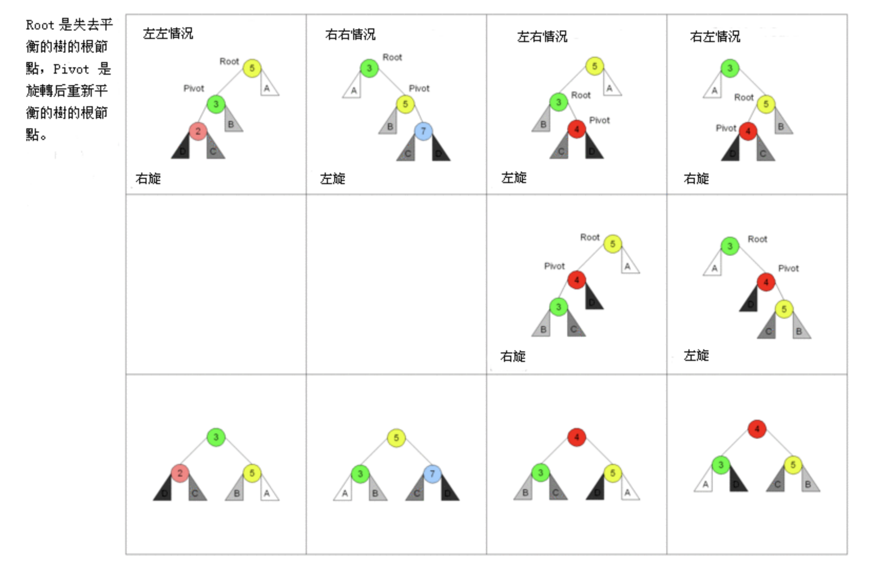

#### 平衡二叉树之：AVL树

- AVL树的平衡是通过左旋和右旋两种操作实现的
- AVL树的平衡分为四种情况：LL/RR/LR/RL，分布施加不同的左右旋操作。
- AVL树是的搜、插、删的最坏复杂度和平均复杂度都是O(log n)级别。

AVL树是一种经典的可以自平衡的二叉查找树结构，名称来源于发明者（Adelson-Velsky and Landis Tree）。示意图（from wiki）：

**定义：平衡二叉树**

- 左右子树高度差最大为1。
- 左右子树各自也都是平衡二叉树。（递归定义）

定义：**树的高度**

- 左右两棵子树的高度最大值。

AVL树除了保存data和left、right指针以外，还需要保存一个balance factor。

所谓balance factor，指的是左右两子树的高度差。即node->left->height - node->right->height。

因此，AVL树可以定义为所有节点balance factor绝对值都不大于1的树。

在AVL树的插入过程中，由于直接插入指定位置可能会破坏平衡（即使得平衡因子不再是-1、0、1），因此需要对其进行rebalance操作。AVL的实现是通过旋转，分为**左旋**和**右旋**。

（一个演示：https://www.cs.usfca.edu/~galles/visualization/AVLtree.html）

**左旋（left rotation）和右旋（right rotation）**

左旋：

当某个节点x的右子树比左子树高2个的时候，就需要左旋以重新平衡。具体的操作分为三步：

1. 将x的左子树拿下来。（准备将它提上去当x的父亲，空出x的左边来接受后面的）
2. 如果x的左子树left有右子树，那么先把右子树挂在x的左子树上。（保持顺序，并且为左子树空出右边，以便将x变成left的右子树）。
3. 将x挂在left的右子树上。旋转完成。

右旋完全对称：

**四种情况：LL/RR/LR/RL**

AVL树对于导致不平衡的插入分为四种情况讨论：

LL：插入左子树的左子树

RR：插入右子树的右子树

LR：插入左子树的右子树

RL：插入右子树的左子树

对于LL 和 RR，如上图情况，可以看出，只需要进行右旋或左旋即可完成平衡。对于LR和RL，需要两步：

LR先对左子树左旋，然后变成了一个类似LL的情况，此时，在对根进行右旋，即完成操作。

RL完全对称，先右子树右旋，变成RR，然后根左旋，完成操作。

