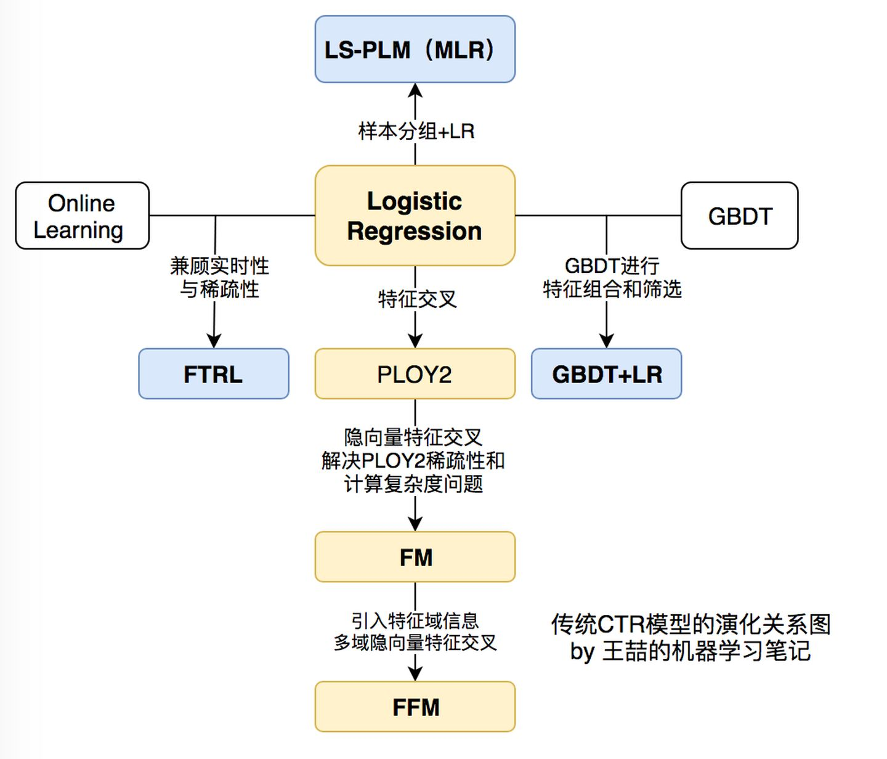
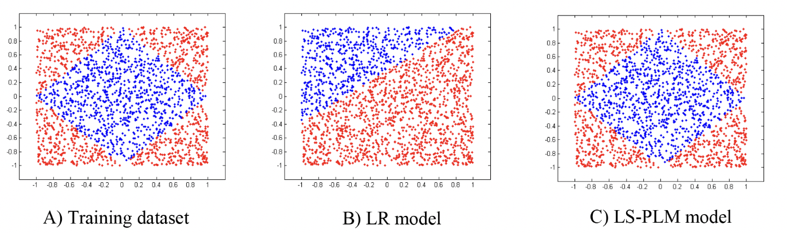

逻辑斯蒂回归（LR）模型与变体

LR模型可以用来做CTR预估，首先将推荐问题视为一个用户对各个item的点击率的预测问题，点击率高、兴趣可能性大的就给予推荐。

LR模型的pros and cons：

-   LR模型的优点：可以融合各路特征，并且可解释性好。模型稳定。
-   LR模型的局限性：不能利用特征之间的关系，模型较弱，拟合能力有限。

从LR出发，可以有两种优化方案：一种是对LR本身做优化，比如分段线性的LR：MLR。另一种是从特征交叉方面出发，比如POLY2和FM系列。

推荐系统的各种算法的脉络图：

（ref：https://zhuanlan.zhihu.com/p/63186101）

MLR：

Mixed Logitstic Regression，混合LR。

>   ref：[Learning Piece-wise Linear Modelsfrom Large Scale Data for Ad Click Prediction](arxiv.org/pdf/1704.05194v1)

阿里曾经的主流模型。基本思路：先将样本分组，然后用不同组的softmax权重加权，分别计算LR概率，然后进行求和。本质上就是对LR施加了聚类的作用，让差距特别大的用户群体之间尽可能不相互干扰。

公式：

效果展示：

