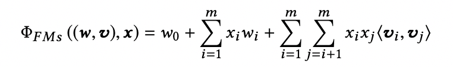
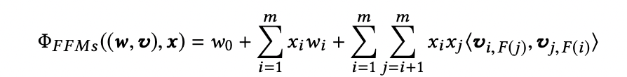

FM和FFM：基于二阶特征的FM和FFM模型

从FM发展出来的模型系列的基本出发点就是对二阶特征（即特征组合）的高效和合理的建模方法。

#### FM模型：因子分解机（Factorization Machine）

**FM的关键点：**

-   **在POLY2的基础上，用特征隐向量的内积作为权重，从而降低了权重参数量和自由度。**
-   **有效处理了稀疏性问题，POLY2只有特征i和j在同一个user中都有时才能更新权重wij，而FM对每个特征都有隐向量，因此在其他组合中（如ik或者jk等）对于vi和vj的优化也会影响wij。**

FM的公式：

对于POLY2，xixj的系数是直接学习的wij，而在FM中，系数为<vi, vj>这两个对应者i和j特征的隐向量的内积。

#### FFM模型：Field-aware FM（特征域因子分解机）

FFM的关键点：

-   基于FM的思路，对于每个特征，不再用单一的隐向量，而是一组隐向量。每次做内积得到权重<vi, vj>时，vi是i对应的{vik}中取出来和j所在的field对应的那个隐向量，vj同理，是i所在的field的隐向量。
-   表达能力更强，但是也提高了复杂度。

FFM的公式：

其中F(j)表示的是j所属的field编号。

