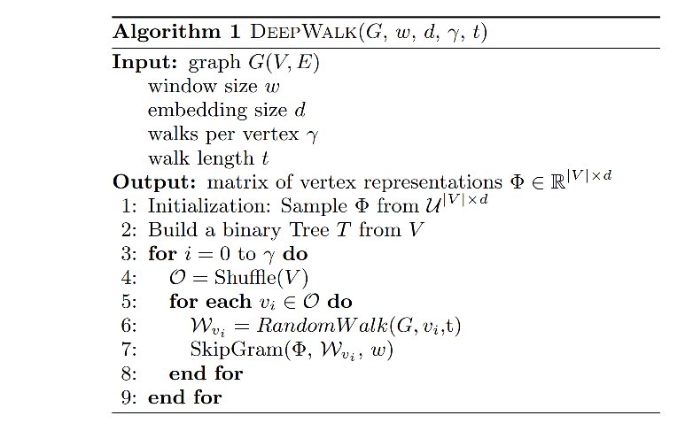

图嵌入方法：DeepWalk

> DeepWalk: Online Learning of Social Representations

DeepWalk是一种图嵌入方法，即将图的每个node映射成一个特征向量。这个特征向量包含这个node在图中所在位置的局部连接信息。这种嵌入只考虑node所在的位置的图结构，没有其他的信息。

DeepWalk的思路是：通过random walk的方式，从目标node出发随机游走，得到一系列路径，将这个路径上的node作为token，含有这些token的路径作为sentence，那么这就变成了一个word embedding的任务，于是可以通过词嵌入的方法进行求解。

deepwalk的算法流程如下：

