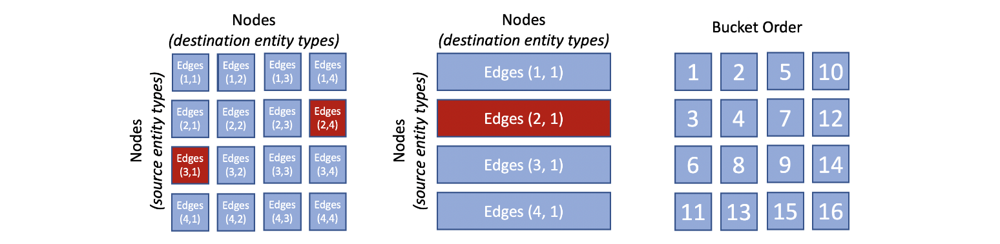
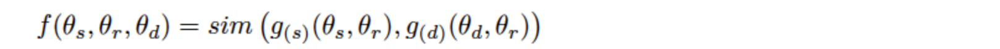
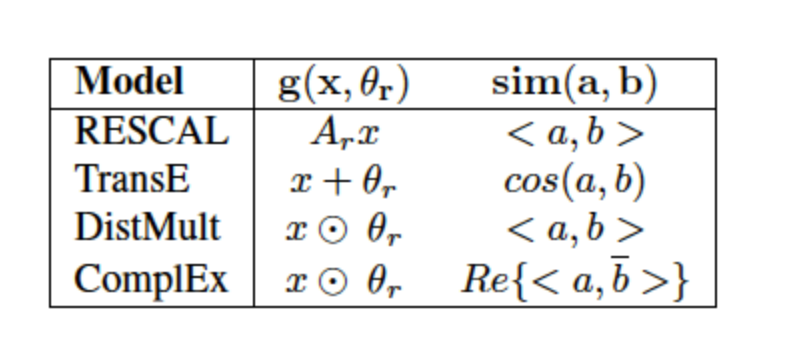

PBG 图嵌入方法

> Ref：[PYTORCH-BIGGRAPH: A LARGE-SCALE GRAPH EMBEDDING SYSTEM](https://mlsys.org/Conferences/2019/doc/2019/71.pdf)
>
> Github: https://github.com/facebookresearch/PyTorch-BigGraph

**基本思路**

读入edgelist，对各node赋予一个vector，通过更新vector，使得connected entities更加接近，unconnected entities距离更远。

**PBG的出发点：图的scale！**

**对于大尺度图的处理方法**

- 图的分割：graph partitioning, so that the model does not have to be fully loaded into memory
- 多线程计算：multi-threaded computation on each machine
- 多机同时计算图的不同的部分：distributed execution across multiple machines (optional), all simultaneously operating on disjoint parts of the graph 
- 批负采样：batched negative sampling, allowing for processing >1 million edges/sec/machine with 100 negatives per edge

分图，多机多线程，以及negative sample的批处理。

**Important components of PBG**

- A block decomposition of the adjacency matrix into N buckets, training on the edges from one bucket at a time. PBG then either swaps embeddings from each partition to disk to reduce memory usage, or performs distributed execution across multiple machines.
  对邻接矩阵分桶，可以用来降低内存压力（将embed swap进disk，用来节省空间），也可以用于分布式计算。

- A distributed execution model that leverages the block decomposition for the large parameter matrices, as well as a parameter server architecture for global parameters and feature embeddings for featurized nodes.

- Efficient negative sampling for nodes that samples negative nodes both uniformly and from the data, and reuses negatives within a batch to reduce memory bandwidth.
  有效的负采样

- Support for multi-entity, multi-relation graphs with per-relation configuration options such as edge weight and choice of relation operator.
  支持多实体、多关系（可以用于带权图）

**PBG 的 score function**

theta表示emb向量，s，d分别是source、destination，r是relation

因此这个打分函数表示是一个relation-specific的打分。可以factorize成gs和gd，使得theta s 和theta d 有semantic meaning。g (x, theta r) 的几种形式，以及sim(a,b) 的计算方式。函数 g 将边的类型加入进行考虑，sim计算两个向量的相关性。

由于graph中的edge分布是heavy tailed，因此如何负采样非常关键。

两种策略

- sample negatives strictly according to the data distribution
- sample negatives uniformly

PBG中，采用折中，alpha比例的负样本用1，(1-alpha)的用2均匀采样。

margin-based ranking objective

这个margin-based ranking loss在图中常用，用来force f(e’) - f(e) >= lambda。即，再向量空间中，negative的edge距离更远，而实际的edge距离更近。

f(e) = f(theta s, theta r, theta d) = f(gs, gd)，实际上就是经过了relation处理以后的source和dest的距离。

最关键的问题：如何进行切分，从而用分布式处理图，或者通过内存与disk的不断swap分别处理图的某个部分。做法：首先，将entity进行分组，分成P个partition。然后，将edge分bucket，对于一条边：s -> d，如果s属于pi，d属于pj，那么，这个边就属于bucket(pi, pj)。可见，bucket的数量是P squared。

实验部分测试的task：

link prediction
use embed as node vectors for other attribute prediction

 

**总结**

**PBG的基本思路是将节点（即entity）划分成不同的partition，这样就不用一次性将图都load进内存。然后，以节点的分片作为参考，对edge也进行分桶（bucket）。这样可以保证同一个bucket中的左右两边的节点（lhs和rhs）只关联某两个entity的分组。同时，neg sample也在这两个分组里进行，从而实现了如DNN那样，每次只读入一个batch，逐批次进行训练。节省了计算空间，原则上只要分的足够小，可以处理任意scale的网络。同时，由于可以切分，从而也可以用于分布式计算。** 

