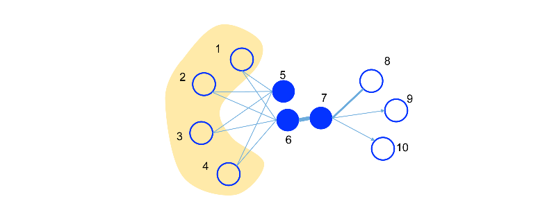
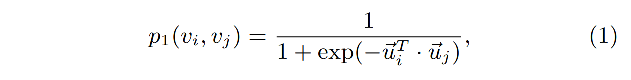
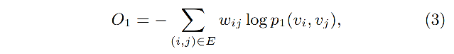
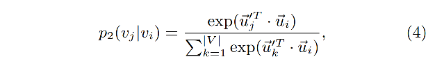
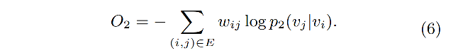

LINE图嵌入方法（Large-scale Information Network Embedding）

LINE的关键点：

- 应用了一阶相似度和二阶相似度来表征node信息。
- 可以处理有向图、无向图；带权图、不带权图。

> Tang J, Qu M, Wang M, et al. Line:  Large-scale information network embedding[C]//Proceedings of the 24th  international conference on world wide web. 2015: 1067-1077.

如图所示：

图中的节点的相似度应该有两方面的信息。一种是6和7，他们之间直连并且权重很大（线段宽度表示权重），因此6和7应该在embedding空间中相近。另一种是5和6，虽然它们没有直连，但他们的邻居都是一样的，也就是具有类似的context，因此，embedding也应该反应这种信息，即5和6也应该编码的近一些。

基于这个思路，LINE设计了两个目标函数：

**一阶相似度（first-order proximity）**

用两node内积的sigmoid值来度量两个node之间直接的相似度，这个p1所拟合的ground truth就是归一化后的两node之间的边权重，即：

$\hat{p_1}(i,j) = w_{ij} / W, \quad W = \sum w_{ij}$

loss选择的是KL-divergence，如：

可以看出去，一阶相似度中的vi和vj是对称的，因此只适用于无向图。

**二阶相似度（second-order proximity）**

二阶相似度表示的是一个条件概率，即以vi为中心，所有点的相似度的分布（对所有vertices做归一化）。这个拟合的应该是对vi的邻域做归一化后的vi和vj之间的权重。即：

$\hat{p_2}(v_j|v_i) = w_{ij} / d_i, \quad d_i = \sum_{k\in N(i)} w_{ik}$

拟合的loss函数仍然是KL-divergence：

**直观理解：一阶相似度希望的是两node的embedding的内积直接表达两个边的直连的权重；二阶相似度希望一个node与它周围的各个node的embedding的内积归一化后的分布，可以表示中心的node到它的邻域的权重分布。**

最终，LINE的优化是一阶和二阶相似度的梯度优化。在实现过程中，还采用了negative sampling和edge sampling来降低计算量。negative sampling是为了避免全局的node的求和。edge sampling是为了处理在求导时直接乘以边权重wij导致的梯度问题，因此将权重为w的边拆成w个权重为1的边，然后采样计算。

