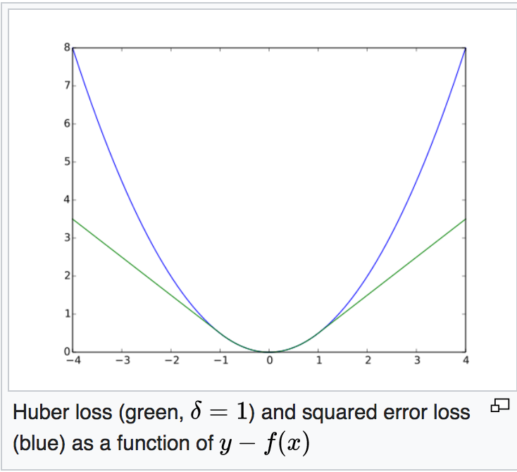
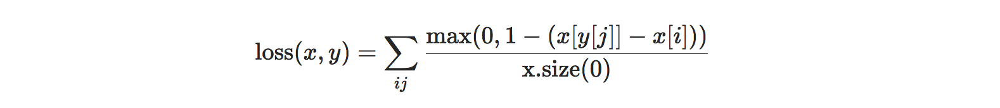
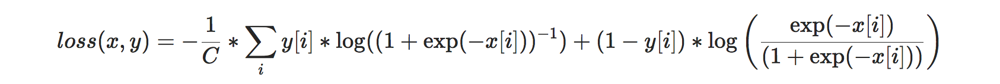
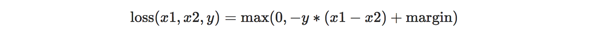
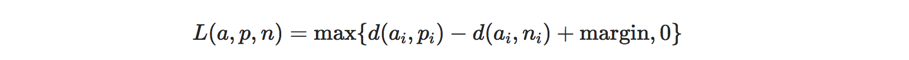

Pytorch中有定义的其他loss函数

#### NLL loss （negative log likelihood loss）

和交叉熵loss作用相同，但是需要先对输入进行Log softmax操作。如下：

~~~python
>>> m = nn.LogSoftmax(dim=1)
>>> loss = nn.NLLLoss()
>>> # input is of size N x C = 3 x 5
>>> input = torch.randn(3, 5, requires_grad=True)
>>> # each element in target has to have 0 <= value < C
>>> target = torch.tensor([1, 0, 4])
>>> output = loss(m(input), target)
>>> output.backward()
~~~

log softmax即先进行softmax，然后再取log。

#### Huber Loss

api：[`nn.HuberLoss`](https://pytorch.org/docs/stable/generated/torch.nn.HuberLoss.html#torch.nn.HuberLoss)

huber loss即原点处用平方项平滑的L1 loss，损失函数数学式如下：

$huberloss(x, y) = \left\{ \begin{aligned} 0.5(x-y)^2, x<\delta \\ \delta(|x-y| - 0.5\delta), otherwise  \end{aligned}\right.$

函数图像：

#### Multi-label Margin Loss

api：[`nn.MultiLabelMarginLoss`](https://pytorch.org/docs/stable/generated/torch.nn.MultiLabelMarginLoss.html#torch.nn.MultiLabelMarginLoss)

多标签任务中使用的loss，这里的margin是hard margin，即Hinge loss。该loss函数定义如下：

这里的x是prediction，y是真实label。函数$f(x) = max(0, 1-x )$ 即hinge loss。该函数也是SVM中的损失函数。hinge loss是对于0-1 loss的一个近似，对于x>1的，不进行惩罚，对于x<1的，越小惩罚约强。在上面的loss中，自变量为x[y[j]] - x[i]，也就是真实类别对应的预测值与其他类别的差距。我们的目标是真实类别上的预测值应该远大于其他类别上的预测值。根据hinge loss，只有真实类别的预测值比其他类别大1以上时，才不被惩罚，否则真实类别多出来的那部分越少，惩罚越大。最终对一个batch进行平均。

#### Multi-label Soft Margin Loss

api：[`nn.MultiLabelSoftMarginLoss`](https://pytorch.org/docs/stable/generated/torch.nn.MultiLabelSoftMarginLoss.html#torch.nn.MultiLabelSoftMarginLoss)

损失函数数学表达式：

对于multi-label，即一个sample对应多个标签，直接用softmax显然是不可行的，因为softmax实际上就是max函数的一种连续化的形式。而多标签中，比如五分类的情况下（0，1，1，0，0）表示这个sample既属于第2类，也属于第3类，那么就不能用一个max函数取最大，而应该让2和3两类都输出更大才对。

soft margin loss和上面的margin loss（hinge loss）类似，但是这里采用了一个sigmoid函数，变成了交叉熵的损失。对于sample所属的类别，令它对应输出x的sigmoid(x)更大，而对于不属于的类别，另1-sigmoid(x)更大。相当于对于每个类别位置单独施加sigmoid的BCE loss。

#### Margin Ranking Loss

api：[`nn.MarginRankingLoss`](https://pytorch.org/docs/stable/generated/torch.nn.MarginRankingLoss.html#torch.nn.MarginRankingLoss)

该函数用于度量一个ranking的准确性，即只关注相对位置（大小）关系，而不是绝对值。损失函数数学式：

这里的y表示的是x1和x2的大小关系（x1和x2为一个batch中取出来的两个样本构成的pair），如果 x1 > x2 则y=1，反之y=-1。由此可见，两者之间差的绝对值如果为d，那么loss就成了：max(0, margin - d)，也就是说，当d < margin，即两者的距离（按照真实rank的大数减小数）小于margin时，则受到惩罚；反之则不进行惩罚。从而使得所有的pair的顺序都尽可能正确，并且有一个margin（更加鲁棒）。

#### Triplet Margin Loss / Triplet Margin with Distance Loss

api：[`nn.TripletMarginLoss`](https://pytorch.org/docs/stable/generated/torch.nn.TripletMarginLoss.html#torch.nn.TripletMarginLoss)

api：[`nn.TripletMarginWithDistanceLoss`](https://pytorch.org/docs/stable/generated/torch.nn.TripletMarginWithDistanceLoss.html#torch.nn.TripletMarginWithDistanceLoss)

两个loss函数的区别在于，后者可以自己定义distance function，而前者的distance function只能是 lp 范数。

以triplet margin loss 为例，损失函数数学式：

其中，a，p，n分别表示anchor，positive，negative。这个margin的约束使得d(a,n) < d(a,p) + margin时会受到惩罚，也就是说，只有当anchor与negative的距离足够大（至少比anchor到positive的距离大出margin）之后，才被接受不被惩罚。
