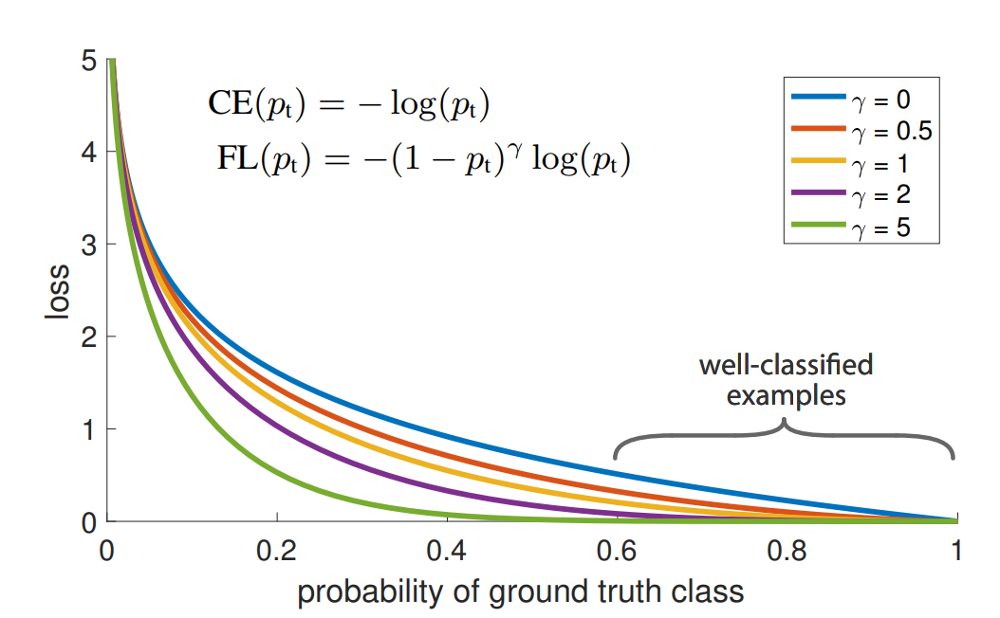

分割和检测中用到的特殊loss函数：

####  Focal Loss

focal loss 是在retinanet中提出的一种针对object detection的一种loss函数。最基本的目的是为了缓解one-stage的训练中的样本不均衡问题。样本不均衡有两种维度，一种是class imbalance，即类别不均衡，正负样本比例悬殊；另一种是难易样本不均衡，有些样本很容易分对，而有些则不容易。

focal loss的函数形式：

其中，pt为预测概率，y=1时pt为p（即直接的预测值），y=0时为1-p。pt越大，预测越准。因此，这里的 (1-pt) 就是不准确率，用来表示样本的难易，不准确率越高，说明样本约难分，反之，越低表示样本越简单，容易分对。

focal loss 的两个参数为alpha和gamma，alpha控制类别不均衡的加权，让少类别的样本多进行惩罚。gamma控制的是难易样本不均衡的加权，让难样本多惩罚。不同gamma下的focal loss曲线图：

很明显地，gamma取值越大，容易样本的权重越低，即更关注难分样本。

focal loss 代码示例：（ref：https://amaarora.github.io/2020/06/29/FocalLoss.html）

~~~python
class WeightedFocalLoss(nn.Module):
    "Non weighted version of Focal Loss"
    def __init__(self, alpha=.25, gamma=2):
        super(WeightedFocalLoss, self).__init__()
        self.alpha = torch.tensor([alpha, 1-alpha]).cuda()
        self.gamma = gamma

    def forward(self, inputs, targets):
        BCE_loss = F.binary_cross_entropy_with_logits(inputs, targets, reduction='none')
        targets = targets.type(torch.long)
        at = self.alpha.gather(0, targets.data.view(-1))
        pt = torch.exp(-BCE_loss)
        F_loss = at*(1-pt)**self.gamma * BCE_loss
        return F_loss.mean()
~~~

#### Dice Loss / IoU loss（Region-based loss系列）

**Dice loss** 是语义分割中的loss函数，直接对iou进行优化，相比于BCE loss更直接（在IoU作为eval criteria的情况下）。

**Dice Loss 被定义为：**

$DiceLoss(pred, gt) = 1 - Dice(pred, gt)$

**其中，dice系数的计算公式：**

$Dice(A, B) = \frac{2|A \cap B|}{|A|+|B|}$

在实际的计算过程中，由于pred的输出是一个heatmap，因此一般采取近似的计算，即用 pred x gt 表示两者的交集，pred + gt 表示分母的两者模数之和。另外，为了增加鲁棒性，一般上下加一个eps，防止除0，使得函数更平滑。

Dice loss的计算代码示例（https://kornia.readthedocs.io/en/v0.1.2/_modules/torchgeometry/losses/dice.html）

~~~python
class DiceLoss(nn.Module):

    def __init__(self) -> None:
        super(DiceLoss, self).__init__()
        self.eps: float = 1e-6

    def forward(
            self,
            input: torch.Tensor,
            target: torch.Tensor) -> torch.Tensor:

        # compute softmax over the classes axis
        input_soft = F.softmax(input, dim=1)

        # create the labels one hot tensor
        target_one_hot = one_hot(target, num_classes=input.shape[1],
                                 device=input.device, dtype=input.dtype)

        # compute the actual dice score
        dims = (1, 2, 3)
        intersection = torch.sum(input_soft * target_one_hot, dims)
        cardinality = torch.sum(input_soft + target_one_hot, dims)

        dice_score = 2. * intersection / (cardinality + self.eps)
        return torch.mean(1. - dice_score)
~~~

Dice loss的缺点在于：训练不稳定。如果预测结果完全没有交集，则导数为0，无法优化。而softmax loss（cross entropy）仍然可以对这些错误结果进行优化。Region based loss，包括后面的 IoU loss，以及各种变体都有类似的问题。

**IoU loss（Jaccard loss）**

上面的Dice系数可以写成：

$Dice(pred, gt) = \frac{2TP}{2TP + FP + FN}$

而IoU loss就是直接对IoU进行优化：

$IoU(pred, gt) = \frac{TP}{TP+FP+FN}$

IoU计算的是交并比，在集合论中交并比称为Jaccard系数，因此也被称为Jaccard loss

根据定义，可以计算出IoU和Dice的关系：

$IoU = Dice / (2 - Dice)$

两者的基本含义类似，在数值上dice的数值会比IoU更高。

#### Lovasz Loss

lovasz loss 是 IoU loss的一个surrogate function，它是对离散的IoU函数的一种光滑延拓。从而更容易优化。

> Ref : https://github.com/bermanmaxim/LovaszSoftmax
>
> https://arxiv.org/abs/1705.08790

