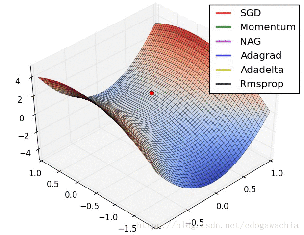
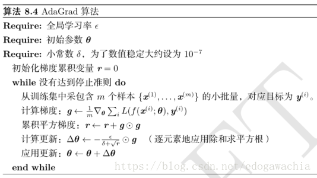
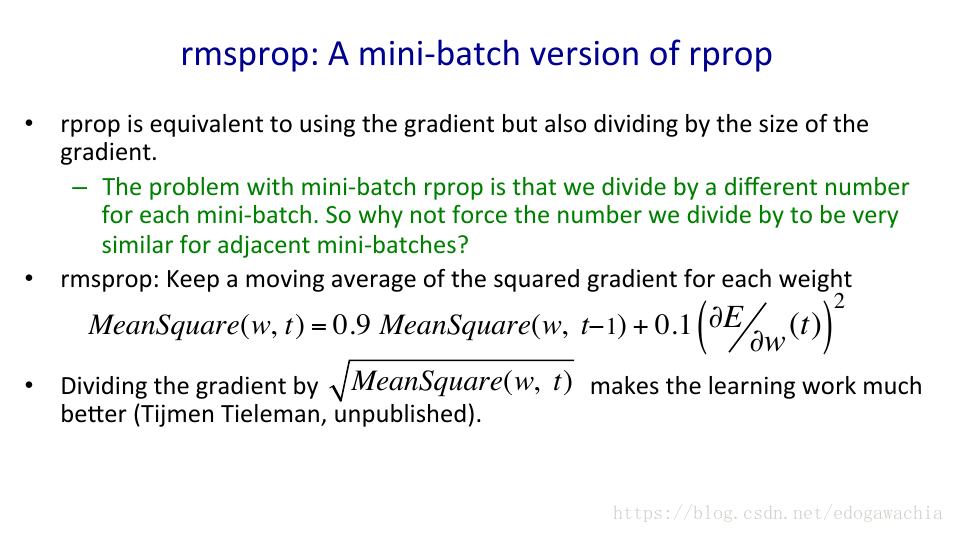
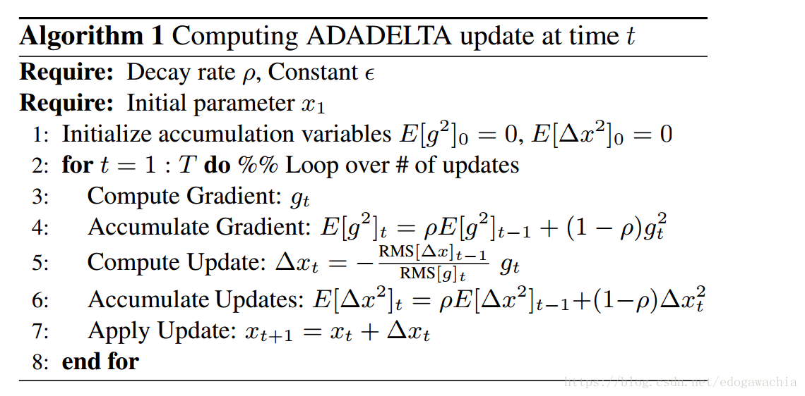
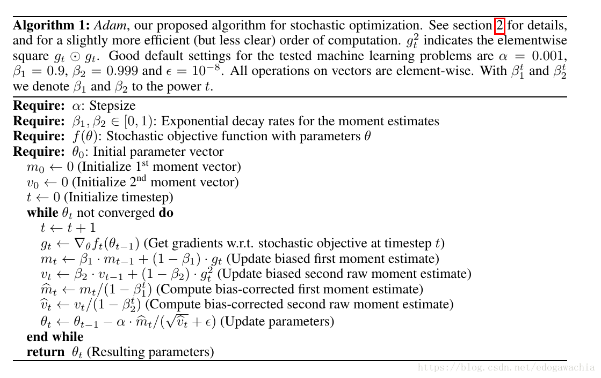
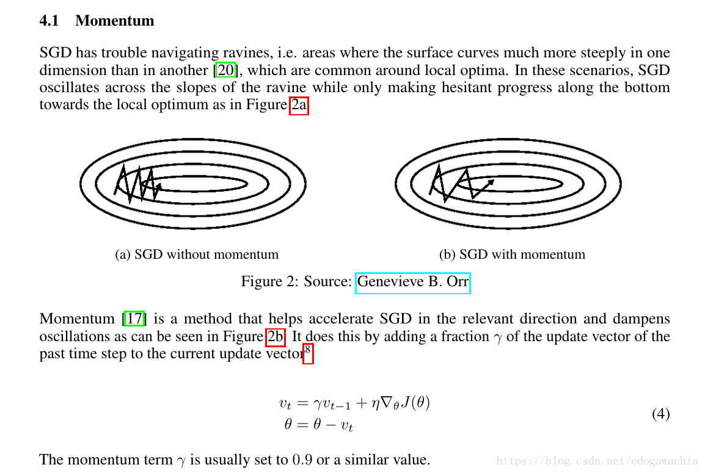
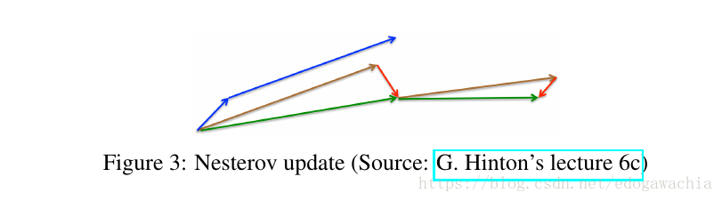
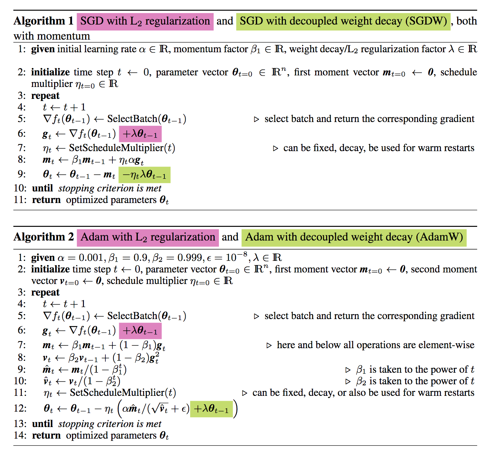

常见的梯度下降简单总结，从SGD到AdamW

整体思路在于对于不同的维度施加不同的步长，保留前面的下降历史结果作为设置步长的参考，从而使得各个方向上下降更稳定，减少不同方向尺度绝对值大小的影响。

实际上，优化算法可以分成一阶优化和二阶优化算法，其中一阶优化就是指的梯度算法及其变种，而二阶优化一般是用二阶导数（Hessian 矩阵）来计算，如牛顿法，由于需要计算Hessian阵和其逆矩阵，计算量较大，因此没有流行开来。这里主要总结一阶优化的各种梯度下降方法。先从最原始的梯度下降开始。

#### SGD/BGD/Mini-batch GD

简单来讲：样本少可以采用Batch Gradient Descent，样本过大可以SGD，实际情况下一般Mini-batch Gradient Descent。

BGD是一次将所有的样本点进行扫描并计算出梯度：

$x_{t+1} = x_t - \eta_t \nabla x_t$

这样虽然简单，但是具有一个很大的缺陷，就是对于较大的数据集速度很慢，而且也并不保险，很可能花了很长时间走到了局部最优，可是又出不来了，因为这里的梯度是0。所以并不实用。

样本较大时可以用SGD，随机梯度下降，也就是说，每次只用一个随机抽取的样本点求导数，作为最终结果，进行下降：

$x_{t+1} = x_t - \eta_t g_t$

这里的g代表着某一个样本的gradient。这样虽然不如直接做BGD在路径上更稳定，但是一般最终会找到最优解。而且还有好处是可以在局部最优解中跳出来，只要新选取的一个样本可以提供一个向外的梯度。SGD是一种可以用来做在线学习的，也就是每进来一个样本就更新一下参数。另外，SGD比BGD收敛更快。

常用的一个是Mini-batch gradient，也就是每次训练一个batch，可以尽量减少波动，同时又不必把所有的都投入训练。因此比较常用。但是小批量下降并不能保证很好的收敛，并且，需要选择learning rate，这是很困难的。

#### AdaGrad

前面的sgd是对所有的参数统一求导和下降的，但是由于实际数据中可能存在这样一种情况：有些参数已经近乎最优，因此只需要微调了，而另一些可能还需要很大的调整。这种情况可能会在样本较少的情况下出现，比如含有某一特征的样本出现较少，因此被代入优化的次数也较少，这样就导致不同参数的下降不平衡。adagrad就是来处理这类问题的。

**adagrad的基本想法是，对每个参数theta自适应的调节它的学习率，自适应的方法就是对每个参数乘以不同的系数，并且这个系数是通过之前累积的梯度大小的平方和决定的，也就是说，对于之前更新很多的，相对就可以慢一点，而对那些没怎么更新过的，就可以给一个大一些的学习率。**

Adagrad的算法如下：

pytorch中的Adagrad的一个代码示例（只展示关键行）：

~~~python
state['sum'].addcmul_(grad, grad, value=1)
std = state['sum'].sqrt().add_(group['eps'])
p.addcdiv_(grad, std, value=-clr)
~~~

#### RMSprop

这个实际上是对adagrad的一个改进，**也就是把Adagrad对历史梯度加和变成了对历史梯度求均值（当然这个不是严格意义上的均值）**，然后用这个均值代替Adagrad的累加的梯度和对当前梯度进行加权，并用来update。

用均值代替求和是为了解决Adagrad的学习率逐渐消失的问题。

#### AdaDelta

这个更高级，用AdaDelta下降我们甚至不需要设置学习率。它的基本思路是这样：首先，借鉴了Adagrad的思路，**对每个参数进行自适应的学习率变化，依据的也是之前的梯度的累积，但是这里不是像Adagrad那样直接加起来，而是用平均值的方式（实际使用的是RMS），把之前的梯度大小的影响加进来。目的是计算历史梯度在某个窗内的值的均值，但是不通过储存窗口内的值，而是用了当前的均值和当前的梯度来近似计算。**另外，为了解决Adagrad，sgd等方法中直接用梯度的倒数可能带来的假设单位不相同的问题（个人理解是这样：希望更新梯度乘上系数以后，那个系数是不带单位的，这样update和当前的parameter有相同的单位才能叠加），把梯度的系数的分子上的eta换成了之前更新的部分Delta(theta)的RMS，这样，更新就变成了：

$\Delta\theta_t = - \frac{RMS[\Delta\theta]_{t-1}}{RMS[g]_t} g_t$

$\theta_{t+1} = \theta_t+\Delta\theta_t$

整个AdaDelta的算法流程如下：

#### Adam

adam名字来源是**adaptive moment estimation**。Our method is designed to combine the advantages of two recently popular methods: AdaGrad (Duchi et al., 2011), which works well with sparse gradients, and RMSProp (Tieleman & Hinton, 2012), which works well in on-line and non-stationary settings。也就是说，adam融合了Adagrad和RMSprop的思想。

这里，用gt的一次方和平方来估计一阶矩和二阶矩，由于不是全部储存求平均，而是迭代更新的方法，所以会有bias，两个带hat 的mt和vt就是消除bias以后的结果。然后用这两个估计的m和v进行更新。

#### Momentum

动量法是为了解决维度的倾斜程度不相等的问题，让下一步的位置带上一些上一次的惯性，而不是完全按照更新后的走，这样会更稳一点，减轻上图所示zigzag的这种情况。

#### Nesterov Accelerated Gradient (NAG)

NAG的思路也很简单，那就是要解决直接动量下降可能直接迈的步子太大的问题，因为我们当前下降的时候是无法知道下一步究竟落在一个什么地方的。但是由于momentum中我们常常把动量项，也就是上一时刻的更新的值，的权重设置为0.9左右，也就是说，下一步达到的位置很大程度是由动量项决定的，因此我们可以先用动量项估计一下下一步的大概位置，然后在估计的位置求取梯度，在将这个梯度作为更新的梯度项，和动量项加起来做一个update。

这个图表示的就是momentum和NAG的区别，蓝色是momentum，先计算梯度，在加上动量，红和绿色表示NAG，先加上动量项，再计算梯度。

> reference： https://arxiv.org/pdf/1609.04747.pdf 
>
> 及其翻译版：https://blog.csdn.net/google19890102/article/details/69942970

#### AdamW

> DECOUPLEDWEIGHTDECAYREGULARIZATION  https://arxiv.org/pdf/1711.05101.pdf
>
> ICLR 2019

AdamW是对Adam中的一个bug的修改版，W指的是weight decay decouple，即将正则化中的weight decay与梯度下降解耦。

之所以做这个修改，是由于这样一个观察：L2正则化和weight decay在自适应的方法（比如Adam）中并不等价。一般来说，对于简单的SGD，对一个含有权重平方项的regularization求导，刚好就是w的一次方，如下：

$loss = f(x) + \lambda ||w||^2$

求梯度：

$grad = \nabla f(x) + \lambda w$

因此，用grad更新时，加正则化就等价于对w多减去一个lambda w的值，也就是通常实现的weight decay。但实际上，对于Adam这种复杂的lr计算方法，由于加了momentum、历史梯度等一系列操作，这两者不在等价了。但是在以往的实现中，还是采用在计算出去的grad上直接加一个weight的项，然后进行后续操作。这种情况下，如果grad值很大，那么正则化就变得很弱了。

因此，AdamW将grad计算与weight decay解耦，将weight decay放在最后一步操作。如图：

