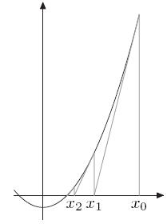

牛顿法 和 拟牛顿法

和梯度下降一样，牛顿法也是一种优化策略。但是梯度下降只考虑被优化函数的一阶导数，而牛顿法则利用了优化函数的二阶导数，从而拟合更加接近真实函数曲面，从而下降速度更快，更稳定。当然，这也是需要牺牲计算量为代价的。

下面分别介绍牛顿法和拟牛顿法的基本思路：

#### 牛顿法（Newton method）

牛顿法最被人熟知的一个应用就是方程求根，也就是函数求零点。比如：

$f(x) = 0$

可以利用Taylor展开，得到近似表示：

$f(x+\Delta) = f(x) + f^{'}(x)\Delta + \frac{1}{2}f^{''}(x)\Delta^2 + \cdots$

只保留到一次项，那么，对于求解$f(x) = 0$来说，可以近似如下：

$f(x+\Delta) =0$

$ f(x) + f^{'}(x)\Delta  = 0$

$\Delta = -\frac{f(x)}{f^{'}(x)}$

换句话说，对于当前函数值不等于0的x，通过增加$\Delta = -\frac{f^{'}(x)}{f(x)}$就可以使得函数等于0。当然，考虑到这里是近似的结果，因此，将delta作为修正x的increment，进行迭代，即可求解到合适精度的0点。

另一个问题是优化，即求解：

$\min f(x)$

这个优化问题在凸优化约束下可以等同于求解导数的零点，于是被化归到了上面的求根问题。应用牛顿法：

$\Delta = -\frac{f^{'}(x)}{f^{''}(x)}$

可以看到，这里的步长是由二次项算出来的（注意：牛顿法是二阶方法，直接求根只用一阶导数，但是求优化问题是对一阶导数求根，因此需要用二阶导数。）

对于多元函数，更新方式为：

$x_{n+1} = x_{n} - B^{-1} \nabla f(x_n)$

可以看出，牛顿法二阶拟合，收敛快，但是需要计算B，也就是二阶Heissen阵的逆矩阵，复杂度高。

#### 拟牛顿法（quasi-Newton method）

下面简单介绍拟牛顿法。

拟牛顿法实际上是一类算法，常见的BFGS、L-BFGS等都属于拟牛顿法。

拟牛顿法的思路就是通过一个矩阵近似拟合Heissen阵的逆，从而省掉求逆的操作，降低复杂度。

首先，考虑Heissen阵的性质：

$\nabla f(x) = \nabla f(x_k) + H_k (x - x_k)$

实际上就是把grad当成原始函数，进行一阶Taylor展开，和对f(x)展开方式一样。

如果令$x = x_{k+1}$，那么：

$\nabla f(x_{k+1}) - \nabla f(x_k) = H_k (x_{k+1} - x_k)$

记：$y_k = \nabla f(x_{k+1}) - \nabla f(x_k) $，$\delta_k = x_{k+1} - x_k $

那么，Hk应该满足的性质就可以写成：

我们拟合inverse(H)，只需要另其满足上面这个条件就可以。这个条件被称为**“拟牛顿条件”（quasi-newton condition）**。

实际上，如果将梯度函数作为原函数，那么，这个条件就是delta y = f' delta x，也就是导数近似于小的delta y 除以小的 delta x。