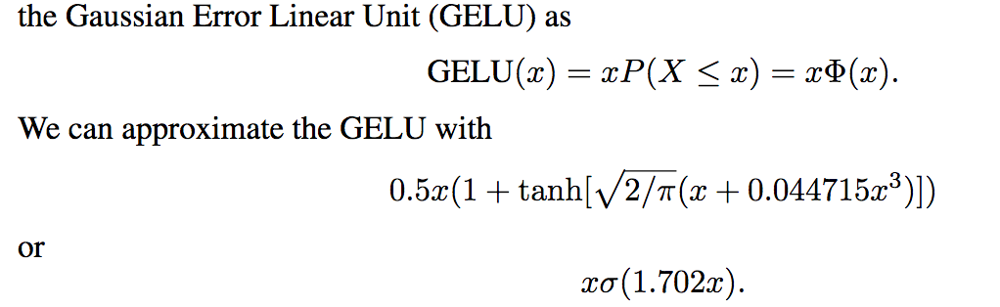
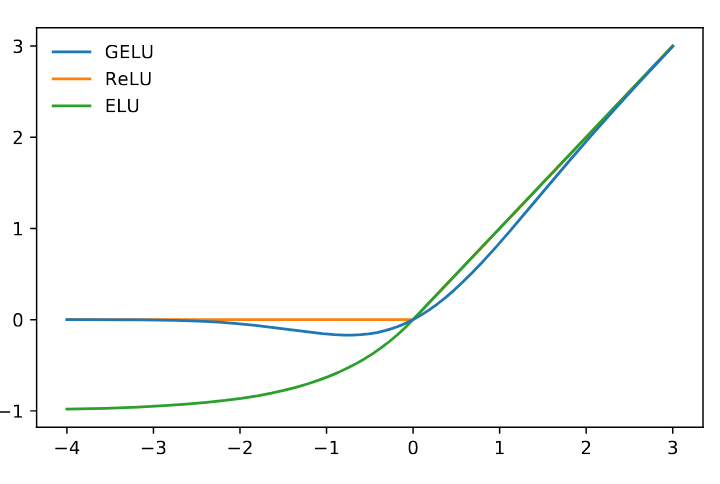

GELU，全称：**Gaussian Error Linear Unit**

形式和对应的近似如下，其中Phi是gaussian分布的cdf：

**GELU在Transformer类模型中应用较多**。近似的结果是一个swish类的函数，即x sigmoid(x)。函数图像：

GELU的一个近似实现：（https://github.com/codertimo/BERT-pytorch/blob/master/bert_pytorch/model/utils/gelu.py）

~~~python
import torch.nn as nn
import torch
import math

class GELU(nn.Module):
    """
    Paper Section 3.4, last paragraph notice that BERT used the GELU instead of RELU
    """

    def forward(self, x):
        return 0.5 * x * (1 + torch.tanh(math.sqrt(2 / math.pi) * (x + 0.044715 * torch.pow(x, 3))))
~~~

