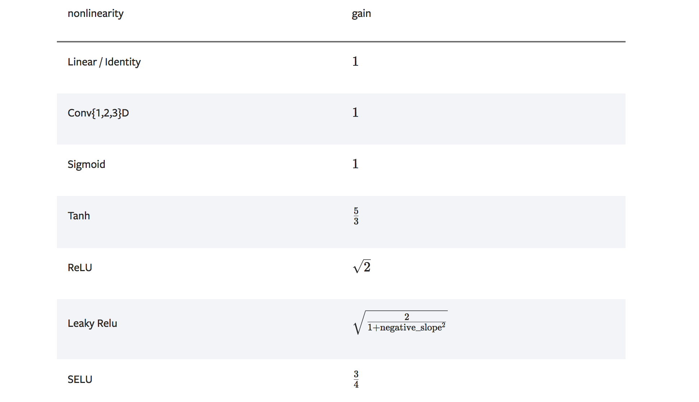

 比较常用的几种经典网络参数初始化方法及其原理

参数初始化的核心问题是如何通过控制网络计算过程中每层中神经元的取值的分布，来尽可能避免梯度消失/爆炸。常用的主要有如下几种类型：

- **固定常数初始化。**即直接将w或b赋值为某个constant，比如全0或全1。这个方法使得所有neuron的初值一样，从而得到的梯度也一样，更新过程相同，具有对称性，这是需要避免的。因此一般不用常数初始化。
- **随机初始化。**即给定某个分布的参数，根据该分布进行随机取值。即控制了参数分布，又打破了对称性。常见的train from scratch的方法一般就是随机初始化。比如xavier、kaiming等，或者最简单的直接人工给定分布系数的，如N(0, 1)，进行初始化。
- **预训练/自监督结果初始化。**pretrain+finetune实际中应用较多。一般利用imagenet等数据集上的预训练模型、或者self-supervised的模型，进行初始化。


#### Naive random initial

普通的随机初始化，设置一个固定的分布，将权重进行初始化，比如：

```python
 torch.nn.init.uniform_(tensor, a=0.0, b=1.0)
```

或者

```python
torch.nn.init.normal_(tensor, mean=0.0, std=1.0)
```

这种方法很容易导致在计算过程中，数值变的非常大或者非常小。因此需要对分布的参数进行设计。


#### Xavier initial

> [Understanding the difficulty of training deep feedforward neural networks](http://proceedings.mlr.press/v9/glorot10a.html)  2010  ‘Xavier initialization’

Xavier初始化的目的就是：尽可能保证前后隐层数值分布的方差相同。根据这一约束，可以进行计算：

$h^{k} = \sum_{n_{k-1}} w_i^{k} h_i^{k-1}$

由于有了n项求和，那么方差也进行了放大，即：

$D(h^k) = n_{k-1} D(w^{k}) D(h^{k-1})$

另hk和hk-1相等，那么可以得到第k-1层的方差为：

$D(w^{k}) = 1/n_{k-1}$

这是正向传播，考虑反传过程的计算，类似的推导可以得到：

$D(w^{k}) = 1/n_{k}$

考虑到正传和反传都要尽量保持前后层方差相等，**Xavier取第k层的wk的方差为：**

$D(w^k) = 2/(n_{k-1} + n_{k}) = 2/(fan\_in+fan\_out)$

已知方差，可以计算出在uniform和normal分布下的参数。如下：

xavier uniform：

$U(-a, a), a = \sqrt{\frac{6}{fan\_in+fan\_out}}$

xavier normal：

$N(0, std^2),  std = \sqrt{\frac{2}{fan\_in + fan\_out}}$


Pytorch 中的代码：

~~~python
def xavier_uniform_(tensor: Tensor, gain: float = 1.) -> Tensor:
    fan_in, fan_out = _calculate_fan_in_and_fan_out(tensor)
    std = gain * math.sqrt(2.0 / float(fan_in + fan_out))
    a = math.sqrt(3.0) * std  # Calculate uniform bounds from standard deviation
    return _no_grad_uniform_(tensor, -a, a)

def xavier_normal_(tensor: Tensor, gain: float = 1.) -> Tensor:
    fan_in, fan_out = _calculate_fan_in_and_fan_out(tensor)
    std = gain * math.sqrt(2.0 / float(fan_in + fan_out))
    return _no_grad_normal_(tensor, 0., std)
~~~

注意到，代码中还要乘以一个gain。前面推导方差时，没有考虑激活函数的情况。这里的gain就是代表激活函数对于分布的影响。各种激活函数的gain如下：




#### He initial / (a.k.a Kaiming initial or msra initial)

> [Delving Deep into Rectifiers: Surpassing Human-Level Performance on ImageNet Classification](https://arxiv.org/abs/1502.01852) winner of the 2015 ImageNet challenge  ‘Kaiming initialization’.


xavier初始化对于sigmoid类函数是有效的，但是对于relu效果不好。如果考虑激活函数，就是上面的gain的表格的内容。何凯明提出了针对relu的initial方法，推广了对于不同激活函数的初始化策略。


**He initial的初始化方差为 (基于relu激活函数计算)：**

$D(w_k) = \frac{2}{fan\_mode}$

其中，fan mode可以是fan in 或 fan out，取决于更关注FF还是BP。同样地，He initial也有uniform和normal两种，如下：

he uniform：

$U(-a, a), a = \sqrt{6/fan\_mode}$

he normal：

$N(0, std^2), std=\sqrt{2/fan\_mode}$


~~~python
def kaiming_uniform_(tensor, a=0, mode='fan_in', nonlinearity='leaky_relu'):
    if 0 in tensor.shape:
        warnings.warn("Initializing zero-element tensors is a no-op")
        return tensor
    fan = _calculate_correct_fan(tensor, mode)
    gain = calculate_gain(nonlinearity, a)
    std = gain / math.sqrt(fan)
    bound = math.sqrt(3.0) * std  # Calculate uniform bounds from standard deviation
    with torch.no_grad():
        return tensor.uniform_(-bound, bound)

def kaiming_normal_(tensor, a=0, mode='fan_in', nonlinearity='leaky_relu'):
    if 0 in tensor.shape:
        warnings.warn("Initializing zero-element tensors is a no-op")
        return tensor
    fan = _calculate_correct_fan(tensor, mode)
    gain = calculate_gain(nonlinearity, a)
    std = gain / math.sqrt(fan)
    with torch.no_grad():
        return tensor.normal_(0, std)
~~~

在pytorch的实现代码里， 方差是1/fan_mode，而不是前面提到的2/fan_mode。这是因为relu的激活函数的gain为根号2，所以最终计算结果是一样的。