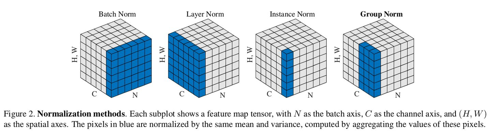
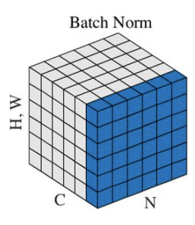

深度学习中的各种normalization方法

主要包括以下：

- BN（batch normalization）
- LN（layer normalization）
- IN（instance normalization）
- GN（group normalization）

#### BN (batch norm)

在mini-batch维度上进行norm，对于一个输入 **[b, c, h, w]**，则 **BN = norm([~, c, h, w])**。

BN是比较常用的规范化手段。通过对每个batch的数据沿着batch方向减均值除以方差，得到近似N(0,1)的分布，然后再学习一个alpha和beta，将normalize后的结果变换一下，从而补偿在归一化时的信息损失。

BN需要注意的一点：在训练过程中，如果某张卡上batchsize是1，那么则无法进行BN操作。因为此时均值为自己，方差是0，所以无法计算统计量并归一化。因此，使用BN必须保证batchsize至少要大于1。

**BN的优点：**

增加表达能力

#### LN (layer norm)

#### IN (instance norm)

#### GN (group norm)

