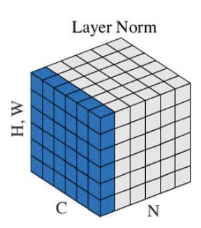
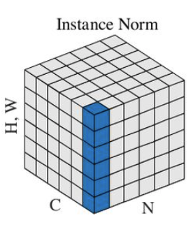
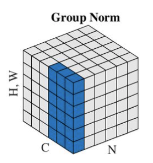

深度学习中的各种normalization方法

主要包括以下：

- BN（batch normalization）
- LN（layer normalization）
- IN（instance normalization）
- GN（group normalization）

#### BN (batch norm)

在mini-batch维度上进行norm，对于一个输入 **[b, d]**，则 **BN = norm([~, d])**。

BN是比较常用的规范化手段。通过对每个batch的数据沿着batch方向减均值除以方差，得到近似N(0,1)的分布，然后再学习一个alpha和beta，将normalize后的结果变换一下，从而补偿在归一化时的信息损失。

BN在实现中需要注意的关键点：

- 在训练过程中，如果某张卡上batchsize是1，那么则无法进行BN操作。因为此时均值为自己，方差是0，所以无法计算统计量并归一化。因此，**使用BN必须保证batchsize至少要大于1**。
- 对于卷积层的输出，[b, c, h, w]，实际上是在b, h, w上进行norm，也就是norm[~, c, ~, ~]。相对应的，学习出来的乘数和偏置，即gamma和beta，都是针对channel的，即**一个channel的feature map共用同一组系数**。
- **训练过程中，每个mini-batch分别算均值方差，各自进行normalization。而在inference阶段，则直接用训练数据集中的所有batch的均值方差的平均值。这个平均值一般在训练过程中通过moving avarage已经算好。**

**BN, the pros：**

增加**表达能力**；降低 **internal covariate shift**；一定程度上避免ReLU的**dead neuron**的现象；

**降低初始化方式敏感度**；控制数值范围，避免**梯度消失/爆炸**；可起到**正则化**的效果；

**BN, the cons :**

当batch-size大时，效果较好，**batch-size小的时候，由于一个batch的均值和方差不能很好的估计真实的分布参数**，从而效果变差。

#### LN (layer norm)

既然BN收到batch大小的影响，那么对于小batch size的情况，BN就不再适用。为了解决batch size影响的问题，Layer Norm被提出。Layer norm的基本思路就是在layer层面，即整个三维的feature map 上进行归一化。对于conv的输出 [b, c, h, w]，**归一化后的结果为 norm([b,~, ~, ~])**，每个样本得到一个各自的均值和方差，进行归一化。

LN（layer norm）的特点：

**可以处理RNN的归一化（常用在NLP类任务）**（BN则不行，因为RNN中输入的分布是变化的）；**摆脱了batch size的限制**。

#### IN (instance norm)

虽然LN不受batch大小的影响，但是由于feature map的不同通道携带不同的内容和表征，因此直接对所有通道一起进行norm是有问题的。而 Instance norm 的作用在于，对于每个channel，分别计算norm。对于[b, c, h, w]，IN的操作相当于：**norm([b, c, ~, ~])**。

对于风格化类的任务，由于最终结果可能更偏向于某个instance，所以不应该对其进行BN平均化。此时可以应用Inst Norm。

#### GN (group norm)

group norm 相当于一种介于 inst norm 和 layer norm 之间的规范化方式。它首先对channel进行分组，然后对每个组内进行归一化操作。

