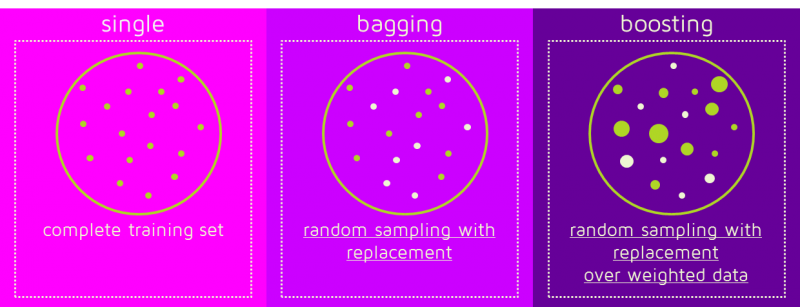
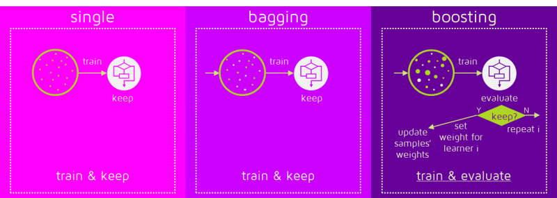
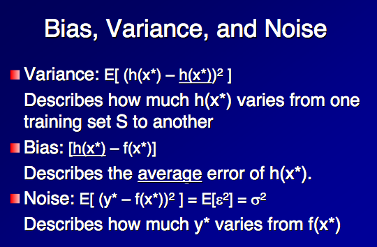
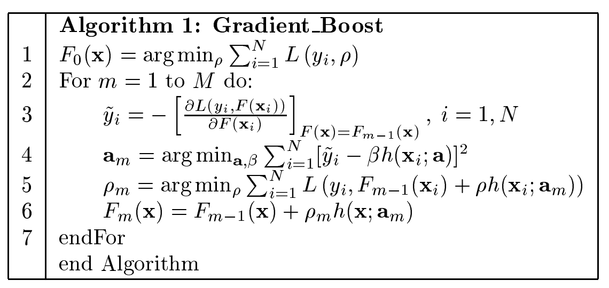

集成学习（ensemble）是实际任务中最常用的策略，同时也是一些常用算法（xgboost，random forest等）的理论基础。下面对集成学习的内容进行总结。

#### Bagging 和 Boosting 各自特点

> 图片参考：https://quantdare.com/what-is-the-difference-between-bagging-and-boosting/

bagging和boosting的区别：

- 基本的一些区别：bagging并行、boosting串行；bagging平均、boosting加权；bagging优化方差、boosting优化偏差。等等。

- bagging对样本集进行采样，获得多个有重叠但是不同的子集，分别训模型，然后进行融合；boosting是对样本集直接用于训练，但是根据训练的结果对不同样本进行加权（可以直接算法中调整，算法中不能调整的可以用过采样、欠采样调整）

- boosting有对模型进行评估和选择、加权等操作的过程。根据模型的误差，将误差超过限度的舍去，误差大的给一个低权重，误差小的给高权重，而不是简单的平均。

问题：bagging和boosting在实际中应该如何选择？

基于bias-variance理论。如果数据量少，经常训练过拟合，导致数据稍微变化方差就很大，那么应该用bagging，多采几次数据，训练一些不同的模型融合；如果模型很差，拟合不了数据集，那么应该用boosting来优化bias，但boosting不能解决过拟合问题。

**偏差-方差理论：**

泛化误差可以分成三个部分：bias+variance+noise，偏差表示拟合程度、方差表示对于不同数据集得到的结果与真实结果的不稳定性、noise表示的是标注和真实值的差距，即任务的困难程度（比如对于一个 y = x + n的生成模型，得到一些(x,y)的点，利用x学习y，那么总会有误差n产生，这是任何模型都不能避免的任务本身的难度。）

如图所示：

#### Stacking 的方法与应用

stacking 和 bagging、boosting 不同，它可以支持不同类型的学习器进行融合。而bagging和boosting都是同一种（树模型、NN）

> 图片reference：https://towardsdatascience.com/ensemble-methods-bagging-boosting-and-stacking-c9214a10a205

stacking 的基本流程是：对数据集应用若干个weak learners进行训练，比如kNN训练一个模型，树模型训练一个模型，LR再训练一个等等，即可得到多个不同模型的输出。然后进行一个meta training的过程，即训练一个meta-model，用来整合上面这些模型的输出，得到最终的结果。

具体实现中，为了stage 1的weak learner和stage 2的meta model所用的数据不相干，一般将数据集划分成两个fold，fold1用来训weak learner，得到各个模型后，在fold2上预测结果，并输入meta model，进行训练。可以用k-fold的方式将所有的数据都用上。

另外，meta-learner可以采用多级的形式，类似于NN的结构，首先，仍然用meta learner去整合weak learner的结果，但是此时采用多个这样的meta learner，比如m1，m2，…， mk。然后，将这k个整合后的结果再输入一个meta-learner中，进行训练。

#### GBDT（梯度提升树）的基本原理简介

Gradient boosting decision tree是一种利用CART树作为基分类器的boosting算法。基本步骤如下：（以回归问题为例）计算所有输出的平均值作为baseline预测结果（初始化结果），然后进入循环。在每轮循环t中，都有一个当前的强分类器（即t-1之前的所有分类器的融合结果），首先，根据当前分类器预测的结果与真实label计算loss，然后对预测结果的loss计算梯度（注意：这里是对强分类器F，即对函数计算梯度，而非对于单个参数，计算的结果即树模型**预测结果与真实label**的差距和方向。）

![r_{im} = -\left[\frac{\partial L(assets/724e7996c78440be2dce585a00e39ca9c561775b)}{\partial F(x_i)}\right]_{F(x)=F_{m-1}(x)} \quad \mbox{for } i=1,\ldots,n.](https://wikimedia.org/api/rest_v1/media/math/render/svg/724e7996c78440be2dce585a00e39ca9c561775b)

GBDT的目的是逐步拟合残差，从而尽可能消除残差，是的拟合效果更好。因此，这里的r就代表残差，是通过负梯度拟合得到的，因此称为pseudo-residual。

【关于为何拟合负梯度就是在拟合残差，可以利用loss函数在Fm-1处进行Taylor展开进行说明。】

接下来，就是通过新建立一棵CART树来拟合上一步的负梯度。得到的新树Tm可以用来对样本进行预测，预测过程即优化各个叶子节点的预测值，使得叶子节点中的样本在当前的预测值下能拟合的结果与真实值的loss最小，即：

然后对强分类器进行更新。最终所有迭代结束后，就得到了最后的强分类器F。

算法步骤如下：

GBDT的关键点：

- 负梯度拟合；
- 对函数而非参数求偏导数；
- 更新步长

关于GBDT以及XGBoost和LightGBM的详细内容见 3.1.4。

