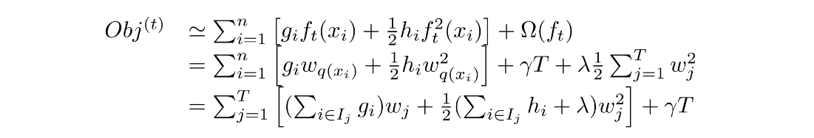

Xgboost、GBDT、lightGBM是对于特征类数据进行机器学习建模的常用模型，三者的基本思路都是基于树模型的梯度提升。相关内容整理如下：

**XGBoost原理与算法pipeline**

> Ref : Chen - Introduction to Boosted Trees (slides) （原网站挂了，copy→） [copy](./assets/Chen_Introduction_to_Boosted_Trees.pdf)

xgboost的基本思路是建立一个对于结构有约束的一系列树模型，从而使得模型在预测性与简单性之间进行折中。

简单来看，xgboost的目标函数为：

其中，l(y, yhat)表示训练误差，Omega是对于树的结构的约束。其中fk代表第k棵树。

首先，考虑boosting的特点，即additive training，第t个时刻的预测结果为第t-1时刻的结果加上第t时刻建立的树的输出。即：$y^t = y^{t-1} + f_t(x)$。将这个关系带入到上面的loss函数中，然后进行Taylor展开，如下：

可以看出，目标函数的loss（不包含regular部分）包括三个部分：当前的（t-1时刻）预测结果的误差、一阶导数项，二阶导数项。而当前误差已经是constant，无法通过当前的树ft进行优化，因此可以不关心（我们只保留含含有ft(x)的项）。最终的目标函数变成了：

要优化的自变量就是ft(x)的输出值，或者说就是新建的树的各个节点的输出值。如果不考虑正则项，前面的loss已经被化简成了ft的二次函数，而g和h分别是一次项和二次项的系数。

下面来看正则项Omega：

XGBoost中定义的正则项，即对树的结构的约束。具体包括：**树的叶子节点个数** and **叶子节点输出的l2范数**。

数学定义如下：

由于有叶子节点的二次项，因此这个需要与前面的loss部分的二次项合并，结果得到了：

相比于之前，一次项系数不变，二次项增加了lamba（正则化系数），并且多了个表示leaf node 数的常数项。

对于优化二次函数，根据初中数学即可知道，存在一个最值，在$x=-b/2a$处取到，最值为$-b^2/4a$。带入上面的参数，可以得到：

到此为止，就已经有一个指标可以度量新树的优劣了。在最优情况下，应该将所有的可能的树都列举出来，然后计算Obj，比较哪个更优（Obj更小）。然后确定下来，各个叶节点的值（weight）就是wj opt。但是，不可能对所有树进行枚举，因此，仍然以Obj为准则，进行greedy learning，即通常的叶子分裂。

XGBoost的gain函数如下定义，其准则就是上面的Obj（对应DT模型的信息增益、Gini系数等的作用）

实际上就是将不分裂的cost减去分裂后两课子树的cost，看看分裂的话cost下降多少，这个下降就是增益gain。最后，还要考虑gamma，因为分裂会增加叶子节点数量，增加树的复杂度。

到此，XGBoost的原理和算法流程就已经基本完成了。流程简单总结：

~~~python
for t in iterations:
    计算当前的yhat与真实y的loss，并对各个预测结果yhat_i求出一阶导数g和二阶导h。
    建立新树，通过预设的lambda、gamma以及当前的g和h计算增益Gain，用于决定是否分裂。
    达到设定层数、或者Gain小于零(prun)，完成建树，得到ft。
    将ft的叶子节点输出ft(x)合并到yhat上，得到新的yhat ← yhat + epsilon * ft(x)
end
~~~

一些其他问题：

1. 分类问题如何处理？one-hot化。
2. 如何实现样本加权？在计算loss和g的时候进行。
3. 如何实现剪枝？计算gain时，由于有gamma参数控制node数，因此可能小于0，即停止分裂，作为prune。

**LightGBM算法pipeline**

**XGBoost是如何实现和改进GBDT的？**

**GBDT/XGBoost的实现细节？**

**XGBoost、GBDT与LightGBM的比较总结**

