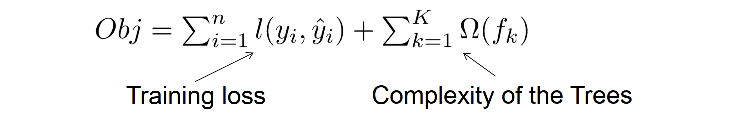
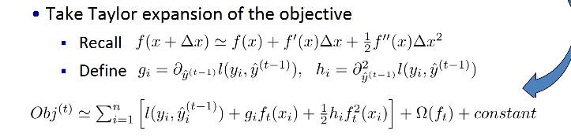

Xgboost、GBDT、lightGBM是对于特征类数据进行机器学习建模的常用模型，三者的基本思路都是基于树模型的梯度提升。相关内容整理如下：

**XGBoost原理与算法pipeline**

> Ref : Chen - Introduction to Boosted Trees (slides) （原网站挂了，copy→） [copy](./assets/Chen_Introduction_to_Boosted_Trees.pdf)

xgboost的基本思路是建立一个对于结构有约束的一系列树模型，从而使得模型在预测性与简单性之间进行折中。

简单来看，xgboost的目标函数为：

其中，l(y, yhat)表示训练误差，Omega是对于树的结构的约束。其中fk代表第k棵树。

首先，考虑boosting的特点，即additive training，第t个时刻的预测结果为第t-1时刻的结果加上第t时刻建立的树的输出。即：$y^t = y^{t-1} + f_t(x)$。将这个关系带入到上面的loss函数中，然后进行Taylor展开，如下：

可以看出，目标函数的loss（不包含regular部分）包括三个部分：当前的（t-1时刻）预测结果的误差、一阶导数项，二阶导数项。而当前误差已经是constant，无法通过当前的树ft进行优化，因此可以不关心。最终的目标函数变成了：

**LightGBM算法pipeline**

**XGBoost是如何实现和改进GBDT的？**

**GBDT/XGBoost的实现细节？**

**XGBoost、GBDT与LightGBM的比较总结**

