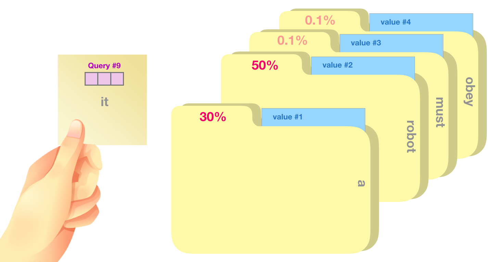

transformer的基础单元：注意力模块，即attention module。

总结attention module的实现过程，以及需要注意的点。

#### attention is all you need 中的attention

ps:   q、k、v做attention的一个形象化解释：（ref：http://jalammar.github.io/illustrated-transformer/）

#### self-attention 的实现代码

#### multi-head机制原理与实现

#### position embedding 相关

#### attention的复杂度

