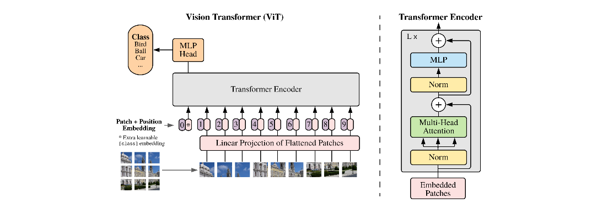

#### ViT的基本结构与原理

paper：[(2020) An Image is Worth 16x16 Words: Transformers for Image Recognition at Scale](https://arxiv.org/abs/2010.11929)

参考代码：https://github.com/lucidrains/vit-pytorch/blob/main/vit_pytorch/vit.py

ViT将transformer用于图像分类，基本结构如下：

首先，将图像裁切成等大（大小为P）的小patch，然后，将patch的各个像素（每个像素为C通道，一般C=3）进行堆叠，形成一个向量，向量的维度为PxPxC，于是我们就获得了(H/P) x (W/P) x (PxPxC)的一个初始的tensor。这一步骤实现如下：

~~~python
# 先计算出patch的数量、以及patch向量化后的dimension
num_patches = (image_height // patch_height) * (image_width // patch_width)
patch_dim = channels * patch_height * patch_width
# 这个是是否需要class token的assertion
assert pool in {'cls', 'mean'}, 'pool type must be either cls (cls token) or mean (mean pooling)'
# 执行图像到patch切分后的tensor，再到embedding的过程
self.to_patch_embedding = nn.Sequential(
Rearrange('b c (h p1) (w p2) -> b (h w) (p1 p2 c)', p1 = patch_height, p2 = patch_width),
nn.Linear(patch_dim, dim),
)
~~~

最后一步是一个linear层，负责将输入的dimension映射到指定的embedding的dim。此时，得到的结果就相当于一个channel数为dim的sequence，后面即可送入transformer计算。当然，在送入transformer之前，还有两个步骤，一个是pos emb，即位置编码；另一个是class token。整个vit的forward的基本流程如下：

~~~python
def forward(self, img):
    x = self.to_patch_embedding(img)
    b, n, _ = x.shape
    
    cls_tokens = repeat(self.cls_token, '() n d -> b n d', b = b)
    x = torch.cat((cls_tokens, x), dim=1)
    x += self.pos_embedding[:, :(n + 1)]
    x = self.dropout(x)
    
    x = self.transformer(x)
    
    x = x.mean(dim = 1) if self.pool == 'mean' else x[:, 0]
    x = self.to_latent(x)
		return self.mlp_head(x)
~~~

首先， 即上面的由图到embedding的过程。然后，将cls token（可学习的，nn.Parameter方式生成）和上面的图像的patch emb进行concat，然后再与pos embedding相加，最后的结果才能进入transformer。

注意：vit中的class token用来最终进入mlp，从而产生最终的分类结果。这是为了不影响各自有独立信息和位置的patch去做自己的attention。另外，vit中的position embedding也是可学的。

ViT的计算流程如下：

ViT的遗留问题：需要用大数据集pretrain（比如JFT），才能取得比resnet高的效果。于是后续的一个改进方向就是如何用更少的pretrain来获得相同的效果，最好直接在imagenet上from scratch的训练。

