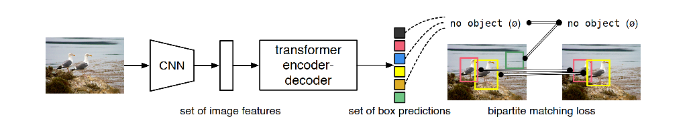
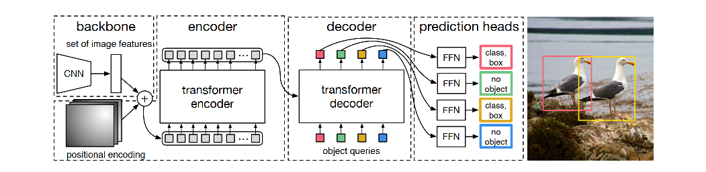

DETR是最早利用transformer结构的模型做object detection的模型

DETR的几个关键点：

- position encoding
- Hungarian matching，set prediction loss
- CNN + transformer，端到端训练

DETR的模型结构与pipeline：

DETR的基本流程：首先，利用CNN提取特征，然后，将image特征过一个transformer结构的enc-dec，得到一系列的bbox set prediction，然后，将bbox prediction与真实的gt bbox通过bipartite match建立loss函数，进行端到端的训练优化。简言之，DETR的基本思路就是将目标检测问题转化为bbox set prediction的过程，从而直接端到端训练。

具体的操作如下：

首先，用CNN提特征，然后将feature map与固定的pos emb进行相加（feature map需要1x1 conv降维），得到的结果作为encoder的输入，encoder是一个transformer结构，得到各个位置编码后的结果。

然后，将encoder的结果输入decoder。注意，这里的decoder不是直接接受encoder的输入，然后做transformer的，而是定义一组可以学的object queries作为learnt pos emb，用来生成最后的bbox。这里的object queries的数量N是预先设定的，比如N=100就意味着最终要产生100个预测框，而如果没有这么多实际的object的话，那么就用背景补充，并且将该类别置为no object，相当于给背景也增加了一个类别。最后，将预测的bbox set与gt bbox set进行二分匹配，找到每个gt bbox对应的预测bbox，然后计算loss。

**position encoding**

DETR的位置编码用的是手动的sin和cos的编码方式，并且将图像的两个方向，即(i, j)都进行编码。

参考官方代码：（ref：https://github.com/facebookresearch/detr/blob/master/models/position_encoding.py）

~~~python
class PositionEmbeddingSine(nn.Module):
    """
    This is a more standard version of the position embedding, very similar to the one
    used by the Attention is all you need paper, generalized to work on images.
    """
    def __init__(self, num_pos_feats=64, temperature=10000, normalize=False, scale=None):
        super().__init__()
        self.num_pos_feats = num_pos_feats
        self.temperature = temperature
        self.normalize = normalize
        if scale is not None and normalize is False:
            raise ValueError("normalize should be True if scale is passed")
        if scale is None:
            scale = 2 * math.pi
        self.scale = scale

    def forward(self, tensor_list: NestedTensor):
        x = tensor_list.tensors
        mask = tensor_list.mask
        assert mask is not None
        not_mask = ~mask
        y_embed = not_mask.cumsum(1, dtype=torch.float32)
        x_embed = not_mask.cumsum(2, dtype=torch.float32)
        if self.normalize:
            eps = 1e-6
            y_embed = y_embed / (y_embed[:, -1:, :] + eps) * self.scale
            x_embed = x_embed / (x_embed[:, :, -1:] + eps) * self.scale

        dim_t = torch.arange(self.num_pos_feats, dtype=torch.float32, device=x.device)
        dim_t = self.temperature ** (2 * (dim_t // 2) / self.num_pos_feats)

        # 两个方向分别编码
        pos_x = x_embed[:, :, :, None] / dim_t
        pos_y = y_embed[:, :, :, None] / dim_t
        # 利用sin和cos进行计算
        pos_x = torch.stack((pos_x[:, :, :, 0::2].sin(), pos_x[:, :, :, 1::2].cos()), dim=4).flatten(3)
        pos_y = torch.stack((pos_y[:, :, :, 0::2].sin(), pos_y[:, :, :, 1::2].cos()), dim=4).flatten(3)
        pos = torch.cat((pos_y, pos_x), dim=3).permute(0, 3, 1, 2)
        return pos
~~~

**匈牙利算法实现set matching**

代码中使用的是：`scipy.optimize.linear_sum_assignment(cost_matrix)`，将pred boxes中的每个元素与gt boxes中的每个元素计算一个weight，然后按照assignment problem的方式找到最优匹配。

