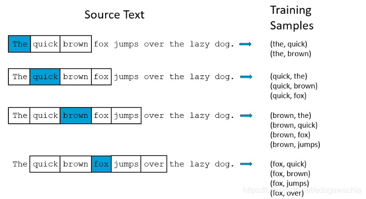
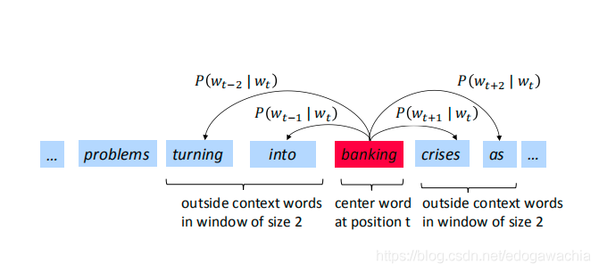
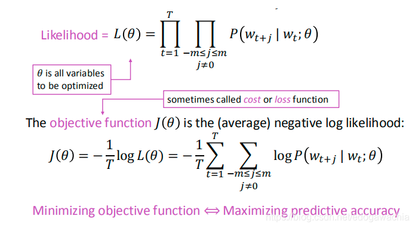
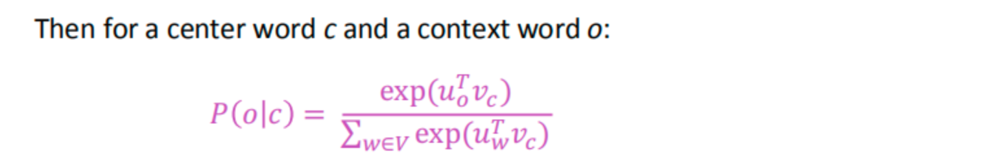
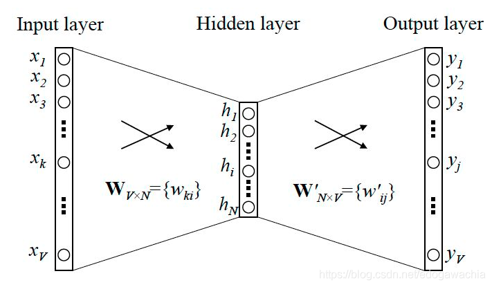
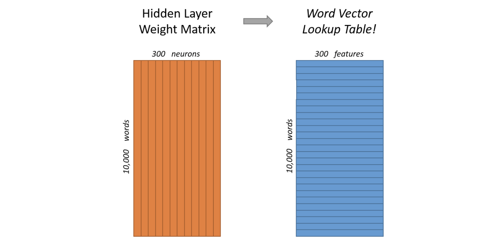
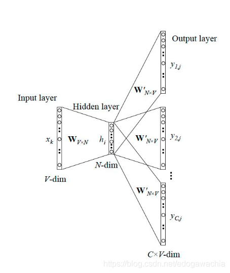
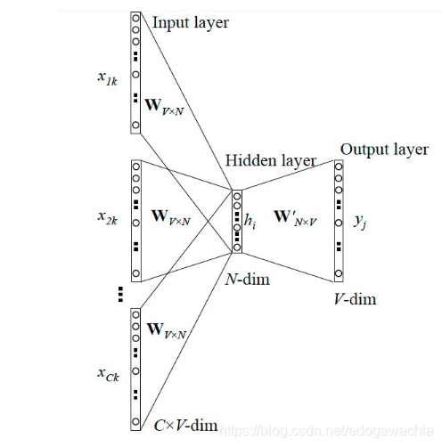
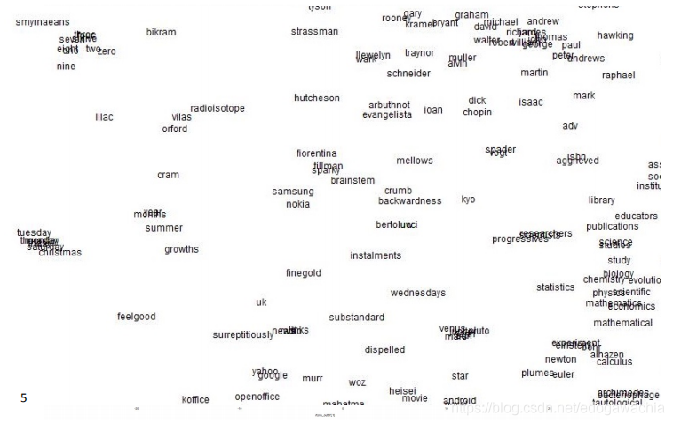

word2vec模型，包括skip gram和CBOW两种实现形式

**word2vec是最基本的词嵌入模型，关键点：**

- **核心思想：用上下文做约束进行嵌入，从而使得条件概率大的（共同出现的频繁的）能够被嵌入到相近区域。**

- **skip gram 为中心词预测上下文（一对多），cbow为上下文预测中心（多对一）**
- **实现上采用了negative sample和hierarchical softmax，目的为了解决词典vocabulary过大的弊端。**

> ref : https://blog.csdn.net/edogawachia/article/details/104744607

#### INTRO

自然语言处理（Natural Language Processing），简称NLP。这个领域是通过统计学、数学模型、机器学习等相关技术研究人类语言的特征，对其进行数学的表示，并基于这种表示进行计算，从而可以处理一些和人类语言相关的事务，以达到模拟人类使用语言的状态。

在人类的思想领域中，针对于人的认识，一直以来都有两种截然相反的倾向。一种是认为人类的认识和各种知识是天然具有逻辑的合理性的，因此在建构知识时，应当自顶向下的搭建逻辑的结构，才能获得对知识的把握；而另一种则认为人类的知识不是通过逻辑和理性把握的，而是通过在世界中的经验一点一点形成的，我们认为是逻辑和理性的确定性，也不过是在经验中被我们归纳总结和确认的，因此人类的知识需要从大量的经验中去归纳总结，这是一个自底向上的过程。从哲学史的角度看来，这两者就是所谓的唯理论和经验论的区别。这两种倾向是认识事物的过程中不可避免的，因此被带入到具体学科领域中，就会得到两套相反的方法。

之所以要提到这个问题，是因为在自然语言处理领域，也曾有偏向规则的（唯理论的）和偏向统计的（经验论）的两种方法。基于规则和语法的自然语言处理算法曾经一度是NLP领域的主流，很多研究者都基于建构一个更合理的语言规则的思路来推进算法对于人类语言的处理能力。现如今，这一主流已经被基于统计学的方法所取代。目前较为流行的BERT及类似算法本质上都是基于对大量语料的训练（实际上就是一种更高级的统计分析）得到的。这种基于神经网络训练的方法得到的模型已经具有了较强的人类语言处理能力。

在本系列中，将对自然语言处理发展过程中较为重要的一些模型进行整理和简要介绍。主要说明它们的思路以及创新点，以及可以应用的领域。下面就从最简单的Word2vec模型开始。

#### Word2vec 词向量模型：Skip-Gram和CBOW

**基本思想**

如果要让机器可以认识，或者说识别人类的语言，首先应该让它认识每个单词。因此第一个问题就是，如何把每个单词变成机器可以辨识的内容？

机器只能识别数学实体，无法直接理解语言中的每个单词，因此需要一种方法，将单词转变成某种数学形式，送入计算机。最直接的想法就是将单词转变成为向量。要想将单词变成向量，最简单的办法就是用词典中的位置，将每个单词映射成0-1向量（one-hot vector）。比如，如果一个词典里只有三个单词：“abandon”、 “abacus”、 “about” ，那么这三个词的向量就分别为 [1, 0, 0 ] 、[ 0, 1, 0 ] 以及 [ 0, 0, 1]。

但是这个方法并不可行，因为对于实际的一种人类语言来说，比如汉语、英语、日语，它的词典是非常庞大的，可能有上万个单词，这也就意味着每个单词都要用一个长达几万维的向量来表示，非常不经济。另外，还有一个原因，回想我们会在什么情况下用one-hot编码？答案是，当这几种取值没有相互关系时（因为这些向量都是相互正交的）。比如我们有三个类别变量：A类、B类、C类，那么我们会用一个3维one-hot进行编码。但是，自然语言中的单词可不是这样的，不同单词之间是有相互关系的。比如“国王”和“王后”就有逻辑意义上的关系，“美丽”和“漂亮”也有近义词的关系，“好”和“更好”有比较级的关系……等等等等。这样复杂的关系，one-hot编码显然也是不科学的。因此，我们需要找到一种方法，可以让得到的词向量具有它们在自然语言场合中的逻辑关系。这就是词向量模型产生的基本缘起。

word2vec 的方法，我们在前面简单提到了，是一种基于统计的方法。也就是说，它不是根据我们人工设定的某些规则而判断单词之间的关系的，而是通过对大量语料的学习，获得不同单词之间统计学意义上的关联性。

所谓统计学意义上的关系，放在自然语言处理任务中，就是所谓的**上下文 （context）**。

在学外语的时候，我们经常被教导：要理解一个词的意思，需要联系上下文。这就说明了上下文的单词一定程度上可以反映这个词的某种含义和性质。因此，并没有一个单词本身的意思，单词本身的意思蕴藏在它所经常一起出现的单词当中。也就是说，词意这种东西，单词之间相互决定的。

因此，就需要一种方法来获取上下文。这种方法理解起来很简单，就是一个滑动窗口，框选出窗中心的那个词的上下文。

看上面这个图，对于这一句话，我们用了一个窗长为5的窗，对每个词的前后邻居进行选择。右边展示的就是选择出来的上下文。我们所希望的，是一个模型可以输入上下文的单词，然后输出中间的词最可能是什么；或者，另一个方向来看，输入中间的词，可以猜测它的上下文都有些什么单词。

这两个思路是Skip-Gram和CBOW模型的出发点。SG试图用中心词预测周围的邻居，CBOW则相反，用邻居预测中心词。除此之外，其它方面思路较为相近。我们就以SG模型为例，来说明算法过程。

首先，我们要解决降维的问题，将一个上万维的one-hot向量降维成一个低维度的向量，可以想到的方法就是用一个矩阵去乘它。比如，一个向量w，它的维度为10000，如果想让他变成300维，可以用一个10000x300的矩阵W去乘它，最终的结果就是一个300维向量。

对于每个one-hot 的单词向量，都进行降维，我们就能得到对应的低维词向量。但是，这矩阵怎么得到呢？实际上，整个矩阵是通过学习的方法更新取值获得的。如何更新呢？这就涉及到我们前面讲的原则：上下文。

看这个图，用概率的语言来说，我们需要做的，是使得中心词到周围词的条件概率尽量高一些。用似然函数的方式来表示，就得到了我们的优化的目标函数。

likelihood尽量大，它的neg log likelihood就要尽量小一些。所以，我们可以通过迭代更新W，使得最终W能够让它降维出来的word vector得到的 J(theta)最小。也就意味着，这样的低维向量中包含了词语的语义信息。

可是还有个问题没解决：我们降维处理的是一些向量，这里的这些条件概率，如何用各个单词的词向量来表示呢？

回想一下，我们如何度量向量之间的相似性？内积是一个很好的方法。因为内积实际上就是对两个向量逐个元素相乘后的求和，因此两个向量越像，内积就会越大。如果再对长度进行归一化，就变成了余弦相似度。

考虑用内积来表示概率，还要进行归一化（概率都是0-1之间的嘛），归一化并不困难，一个softmax就可以解决。这样一来，就得到了最终的结果。

结合上面的公式，对于这个优化过程，实际上就是让输入为 vc 的时候，输出的结果向量中，表示uo的位置的值更趋向于1。

**神经网络实现**

下面来说一下这个优化过程是怎么实现的。

如果对神经网络有所了解，这个过程就非常简单明了了。首先，我们将10000x300大小的W矩阵看成是输入层到隐层的连接权重矩阵，那么，对于一个one-hot的10000维input向量，得到的hidden layer结果，自然就是低维的词向量。我们也将这个过程叫做词嵌入（word embedding），就是将词语嵌入到300维的向量中。然后，从hidden到output，这个矩阵将词向量又映射回去了10000维，但是，它表示的则是input的word周围的word，也就是说，对于一个input vector，比如banking，输入进去以后，output layer中表示crises 的词语的那个位置应该输出1。通过训练，直到能够预测的比较准，最终得到一个训练好的模型，此时，W这个矩阵的每一行，即1x300的向量，就是每个one-hot的位置对应词的词向量。

这是输入输出一对一的情况，如果考虑前面的一对多（SG）或者多对一（CBOW），那么，网络结构就是这样的：

这个是Skip Gram 的网络。此时，需要将所有的输出的cost function进行求和汇总，来进行训练。

这个是CBOW，需要对各个输入的结果进行求和后，再去拟合label。

至此，Word2vec的基本内容就说完了。

训练word2vec有两个技巧：

**negative sampling** 和 **hierarchical softmax**

这两个trick实际上不仅限于word2vec这一个场景，后续再介绍吧。

最后，来一张word2vec得到的词在空间中的位置关系图（降维过后的）

END

2020年3月9日00:45:07

北京

> 人生如梦幻，无论何事物
> 受已成念境，往事不复见

