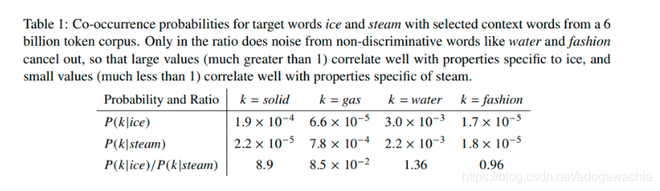
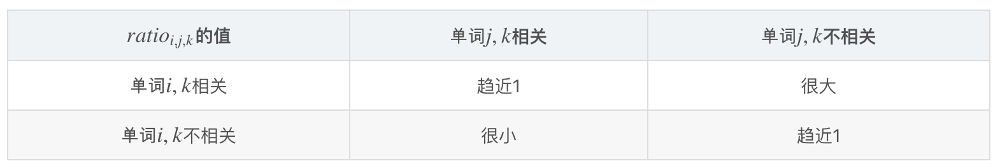
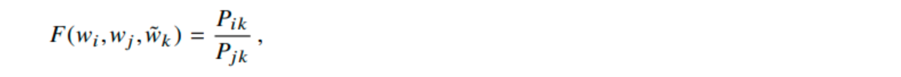
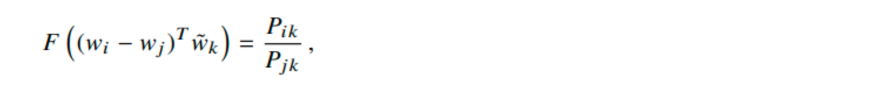
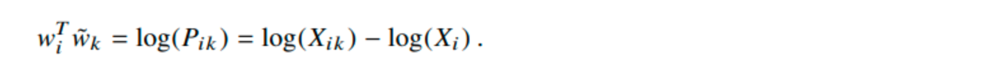
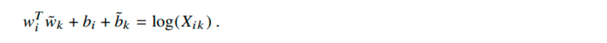
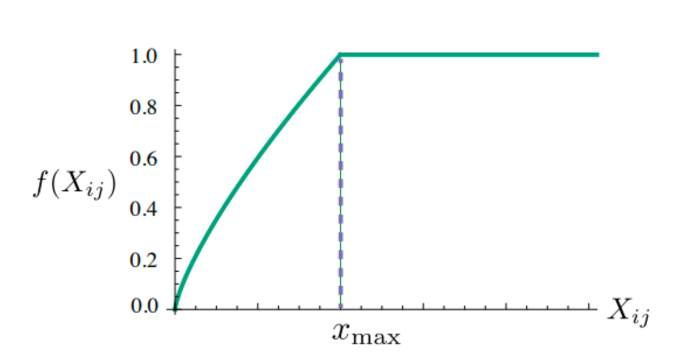

Glove模型（Global Vectors for Word Representation）是对word2vec的一个改进。也是词向量模型。其主要特点如下：

Glove模型的关键点：

- 考虑共现矩阵，即待预测的两个词与一个相同的第三个词的共现情况，从而使得vector在表征词向量之间语义关系的任务上更有效。
- 最终的loss函数拟合的是log(X_ij)，即 i 和 j 的共现次数。并且通过加权，降低高频词的影响。

> ref : https://blog.csdn.net/edogawachia/article/details/105804378

GloVe模型

> glove模型的参考资料链接如下：
>
> https://nlp.stanford.edu/projects/glove/
>
> 论文链接（pdf）如下：
>
> https://nlp.stanford.edu/pubs/glove.pdf
>

GloVe: Global Vectors for Word Representation [Jeffrey Pennington], [Richard Socher], [Christopher D. Manning]

#### GloVe的基本思路

和之前讲过的word2vec（SG和CBOW）一样，glove模型也是一种无监督的词嵌入方法，即词向量学习方法。

glove是一个全局对数双线性回归模型（global log bilinear regression model）。顾名思义，该模型用到了语料库的全局特征，即单词的共现频次矩阵，并且，其优化目标函数是对数线性的，并用回归的形式进行求解。

glove的思想基于这样一个经验，如下图所示：

在glove的论文中，作者举了上表中的这样一个栗子。现在我们已经知道ice和steam这两个词在语料中出现的频率，这两个词被视为**目标词（target words)** ，也就是需要对它们的词向量进行学习和表征的词语。此时，我们暂且不直接去求解这两个词之间的共现关系（就像word2vec那样），而是基于这两个词的频率，去探索一下given这两个目标词的情况下，其他词的条件概率是一个什么情况，这里的k就是其他词。

首先，我们计算given单词ice的情况下，单词k出现的频率，也就是说，k出现在i的上下文中的概率是多少。这个条件概率记做P(k|ice)，P(k|ice) = X k,ice / X ice，X k, ice是k和ice在同一个context中出现的次数，X ice为ice出现的次数。同理，我们计算P(k|steam)，计算方法一样。这里的k可以是字典中的任何一个单词。

下面，我们观察两个条件概率的比值，也就是对于任一个k，k出现在ice的context中的条件概率，与k出现在steam的context中的条件概率，这两者之间的比值。

上面表格中，作者展示了k取solid，gas，water，fashion这四个值的时候，比值的情况。为啥要取这四个值呢？因为solid和ice语义上是有关的，冰是固体嘛，而solid和steam没有语义的关系；而gas则相反，与steam有语义关系，与ice则无；而water则与ice和steam两者都有关系，一个是水汽，一个是水的固态，即冰；而fashion这个词明显与ice和steam都无关。作者计算了这四个k下的条件概率比值，我们发现，当k与分子上的这个词（ice）接近，而与分母（steam）无关时，这个比值远大于1，而k与分母更接近，则比值远小于1。另外两种情况，要么k与分子分母都有关，要么都无关，这时候，这个比值基本在1附近，表明这两个条件概率其实差不太多。这样一个结论也是符合我们的直觉的。毕竟语义相近，出现在上下文中的比例更高一些嘛，也是合理的。

而正是基于这个朴素的道理，glove的作者决定**用一个函数去拟合这个条件概率的比值**，即：

其中，i和j就是目标词，k就是用于计算条件概率的上面讲的那个k。拟合ratios of co-occurence probability这个思路是glove中最基本和最重要的。我们来稍微详细讨论一下这个问题。首先，对于词嵌入这个任务来说，我们的目标是让语义相同的词语在向量空间中离得更近一些，因此，我们首先得需要找到在实际的语料中（而非向量空间中）如何数学化地表达两个词语的相似程度。word2vec对这个问题的答案是在context中出现的概率。这个思路自然是对的，但是这种embedding方法相当于绝对地去模拟两个词之间的条件概率。而我们知道，对于人类的自然语言来说，每个单词的意义实际上是建构在词语之间的结构当中的。换句话说，每个词语只有当与其他词语比较时才真正能有其意义。比如NLP中常举例的一个栗子：king - man + woman = queen，这个analogy中，我们其实并不需要实际地知道king和man等词语在实际的世界中所指称的对象（很多抽象概念甚至没有实际指称的经验对象），而是只需要知道这几个词之间的逻辑关系即可。

**因此，相比起绝对地描述一个词语，通过与第三者的比较，得到第三者与两个词语中的哪个更接近这样一个相对的关系，来表达词语的含义，实际上更符合我们对于语言的认知。很容易联想到的是，这样一来，我们学习出的vector在analogy这个任务上可以被期待做的更好，因为用词向量拟合这个条件概率ratio，本身就是基于两个词向量相对于另外的其他词向量之间关系来做的。**

所以，作者在abstract中说道：这样学习出来的vector space具有一个meaningful substructure。这个比值关系是glove最基本的思路，理解了这一点，我们下面来看怎么样通过上面这个式子推导出glove的损失函数。

首先，上面的F这个函数是个三元函数，包括了wi，wj，tilde wk。这个F由于拟合的是条件概率的比值，也就是k与i和j的相似性，因此它应该是个相似性的度量。考虑到在vector space中，我们希望词向量之间的关系是linear的（正如前面的king-man+woman=queen的例子），因此，我们将我们的目标词i和j的向量相减，让这个F只和wi-wj有关，即：

这样，只需要计算wk和wi-wj之间的相似度，就可以拟合右边的ratio了。到这里，其实不难发现，由于k要与i和j比较，看看与i,j中哪一个更近，因此这个wi-wj 和wk的关系可以用向量点积（内积）来处理，因为向量内积表示相似度，这样一来，wiTwk表示i和k的相似度，wjTwk为j和k的相似度，如果k和i更接近，则减号前的大，否则减号后的大。

这里，我们发现，如果把i和j换换位置，得到F( (wj-wi)T wk) = Pjk / Pik，和上式相比，我们发现F函数有一个性质，那就是F(x) = 1/ F(-x) 。具备高中数学函数知识就可以猜到，这个F就是一个exp()指数函数。exp(-x) = 1/exp(x)。（这一段内容为了容易理解，与论文中说明方法略有不同）

这样，我们带入指数函数，与Pik和Pjk对应后发现，exp(wiTwk) = Pik，因此，可以得到：

这里我们把Pik = Xik / Xi这个除法通过log拆成了减法。

由于右边有一个log(Xi)，我们这个式子不对称了。试想一下，如果把wiTwk换成wkTwi，那么右边需要 -log(Xi)呢还是 -log(Xk)呢？为了维持这种对称性，我们把-log(Xi)丢掉，但是由于这个term之和i有关，因此可以在左边加一个bi作为i的bias。为了维护对称性，我们只好也对k加一个同样的bias，于是得到：

到这里，我们就已经基本结束了 ，因为我们知道了word vector要拟合的目标。最终的loss函数：

上面的 J 就是最终的loss function。里面有一个f函数，作为加权项。这个函数的设计很有意思，它的性质在上面的1 2 3中已经说明了。下面看一下它的图像：

可以看到，这个函数以Xij为自变量，在取值小的区间递增，而大于某个thr后，即xmax，就开始不再增加。Xij过高的那些word的权重相对就被压下来了。这就意味着，那些高频词组合对模型的影响相对小一些，从而使得那些出现不那么多的词语的co-occurence有机会更多地影响和改变模型。这个思路主要是由于自然语言中天然的长尾效应，为了使得长尾部分不至于被头部掩盖掉，只好通过赋权的方式降低这两个部分在loss中占比的差异。这个想法和自然语言处理中先去停用词（stop-words）的思路是类似的。

以上就是GloVe的基本原理和推导过程。

2020年4月28日01:55:58

北京

> 春将归去，与汝同车，低声细语。
> —— 【日】 松尾芭蕉

