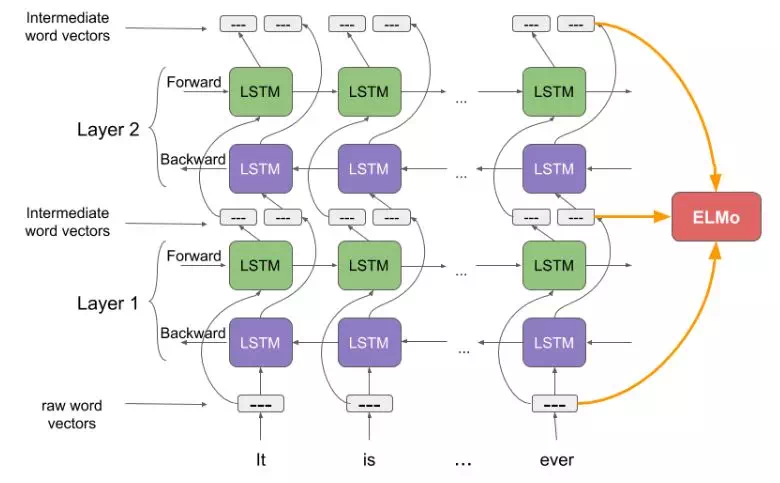
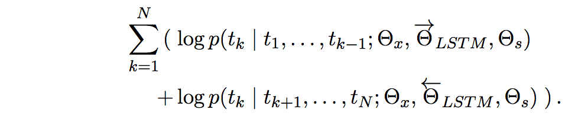

ELMo（Embeddings from Language Models）是一种上下文相关的词嵌入方法，可以处理一词多义。

> ref：https://arxiv.org/pdf/1802.05365.pdf

ELMo的工作原理和结构如图：

可以看出，elmo的基本结构就是stacked bi-LSTM。最终用到的实际上是各个输出层的embedding的加权和。

训练elmo的目标函数：最大化似然

对于下游任务：

