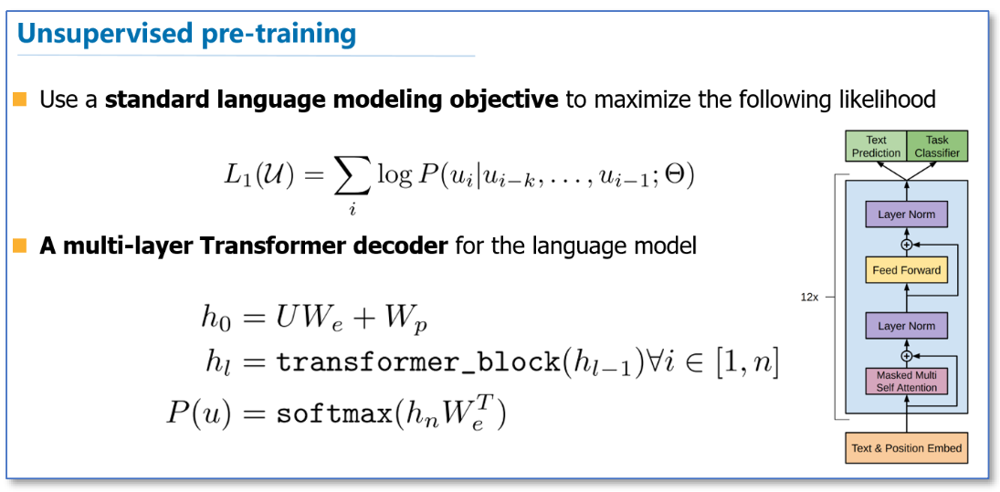
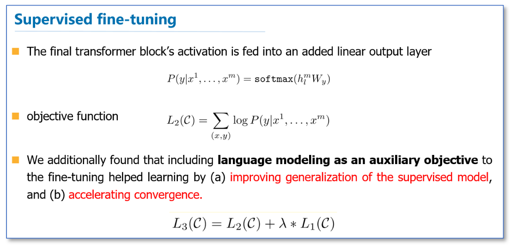
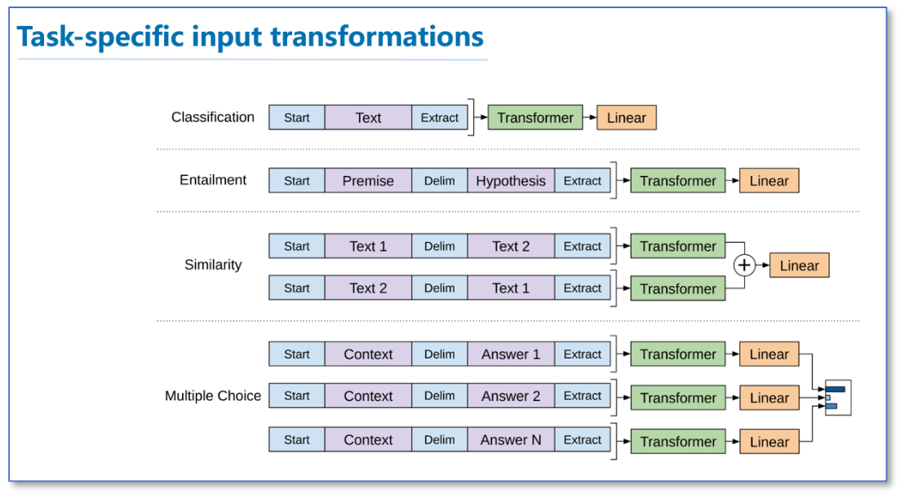

Open AI 的GPT系列模型

GPT模型的关键点：

- 采用了**无监督预训练+下游任务微调**（整个模型微调）的模式。不同任务微调的方式不同。
- 采用**Transformer网络结构**建立语言模型，相比bi-lstm可以更好的capture长程信息。
- fine-tune过程中也用了LM（Language Model）作为auxiliary objective。

> reference：
>
> GPT:  [Improving Language Understanding by Generative Pre-Training](https://www.cs.ubc.ca/~amuham01/LING530/papers/radford2018improving.pdf)
>
> GPT-2: [Language Models are Unsupervised Multitask Learners](https://d4mucfpksywv.cloudfront.net/better-language-models/language_models_are_unsupervised_multitask_learners.pdf)
>
> GPT-3: [Language Models are Few-Shot Learners](https://arxiv.org/pdf/2005.14165.pdf)

GPT模型的基本结构：

（图ref：https://www.cnblogs.com/robert-dlut/p/9824346.html）

