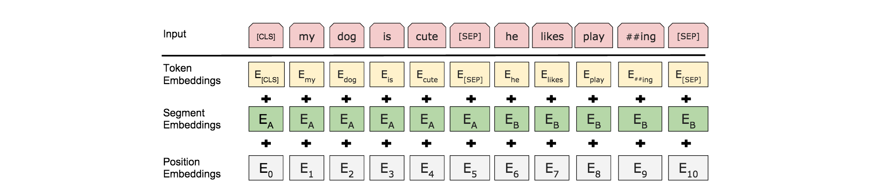
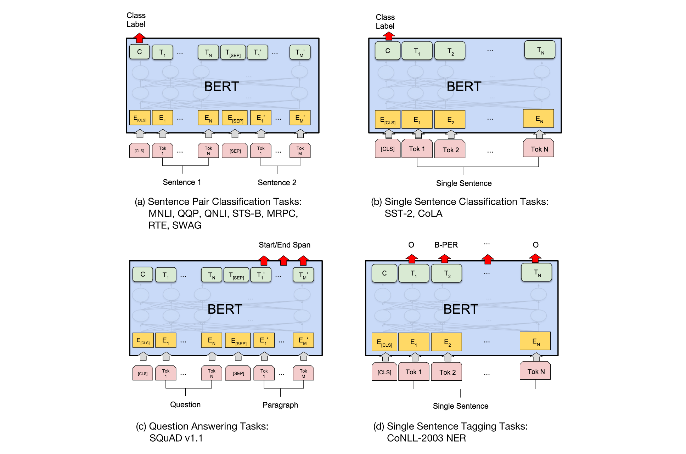

BERT模型结构及其变体

BERT的关键点：

- 用多层的 bidirectional Transformer 作为encoder，进行预训练。（GPT和ELMo都算单向（ELMo的bi-lstm的两个方向是独立的，只在最后融合））
- 除了token外，segment embedding和position embedding也相加作为输入。
- 第一个token为 [CLS] token。在某些任务上（如QA）用 [SEP] token 区分输入的sentence和paragraph。
- 随机Mask一些token。具体操作：按一定概率分别将mask的token： 1）替换成[MASK] ；2) 保留原词；3）替换成任意其他词。
- 设计了一种position encoding，通过sin和cos对位置编码。

> Ref： [BERT: Pre-training of Deep Bidirectional Transformers for Language Understanding](https://arxiv.org/abs/1810.04805) （arxiv Oct. 2018）

BERT的基本结构：

输入：

中间层即为多层transformer。根据参数量，还区分了BERT_large和BERT_base。

| 参数            | BERT base               | BERT large |
| --------------- | ----------------------- | ---------- |
| 层数L           | 12                      | 24         |
| 隐层维度H       | 768                     | 1024       |
| multi-head数量A | 12                      | 16         |
| 总参数量        | 110M                    | 340M       |
| 备注            | 与GPT参数相等，便于对比 |            |

下游子任务根据任务类型不通过，设计的finetune方案也不同：

