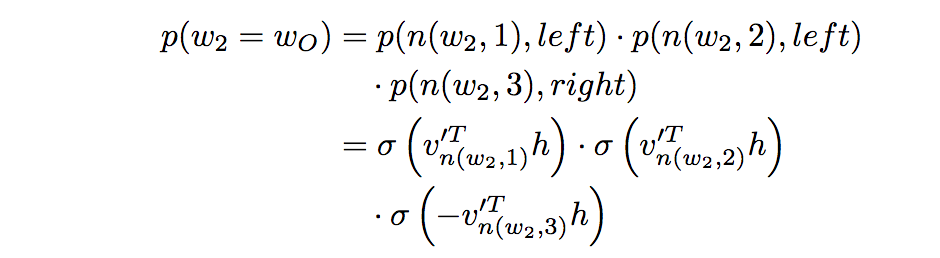

#### Hierachical Softmax

层次化softmax（HS）的动机在于，需要进行softmax的输出与label太多（比如word2vec中预测vocabulary中的一个word，通常vocabulary的大小|V|很大，用传统softmax需要对|V|个值计算），不便于计算，因此利用编码，将one-hot的label变成一个较短的码。编码也可以理解为一条路径，即对所有label种类（各个预测的输出元素）建立一颗Huffman树，预测从root到正确输出的路径。

HS的基本操作如下：

~~~
根据词频，对vocabulary建立Huffman Tree
开始训练：
    (以cbow为例，中间词为w)
    Huffman tree 中对应w的路径为：path = a1->a2->a3...->an
    对每个节点ak，都有两条路径，用0表示向左子树，1表示向右子树。则用sigmoid拟合各位置的0或1(拟合路径)。
    将path中所有的节点的拟合结果相乘(拟合1的直接相乘，拟合0的1减后相乘，保证最终优化方向一样)
end
~~~

一个栗子：

这样，最后的计算output的过程，就从O(|V|)降低到了O(log|V|)。

但是HS计算还是有一定的问题：如果某个word出现次数极低，那么它在Huffman树中的路径就很长，计算点乘和sigmoid的次数很多。相比于HS，负采样可以解决这个问题，因为它每次只需要拟合一个是否在window内的True or False 即可。