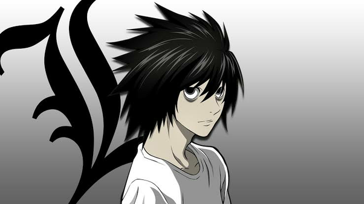

# Algorithm Engineer Prepares
### **算法工程师的自我修养**

【算法岗相关的常用知识梳理，包括理论、代码、经典模型与新技术】**（持续更新ing）**

<!--  -->

---

### 0x000 [计算机视觉](./0.ComputerVision)

#### 基础概念

[图像分类经典模型（LeNet、AlexNet、VGG、ResNet、GoogLeNet）](./0.ComputerVision/0.Basics/0.ClassBasics.md)

[语义分割任务经典模型（FCN、Unet、RefineNet、PSPnet、SegNet）](./0.ComputerVision/0.Basics/1.SegBasics.md)

[目标检测任务基础模型（两阶段、一阶段，包括R-CNN系列、YOLO系列、SSD）](./0.ComputerVision/0.Basics/2.DetectionBasics.md)

实例分割基本概念与经典模型

[计算机视觉任务中常用的loss函数汇总](./0.ComputerVision/0.Basics/4.CVLosses.md)

[CNN的轻量化方法基本概念（剪枝、蒸馏、量化、小网络）](./0.ComputerVision/0.Basics/5.LiteMethods.md)

模型蒸馏（distillation）的基本原理

YOLO实现细节

DeepLab实现细节

非极大值抑制方法（NMS）及其实现

数据增广与测试时增强（TTA）

[RoIAlign算子具体代码实现（以facebook的maskrcnn-benchmark为例）](./0.ComputerVision/0.Basics/12.RoIAlign.md)

[DeepLab中的CRF的实现](./0.ComputerVision/0.Basics/13.CRFsInCV.md)

#### 低层视觉技术（low-level task）

[图像与视频去噪经典算法与原理](./0.ComputerVision/1.LowLevelTasks/0.Denoise.md)

图像与视频超分辨率：任务与方法

双目超分辨率（Stereo SR）相关模型

无监督超分辨率方法

去雾算法（Dehaze）：暗通道先验原理

光流（Optical Flow）计算与应用：传统方法与光流网络

#### 分割与检测

[DeepLab系列模型内容梳理](./0.ComputerVision/2.Seg&Det/0.DeepLab.md)

[并行的多尺度融合策略：HRNet](./0.ComputerVision/2.Seg&Det/1.HRNet.md)

[多次稠密上采样后融合的unet加强版：Unet++](./0.ComputerVision/2.Seg&Det/2.Unet++.md)

[OCRNet（Object Contextural Representation）：基于transformer attention机制的上下文关联策略](./0.ComputerVision/2.Seg&Det/3.OCRNet.md)

[Dilated Residual Net（DRN）：空洞卷积改进resnet](./0.ComputerVision/2.Seg&Det/4.DilatedResNet.md)

[MS COCO 数据集的实例分割/目标检测的annotation基本格式](./0.ComputerVision/2.Seg&Det/7.COCOAnno.md)

[anchor-free目标检测模型之：FCOS（多尺度、相对位置、centerness）](./0.ComputerVision/2.Seg&Det/5.FCOS.md)

[COCO数据集的官方api的基本用法（get类别/图像/标注Id、load图像/标注信息）](./0.ComputerVision/2.Seg&Det/14.Pycocotools.md)

#### 生成模型（GAN、Diffusion Model etc.）

[生成对抗网络GAN基本原理与问题](./0.ComputerVision/3.GenerativeModel/0.GANBasics.md)

[Wasserstein GAN：log微操防止JS散度的梯度消失和logD trick的模式坍塌](./0.ComputerVision/3.GenerativeModel/3.WassersteinGAN.md)

[CycleGAN：循环一致性约束的无监督domain transfer方案](./0.ComputerVision/3.GenerativeModel/1.CycleGAN.md)

StyleGAN 和 StarGAN

Diffusion Model：扩散模型原理

#### 神经网络鲁棒性与攻击

神经网络的鲁棒性（clever Hans效应）

#### 轻量化模型

[Mobilenet系列模型梳理](./0.ComputerVision/5.LiteModels/0.Moblienet.md)

[Shufflenet v1&v2：分组卷积加通道shuffle信息交互](./0.ComputerVision/5.LiteModels/1.Shufflenet.md)

[Squeezenet：压缩通道学特征与膨胀](./0.ComputerVision/5.LiteModels/2.Squeezenet.md)

[Ghostnet：ghost特征加简单变换生成丰富feature map](./0.ComputerVision/5.LiteModels/3.Ghostnet.md)

[Efficientnet：通道数、深度、分辨率的复合NAS搜索优化](./0.ComputerVision/5.LiteModels/4.EfficientNet.md)

[轻量化超分网络：IMDN、ECBNet、RFDN](./0.ComputerVision/5.LiteModels/8.SRLite.md)

#### 小样本学习

[小样本基本概念](./0.ComputerVision/6.FewShotLearning/0.FewShotBasics.md)

[小样本分割经典模型梳理](./0.ComputerVision/6.FewShotLearning/1.FewShotSegmentation.md)

- **OSLSM** 2017 （Pascal 5i做交叉验证，weight hashing，sup和que最终特征logistic回归）
- **SG-One** 2018 （mask pooling + cosine sim）
- **Prototype Alignment Network (PANet)** 2019 （alignment，一种类cycle loss）
- **FSS-1000（relation net）** 2019 （主要是数据集FSS-1000，适用于小样本分割的数据集）
- **CANet: Class-Agnostic Segmentation** 2019（对结果进行 refinement）
- **BMVC 2018**  2018（网络设计较复杂）
- **Prototype Mixture Models（PMM）** 2020  （将prototype拆成多个）
- **Prior Guided Feature Enrichment Network（PFENet）** 2020（先生成无须训练的prior，后接多特征融合）
- **FSIL（Few shot Seg Image Level）** 2020 （利用image-level的弱监督信息做few shot seg）

#### 弱监督学习

Image-level label 语义分割基本思路

#### 小目标检测

小目标检测常见处理思路

多尺度特征学习思路相关模型

context-based 相关模型

训练策略、loss函数、data augment思路相关方法汇总

#### 重参数化策略

RepVGG：make VGG great again！

ECB（Edge-oriented Conv Block）：Sobel与Laplacian强化边缘的重参数化策略

ACNet（Asymmetric Conv）：1x3、3x1、3x3的非对称重参数化

DBB（Diverse Branch Block）：不同排列组合的多分支block

SLaK中的重参数化：极端大核如何训练？

#### 骨干网络（backbone）发展

Resnet变体

SENet：squeeze and excitation

DenseNet

Inceptions

51x51 SLaK（Sparse Large Kernel）More ConvNets in the 2020s: Scaling up Kernels Beyond 51x51 using Sparsity

---

### 0x001 [数据处理](./1.DataProcessing)

#### 基础概念

[数据处理和评估中的常用度量指标（AUC/KS/Gain/Lift）](./1.DataProcessing/0.Basics/0.Measurements.md)

[特征分箱原则与策略（等频分箱、等距分箱、卡方分箱、bestKS分箱）](./1.DataProcessing/2.FeatureEngineering/1.BinCount.md)

[特征分析之单变量分析（WOE/IV/PSI）](./1.DataProcessing/0.Basics/2.SingleFactorAnalysis.md)

---

### 0x002 [深度学习基础 ](./2.DeepLearningBasic)

#### 损失函数

[最常用的损失函数（BCE、交叉熵、MSE、MAE）](./2.DeepLearningBasic/0.Losses/0.CommonLosses.md)

[PyTorch中定义的其他几种损失函数（NLL、Multi-label、Huber、Triplet Loss等）](./2.DeepLearningBasic/0.Losses/1.PytorchLosses.md)

[分割和检测任务中的损失函数（IoU loss、Dice loss、Lovasz loss）](./2.DeepLearningBasic/0.Losses/2.SegDetLosses.md)

#### 下降方法与学习率策略

[梯度下降法及其变体（Momentum、Nesterov、RMSprop、Adagrad、Adam、AdamW等）](./2.DeepLearningBasic/1.Descent&Scheduler/0.GradDescentMethods.md)

[牛顿法和拟牛顿法：二阶优化的策略](./2.DeepLearningBasic/1.Descent&Scheduler/5.NewtonMethod.md)

[Gradient Clipping：梯度裁剪，防止梯度爆炸的手段](./2.DeepLearningBasic/1.Descent&Scheduler/6.GradientClipping.md)

L1 norm下的优化；ISTA&FISTA；学习率策略；ADMM；

EMA（Exponential Moving Average）

#### 激活函数

[常见激活函数（sigmoid/ReLU/Maxout 等）](./2.DeepLearningBasic/2.Activations/0.CommonActivations.md)

[RELU6：适应低精度计算的有界激活函数](./2.DeepLearningBasic/2.Activations/1.ReLU6.md)

[GELU：依据高斯分布cdf计算设计的激活函数](./2.DeepLearningBasic/2.Activations/2.GELU.md)

[Swish：光滑非单调下有界的self-gating函数](./2.DeepLearningBasic/2.Activations/3.Swish.md)

#### 卷积层设计

分组卷积

deformable（可变）卷积

#### 初始化方法

[常用初始化方法（随机初始化、xavier初始化、kaiming初始化）](./2.DeepLearningBasic/4.WeightInitialization/BasicInit.md)

---

### 0x003[传统机器学习基础（非NN类）](./3.MachineLearningBasic)

#### 必备基础

[SVM、逻辑回归、决策树的关键内容整理](./3.MachineLearningBasic/0.VeryBasic/0.SVM&LR&DT.md)

kNN与k-d树：简单算法的工程优化

[集成学习方法（bagging、boosting、stacking）、梯度提升原理](./3.MachineLearningBasic/0.VeryBasic/2.Ensembles.md)

#### 进阶模型与算法

隐马尔科夫模型（HMM）

蒙特卡洛方法

MCMC：马尔科夫链蒙特卡洛算法

Viterbi算法

[无权重二部图最大匹配的匈牙利算法（Hungarian Algorithm）、赋权图Kuhn-Munkres算法](./3.MachineLearningBasic/1.AdvancedMethod/3.Hungary&KM.md)

[宽表数据建模常用集成模型：XGBoost、GBDT、LightGBM，原理与区别](./3.MachineLearningBasic/1.AdvancedMethod/4.Xgboost&GBDT&LightGBM.md)

---

### 0x004 [视觉中的非CNN结构（Transformer/MLP） ](./4.Transformer)

#### 基础概念

注意力机制的原理、应用与局限

#### 视觉Transformer与MLP（非CNN结构）

[ViT模型基本原理：image=16x16 words](./4.VisionTransformer/1.VisionTransformer/0.ViT.md)

[DETR：基于transformer的端到端目标检测（bbox集合预测、二分匹配）](./4.VisionTransformer/1.VisionTransformer/2.DETR.md)

Swin Transformer

SETR

DeiT

CaiT

Segmenter

SegFormer

MLP-Mixer（非transformer）

---

### 0x005 [自然语言处理基础 ](5.NLPBasic)

#### 必备基础

[文本数据预处理：分词、去停用词、tfidf编码](./5.NLPBasic/0.VeryBasics/0.Words.md)

主题模型（topic model）

#### 基本NLP模型

[最基础的词嵌入模型Word2vec（skip-gram & cbow）](./5.NLPBasic/1.NLPModels/0.Word2vec.md)

[GloVe词嵌入：基于共现矩阵学习词间**关系**差别的嵌入方法](./5.NLPBasic/1.NLPModels/1.Glove.md)

[ELMo：基于语言模型的bi-LSTM的基于上下文动态嵌入的模型，处理一词多义（芝麻街命名模型第一弹）](./5.NLPBasic/1.NLPModels/2.ELMo.md)

[FastText：Facebook开源的文本分类和词嵌入工具包](./5.NLPBasic/1.NLPModels/3.Fasttext.md)

[GPT系列：Generative Pre-Training，单向Transformer，非监督预训练+下游任务微调](./5.NLPBasic/1.NLPModels/4.GPT.md)

[BERT：谷歌开放的基于bidirectional Transformer的最强语言模型，BERT yyds !](./5.NLPBasic/1.NLPModels/5.BERT&Variants.md)

#### NLP模型实现的相关tricks

[Negative Sampling：词嵌入训练中的负采样操作](./5.NLPBasic/2.NLPTricks/0.NegativeSampling.md)

[Hierachical Softmax：基于Huffman编码的高输出维度（词典大小）的优化方法](./5.NLPBasic/2.NLPTricks/1.HierarchicalSoftmax.md)

---

### 0x006 [信息论](./6.InformationTheory)

信息论基本概念与定义：信息量、信息熵、条件熵、相对熵

香农三大定理：变长无失真信源编码、有噪信道、有损信源编码

---

### 0x007 [矩阵论](./7.Matrix)

矩阵与线性代数基础概念与定义

图像处理与图形学中的矩阵变换

基变换与坐标变换

矩阵的对角化

---

### 0x008 [统计推断与概率论](./8.StatisticalInference)

贝叶斯定理与应用

最大似然估计与最大后验估计

古典概型例题汇总

---

### 0x009 [PyTorch相关](./9.PyTorch)

[并行化策略（DataParalle和DistributedDataParallel）与多机多卡训练](./9.PyTorch/0.DP&DDP.md)

PyTorch中的Dataset处理逻辑

PyTorch模型量化与onnx转换处理流程

------

### 0x00A [数据结构与算法](./10.PureAlgorithm)

[数据结构：单调栈（MonoStack）基本原理](./10.PureAlgorithm/7.Monostack.md)

[Huffman树与Huffman编码：最优权重路径的无损压缩编码算法](./10.PureAlgorithm/6.HuffmanTree.md)

[跳表（skiplist）：基于多级别索引的查找复杂度log(n)的链表](./10.PureAlgorithm/11.SkipList.md)

[并查集（union-find）：近乎常数操作复杂度的不相交集合查询](./10.PureAlgorithm/1.UnionFind.md)

[Trie（字典树/前缀树）字符串前缀匹配查询](./10.PureAlgorithm/3.Trie.md)

[自平衡的二叉查找树：AVL树（平衡因子，左旋、右旋）](./10.PureAlgorithm/8.AVLtree.md)

位图算法与布隆过滤器（Bloom Filter）

------

### 0x00B [强化学习](./11.ReinforcementLearning)

强化学习的基本概念

Q-learning模型与SARSA模型

深度强化学习概述

------

### 0x00C [推荐系统与推荐算法基础](./12.RecSys)

[经典推荐算法：协同过滤（Collaborative Filtering，CF）](./12.RecSys/0.CF.md)

[Matrix Factorization：从用户-物品矩阵中分解出用户和物品的特征隐向量](./12.RecSys/1.MF.md)

[LR模型及其改进版MLR（piece-wise LR）：一阶特征建模的CTR预估](./12.RecSys/6.LR&MLR.md)

[POLY2：二阶特征交叉](./12.RecSys/5.POLY2.md)

[FM（因子分解机）和FFM（Field-aware FM）：隐向量内积实现特征交叉权重](./12.RecSys/0.CF.md)

------

### 0x00D [图嵌入与图神经网络相关算法](./13.GNN)

[图嵌入方法DeepWalk：利用random walk将图嵌入转为词嵌入](./13.GNN/0.DeepWalk.md)

[LINE：基于一阶相似度和二阶（邻域）相似度的图嵌入方法](./13.GNN/6.LINE.md)

[node2vec：通过参数整合BFS和DFS的游走采样](./13.GNN/1.node2vec.md)

[PyTorchBigGraph：一种分块的处理大图的方法和框架，Facebook出品](./13.GNN/5.PyTorchBigGraph.md)

---

### 0x00E [信号处理相关常识与算法](./14.Signal)

频域分析、傅里叶变换与FFT

连续信号、离散信号，采样与奈奎斯特定理

---

### 0x00F [计算成像、图形学相关算法](./15.Graphics)

光、颜色与颜色空间

ISP基本处理流程

计算机图形学基本概念

---

### 0xFFF [常用工具类](./999.Tools)

#### >> Git相关

[Git基本原理](./999.Tools/0.Git/0.GitBasic.md)

[Git常用操作指令](./999.Tools/0.Git/1.GitCommands.md)

#### >> 大数据处理 （hadoop、SQL、Hive、Spark）

hadoop基本原理简介

SQL基本操作

Hive表基本格式与原理

Spark基本原理简介

#### >> Docker相关

Docker基本原理

Docker常用指令

#### >> 编程语言相关

##### ==== Python相关

[Python的反射机制及其使用方法](./999.Tools/4.BackEnd/Python/5.Reflect.md)

Python中的深拷贝和浅拷贝

Python中的类（class）的原理与特点

Python的垃圾回收机制（Garbage Collection）

Python的with语句执行原理

Python中的函数wrapper和装饰器（decorator）

Python的线程、进程，与协程（Corountine）的基本概念

##### ==== C/C++ 相关

C/C++基本常识、编译链接过程

C++中的常用修饰符：static、const 等

CMake的使用方法

##### ==== Java相关

Java虚拟机基本原理

Java常用语法结构

